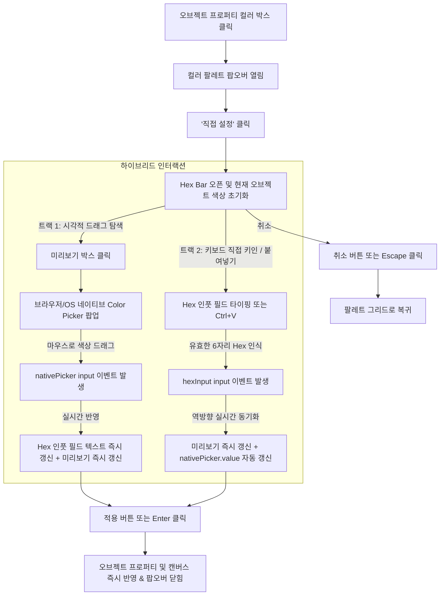

# 컬러 팔레트 Hexcode 기반 유지 및 드래그 Color Picker 부활(양방향 동기화 하이브리드) 구현 계획서

## 1. 개요 및 목적 (Overview & Goals)
본 계획서는 오브젝트 프로퍼티 인스펙터의 공통 컬러 팔레트에서, **현재의 Hexcode 직접 키인/복사붙여넣기/미리보기/단축키(`Enter`, `Escape`) 체계를 100% 온전히 유지하면서**, 과거에 제공되던 **마우스 드래그 기반 시각적 Color Picker(브라우저/OS 네이티브 스펙트럼 및 R.G.B 조절 피커)를 유기적으로 결합하여 되살리는 것**을 목표로 합니다.

이를 통해 키보드 중심의 정밀한 Hexcode 입력(퍼블리셔/개발자 워크플로우)과 마우스 중심의 직관적인 색상 탐색 및 드래그 선택(디자이너/기획자 워크플로우)을 단 하나의 콤팩트한 UI에서 완벽하게 양립시킵니다.

### 핵심 요구사항
1. **Hexcode 직접 키인 기능 100% 불변 보존**:
   - 6자리/3자리 Hexcode 직접 타이핑, 외부 클립보드 복사붙여넣기(`Ctrl+V`), `#` 자동 처리, 유효성 검사 및 에러 흔들림 애니메이션, `Enter`(적용) / `Escape`(취소) 단축키 체계를 그대로 보존합니다.
2. **시각적 Color Picker(드래그 스펙트럼)의 부활**:
   - `[직접 설정]` 모드에서 색상 미리보기 박스(`.v4-hex-preview`)를 클릭하면 브라우저 OS의 네이티브 Color Picker 다이얼로그가 즉시 팝업되어, 마우스 드래그로 2D Saturation/Value 평면 탐색, Hue 슬라이더, R.G.B 값 직접 조절, 화면 스포이드(EyeDropper) 기능을 사용할 수 있도록 합니다.
3. **양방향 실시간 동기화 (Bi-directional Real-time Sync)**:
   - **피커 드래그 시**: 네이티브 피커에서 마우스로 색상을 드래그하는 즉시 Hexcode 텍스트 인풋 필드(`.v4-hex-input`)의 값이 실시간으로 변경되고 미리보기 색상이 즉시 갱신됩니다.
   - **Hexcode 타이핑 시**: 반대로 인풋 필드에 Hexcode를 입력하면 숨겨진 네이티브 피커의 내부 값도 자동으로 동기화되어, 피커를 열었을 때 해당 색상 위치에 정확히 포인터가 위치합니다.
4. **172px 팝오버 컴팩트 규격 100% 보존**:
   - 추가적인 거대 버튼이나 UI 요소를 배치하지 않고, 기존 Hex Bar 좌측의 미리보기 박스(`.v4-hex-preview`) 자체를 '인터랙티브 피커 트리거'로 확장하여 기존 172px 너비와 높이를 0.1px도 증가시키지 않는 완벽한 공간 효율성을 달성합니다.
5. **Quill 리치 텍스트 에디터 컬러 피커 동시 고도화**:
   - 오브젝트 프로퍼티 글로벌 팔레트뿐만 아니라, 동일한 구조를 가진 Quill 리치 텍스트 툴바의 글자색/배경색 피커(`setupCustomColorPicker`)에도 동일한 양방향 동기화 하이브리드를 적용하여 시스템 전체의 일관성을 확보합니다.

---

## 2. 과거 히스토리 및 현행 시스템 구조 전수 분석

### 2.1. Git 히스토리 분석 결과
- **과거 구현 (`2ad74ab`, `eae29f8`)**:
  - `[직접 선택]` 버튼 내부에 `<input type="color" class="v4-palette-native-input">`가 투명하게 오버레이되어 클릭 시 브라우저 네이티브 Color Picker가 실행됨.
  - 브라우저 네이티브 피커는 2D 채도/명도 드래그 영역, 색조(Hue) 슬라이더, 그리고 **R, G, B 숫자 입력 필드**를 기본 제공함.
- **현재 구현 (`71ad7f3`)**:
  - Hexcode 복사붙여넣기 및 다크 테마 일체감을 위해 전용 `v4-palette-hex-bar` 텍스트 입력 바로 전면 교체됨.
  - 결과적으로 Hexcode 직접 입력 편의성은 높아졌으나, **마우스로 시각적 색상을 탐색하며 드래그하는 기능이 완전히 단절**됨.

### 2.2. 관련 파일 및 영향 범위 분석
| 파일 경로 | 현재 역할 및 분석 내용 | 변경 및 구현 내용 |
| :--- | :--- | :--- |
| **`assets/vctrl_color_picker.js`** | 전역 컬러 팔레트 팝오버(`initV4GlobalColorPalette`) 및 Quill 컬러 피커(`setupCustomColorPicker`)의 단일 진실 공급원(SSOT). | - Hex Bar 내 네이티브 `<input type="color">` 래핑 및 오버레이<br>- `input`/`change` 이벤트 리스너를 통한 Hexcode 인풋 필드 실시간 동기화<br>- Hex 키인 시 네이티브 피커 값 역방향 동기화<br>- `openHexBar()` 시 초기 색상 주입 로직 강화 |
| **`assets/style.css`** | `.v4-palette-hex-bar`, `.v4-hex-preview`, `.ql-custom-hex-bar` 스타일 정의. | - `.v4-hex-preview`에 `cursor: pointer`, 호버 테두리 강조, 미니 팔레트 아이콘 오버레이 스타일 추가<br>- 네이티브 input 숨김/오버레이 스타일링<br>- 172px 규격 내 요소 간 간격 픽셀 퍼펙트 정렬 유지 |
| **기존 인스펙터 및 캔버스 엔진** | `vctrl_inspector.js`, `vctrl_ui_atoms.js`, `vctrl_object_shape.js` 등 | - **수정 불필요 (100% 호환)**: 최종 값 반영은 기존과 동일하게 `currentTargetInput.dispatchEvent(new Event('change'))` 표준 파이프라인을 그대로 경유하므로 기존 캔버스 렌더링에 영향 0건 |

---

## 3. 핵심 기술 설계 명세 (Detailed Technical Design)

### 3.1. UI 마크업 구조 및 인터랙티브 피커 트리거 설계
기존 `.v4-palette-hex-bar`의 마크업을 다음과 같이 고도화합니다:

```html
<!-- 기존 -->
<div class="v4-palette-hex-bar">
    <div class="v4-hex-preview" style="background-color: #ffffff;" title="색상 미리보기"></div>
    <span class="v4-hex-prefix">#</span>
    <input type="text" class="v4-hex-input" maxlength="7" placeholder="HEXCODE" spellcheck="false" autocomplete="off">
    <button type="button" class="v4-hex-btn v4-hex-btn-apply" title="적용">...</button>
    <button type="button" class="v4-hex-btn v4-hex-btn-cancel" title="취소">...</button>
</div>

<!-- 개선안: 미리보기 박스를 피커 트리거 래퍼로 확장 -->
<div class="v4-palette-hex-bar">
    <div class="v4-hex-preview-wrap" title="클릭하여 컬러 피커(드래그) 열기">
        <div class="v4-hex-preview" style="background-color: #ffffff;">
            <span class="material-icons-outlined v4-hex-preview-icon">palette</span>
        </div>
        <input type="color" class="v4-hex-native-picker" tabindex="-1" aria-hidden="true">
    </div>
    <span class="v4-hex-prefix">#</span>
    <input type="text" class="v4-hex-input" maxlength="7" placeholder="HEXCODE" spellcheck="false" autocomplete="off">
    <button type="button" class="v4-hex-btn v4-hex-btn-apply" title="적용">...</button>
    <button type="button" class="v4-hex-btn v4-hex-btn-cancel" title="취소">...</button>
</div>
```

### 3.2. 양방향 실시간 동기화 (Bi-directional Sync) 인터랙션 흐름도



### 3.3. 상세 자바스크립트 로직 명세 (`assets/vctrl_color_picker.js`)

1. **초기화 및 동기화 (`openHexBar`)**:
   ```javascript
   function openHexBar() {
       if (!hexBar || !footer) return;
       footer.style.display = 'none';
       hexBar.classList.add('active');

       const curVal = (currentTargetInput && currentTargetInput.value ? currentTargetInput.value : '#ffffff').toLowerCase();
       const norm = normalizeHex(curVal) || '#ffffff';
       const cleanHex = norm.replace(/^#/, '').toUpperCase();

       if (hexInput) {
           hexInput.value = cleanHex;
           hexInput.classList.remove('error');
       }
       if (hexPreview) {
           hexPreview.style.backgroundColor = norm;
       }
       if (nativePicker) {
           nativePicker.value = norm; // ★ 네이티브 피커 초기 색상 동기화
       }
       setTimeout(() => {
           if (hexInput) {
               hexInput.focus();
               hexInput.select();
           }
       }, 10);
   }
   ```

2. **네이티브 피커 ➔ Hex 인풋 실시간 동기화 (`nativePicker.oninput`)**:
   ```javascript
   nativePicker.addEventListener('input', (e) => {
       const pickedColor = e.target.value.toLowerCase();
       const cleanHex = pickedColor.replace(/^#/, '').toUpperCase();
       
       if (hexInput) {
           hexInput.value = cleanHex;
           hexInput.classList.remove('error');
       }
       if (hexPreview) {
           hexPreview.style.backgroundColor = pickedColor;
       }
   });
   ```

3. **Hex 인풋 ➔ 네이티브 피커 역방향 동기화 (`hexInput.oninput`)**:
   ```javascript
   hexInput.addEventListener('input', (e) => {
       const val = e.target.value;
       const norm = normalizeHex(val);
       if (norm) {
           if (hexPreview) hexPreview.style.backgroundColor = norm;
           if (nativePicker) nativePicker.value = norm; // ★ 역방향 동기화
           hexInput.classList.remove('error');
       }
   });
   ```

4. **Quill 리치 텍스트 서식 툴바 (`setupCustomColorPicker`) 동일 적용**:
   - `ql-custom-hex-bar`에도 동일한 래퍼 및 `ql-hex-native-picker`를 탑재하여 글자색/배경색 선택 시에도 동일하게 작동하도록 보장합니다.

### 3.4. CSS 스타일 명세 (`assets/style.css`)
```css
/* V4 Hex Preview Wrap & Native Picker Overlay */
.v4-hex-preview-wrap,
.ql-hex-preview-wrap {
    position: relative;
    width: 18px;
    height: 18px;
    flex-shrink: 0;
    cursor: pointer;
}

.v4-hex-preview,
.ql-hex-preview {
    width: 100%;
    height: 100%;
    border-radius: 3px;
    border: 1px solid rgba(255, 255, 255, 0.3);
    box-sizing: border-box;
    display: flex;
    align-items: center;
    justify-content: center;
    transition: border-color 0.15s ease, transform 0.1s ease;
}

.v4-hex-preview-wrap:hover .v4-hex-preview,
.ql-hex-preview-wrap:hover .ql-hex-preview {
    border-color: #818cf8;
    transform: scale(1.08);
}

.v4-hex-preview-icon,
.ql-hex-preview-icon {
    font-size: 11px !important;
    color: #ffffff;
    opacity: 0;
    transition: opacity 0.15s ease;
    pointer-events: none;
    text-shadow: 0 1px 2px rgba(0, 0, 0, 0.8);
}

.v4-hex-preview-wrap:hover .v4-hex-preview-icon,
.ql-hex-preview-wrap:hover .ql-hex-preview-icon {
    opacity: 0.9;
}

.v4-hex-native-picker,
.ql-hex-native-picker {
    position: absolute;
    left: 0;
    top: 0;
    width: 100%;
    height: 100%;
    opacity: 0;
    cursor: pointer;
    border: none;
    padding: 0;
    margin: 0;
    z-index: 2;
}
```

---

## 4. 7대 필수 게이트웨이 준수 및 리스크 방지 전략

1. **[운영 시스템 무결성 보장] (Strict Production Integrity)**:
   - 프로퍼티 최종 적용은 기존 검증된 `currentTargetInput.dispatchEvent(new Event('change'))` 경로를 100% 동일하게 통과하므로, 저장/커밋/되돌리기 무결성이 완벽하게 보장됩니다.
2. **[사전 정밀 심층 분석 & 계획 수립] (Deep Analysis & Plan First)**:
   - Git 히스토리부터 현재 DOM 구조 및 Quill 모듈까지 전수 분석을 완료하고 본 계획서를 수립했습니다.
3. **[사이드이펙트 원천 차단] (Zero Side-Effects)**:
   - `hexInput`의 `keydown` 이벤트 버블링 차단(`e.stopPropagation()`)을 유지하여 전역 단축키(삭제, 전체화면 등) 오동작을 원천 차단합니다.
   - 네이티브 피커 클릭 및 드래그 중에도 팔레트 외부 클릭 닫기 리스너와 충돌하지 않도록 모듈 스코프 가드를 적용합니다.
4. **[스크립트/런타임 에러 0건] (Zero Script/Runtime Errors)**:
   - `normalizeHex` 널 체크, 옵셔널 체이닝 및 폴백(`#ffffff`)을 적용하여 유효하지 않은 색상 코드에서도 런타임 오류가 발생하지 않습니다.
5. **[백틱 충돌 에러 0건] (Zero Backtick Syntax Collisions)**:
   - 수정 대상 파일(`assets/vctrl_color_picker.js`)은 부모 측 일반 모듈이지만, 백틱 충돌 0건 원칙을 준수하고 브래킷 및 쿼테이션 무결성을 완벽히 유지합니다.
6. **[구문/브래킷 에러 0건 및 자동 정적 검증 강제] (Zero Syntax Errors & Mandatory Verification)**:
   - 작업 완료 후 `powershell -ExecutionPolicy Bypass -File scripts/check_syntax.ps1`을 자체 실행하여 무결성(0 Errors) 통과를 자체 검증합니다.
7. **[CORS 에러 0건 및 통신 프로토콜 준수] (Zero CORS Errors)**:
   - Iframe과의 직접 DOM 접근 없이 부모 창 내부 인스펙터 입력 필드의 표준 `change` 이벤트 디스패치를 통해서만 메시지가 전송되도록 설계합니다.

---

## 5. 구현 단계별 실행 계획 (Phase Implementation Roadmap)

- **Phase 1: 스타일시트 고도화 (`assets/style.css`)**
  - `.v4-hex-preview-wrap`, `.v4-hex-native-picker`, 호버 시 미니 팔레트 아이콘 노출 스타일 추가.
  - Quill용 `.ql-hex-preview-wrap` 스타일 동시 정의.
- **Phase 2: 공통 오브젝트 컬러 팔레트 로직 구현 (`assets/vctrl_color_picker.js`)**
  - `initV4GlobalColorPalette` 내부 `v4-palette-hex-bar` 마크업 변경.
  - 네이티브 피커 엘리먼트 참조 및 이벤트 바인딩(`nativePicker.oninput`).
  - `openHexBar()` 및 `hexInput.oninput`의 양방향 동기화 로직 연결.
- **Phase 3: Quill 리치 텍스트 서식 툴바 컬러 피커 동시 구현**
  - `setupCustomColorPicker` 내부에 동일한 하이브리드 동기화 로직 적용.
- **Phase 4: 정적 검증 및 품질 검사**
  - `powershell -ExecutionPolicy Bypass -File scripts/check_syntax.ps1` 실행하여 0 Syntax Errors 검증.
  - 브라우저 동작 및 사용자 테스트 가이드 수립.

---

## 6. 검증 시나리오 및 체크리스트

1. **Hexcode 직접 키인 시나리오**:
   - `[직접 설정]` 클릭 ➔ `HEXCODE` 인풋에 `#4F46E5` 입력 ➔ 미리보기 박스 및 숨겨진 네이티브 피커에 보라색 동기화 확인 ➔ `Enter` 또는 체크 버튼 클릭 시 오브젝트에 정상 반영 확인.
2. **Color Picker 마우스 드래그 시나리오**:
   - `[직접 설정]` 클릭 ➔ 좌측 미리보기 박스(호버 시 팔레트 아이콘 표시) 클릭 ➔ 브라우저/OS 네이티브 Color Picker 창 팝업 확인.
   - 마우스로 색상 영역을 드래그하거나 Hue 슬라이더를 조작했을 때, **Hex 인풋 필드의 텍스트가 실시간으로 `#XXXXXX`로 즉시 바뀌는지 확인**.
   - 피커 닫기 후 `Enter` 또는 체크 버튼을 눌러 오브젝트에 최종 반영 확인.
3. **취소 및 리셋 시나리오**:
   - 색상 변경 중 취소 버튼(`close`) 또는 `Escape` 키 클릭 시 기존 상태를 유지하며 팔레트 그리드로 정상 복귀하는지 확인.
4. **Quill 에디터 서식 툴바 시나리오**:
   - 캔버스 텍스트 셀 더블클릭 ➔ 툴바 글자색/배경색 드롭다운 ➔ `[직접 설정]` ➔ 동일한 양방향 동기화 정상 작동 확인.
