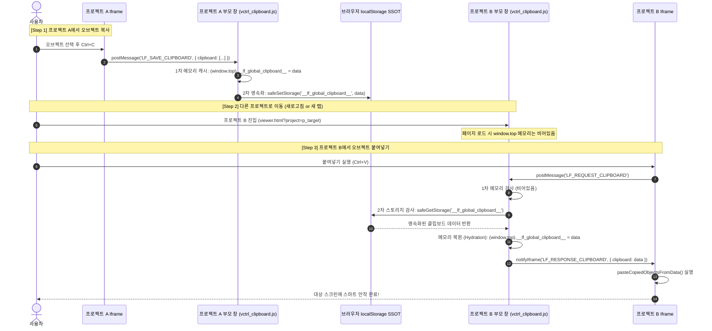

# 프로젝트 간 오브젝트 및 서식 복사/붙여넣기(Cross-Project Clipboard) 하이브리드 영속화 구현 계획서

## 1. 개요 및 목적 (Overview & Goals)

### 1.1. 배경 및 문제 상황
- **기존 동작**:
  - 스크린 내 오브젝트 복사(`Ctrl+C`) 및 서식 복사(`Ctrl+Shift+C`) 실행 시, 데이터는 브라우저의 런타임 메모리인 최상위 윈도우 인스턴스(`(window.top || window).__lf_global_clipboard__`)에만 저장되었습니다.
  - **동일 프로젝트 내 스크린 전환**: `viewer.html` 부모 창이 유지된 채 iframe의 `srcdoc`만 교체되므로 메모리가 보존되어 정상 동작했습니다.
- **프로젝트 간 이동 시 발생하는 결함**:
  - 사용자가 **다른 프로젝트의 스크린**으로 이동하기 위해 대시보드(`index.html`)로 이동하거나 주소창 URL(`viewer.html?project=...`)을 변경하면, 브라우저 페이지 전체가 언로드(Page Navigation/Reload)되어 **`window.top`의 모든 자바스크립트 런타임 메모리가 완전히 소멸(GC)**됩니다.
  - 또한 **서로 다른 브라우저 탭**에서 프로젝트 A와 프로젝트 B를 열고 작업하는 경우에도 탭 간 메모리가 격리되어 데이터가 전달되지 않습니다.
  - 이로 인해 다른 프로젝트 화면에서 붙여넣기(`Ctrl+V`) 실행 시 클립보드 요청에 빈 배열(`[]`)이 반환되어 아무것도 붙여넣어지지 않는 문제가 발생합니다.

### 1.2. 핵심 개선 목표
1. **[목표 1] 프로젝트 간 오브젝트 복사/붙여넣기 완벽 보장 (Cross-Project Object Paste)**:
   - 프로젝트 A의 스크린에서 오브젝트 복사(`Ctrl+C`) 후, 대시보드를 거쳐 프로젝트 B로 이동하거나 다른 탭에서 프로젝트 B를 열었을 때도 `Ctrl+V`로 온전히 붙여넣기 지원.
2. **[목표 2] 프로젝트 간 서식 복사/붙여넣기 완벽 보장 (Cross-Project Style Paste)**:
   - 도형 및 텍스트 서식(`Ctrl+Shift+C`) 역시 동일한 영속화 파이프라인을 통해 다른 프로젝트 화면의 오브젝트에 `Ctrl+Shift+V`로 일괄 적용 지원.
3. **[목표 3] 인메모리 + 스토리지 하이브리드 듀얼 레이어 구축 (High Performance & Zero Regression)**:
   - 동일 스크린/동일 프로젝트 내에서의 빠른 인메모리 캐시 접근 속도를 100% 유지하면서, 페이지 언로드 시에만 `localStorage`에서 복원(Hydration)하는 고성능 무결성 구조 확보.
4. **[목표 4] 쿼터 초과 및 예외 3중 방어 (Production Integrity)**:
   - 거대 이미지 복사 등으로 인한 브라우저 `QuotaExceededError` 발생 시에도 에디터가 다운되지 않고 인메모리 폴백 및 안전 가이드 동작.

---

## 2. 작업 난이도 종합 평가 (Task Difficulty Assessment)

| 평가 항목 | 수준 | 상세 근거 |
| :--- | :---: | :--- |
| **종합 체감 난이도** | **보통 (Medium)** | 핵심 아키텍처 및 렌더링 파이프라인 변경 없이 부모 측 클립보드 매니저([`vctrl_clipboard.js`](file:///c:/Users/sisun/ai_work/assets/vctrl_clipboard.js)) 단일 모듈에 격리된 안전한 보강 작업 |
| **코드 변경 범위** | **작음 (Small, 약 50줄 내외)** | `LF_SAVE_CLIPBOARD`, `LF_REQUEST_CLIPBOARD`, `LF_SAVE_STYLE_CLIPBOARD`, `LF_REQUEST_STYLE_CLIPBOARD` 핸들러 내 영속화 유틸리티 연동 |
| **회귀 위험도 (Regression Risk)** | **매우 낮음 (Very Low)** | 기존 `(window.top || window).__lf_global_clipboard__` 인터페이스를 100% 유지한 채 2차 저장소로 `localStorage`를 연계하므로 기존 기능 100% 호환 |
| **핵심 주의 사항** | **3대 방어선 필요** | 1) `QuotaExceededError` 용량 초과 방어<br>2) `JSON.parse` 파싱 오류 안전 가드<br>3) 멀티 탭 storage 이벤트 동기화 |

---

## 3. 7대 필수 게이트웨이 및 원칙 사전 점검 (Pre-Flight Gateway Audit)

| 게이트웨이 원칙 | 점검 항목 및 대응 계획 | 준수 여부 |
| :--- | :--- | :---: |
| **1. 운영 시스템 무결성 (Strict Production Integrity)** | 임의의 가짜 더미 데이터나 임시 mock을 주입하지 않고, 실제 클립보드 직렬화 데이터 및 브라우저 표준 스토리지만을 정직하게 처리합니다. | ✅ 준수 |
| **2. 사전 정밀 심층 분석 & 계획 수립 (Deep Analysis First)** | `assets/vctrl_clipboard.js`, `assets/vctrl_clipboard_objects.js`, `assets/vctrl_format_painter.js`의 통신 흐름을 전수 분석하고 전용 구현 계획서를 사전 확정합니다. | ✅ 준수 |
| **3. 사이드이펙트 원천 차단 (Zero Side-Effects)** | 동일 프로젝트 내 스크린 간 복사, 동일 프레임 안착(+15px), 반응형 뷰포트 센터링, Undo(`Ctrl+Z`), 스마트가이드 등 기존 클립보드 파이프라인의 일체 동작에 간섭하지 않습니다. | ✅ 준수 |
| **4. 스크립트/런타임 에러 0건 (Zero Runtime Errors)** | `localStorage` 접근 차단(`SecurityError`), 용량 초과(`QuotaExceededError`), 손상된 데이터 파싱 에러를 `try-catch` 가드로 100% 격리 차단합니다. | ✅ 준수 |
| **5. 백틱 충돌 에러 0건 (Zero Backtick Syntax Collisions)** | 주 수정 대상 파일인 `assets/vctrl_clipboard.js`는 일반 모듈 파일로 백틱 템플릿 리터럴 래핑 파일이 아니며, 표준 따옴표와 안전한 JS 구문만을 사용합니다. | ✅ 준수 |
| **6. 구문/브래킷 에러 0건 & 정적 검증 (Mandatory Static Verification)** | 작업 완료 즉시 `powershell -ExecutionPolicy Bypass -File scripts/check_syntax.ps1`을 실행하여 브래킷 밸런스 및 인라인 스크립트 결합 컴파일 0 Error를 자체 확인합니다. | ✅ 준수 |
| **7. CORS 에러 0건 및 통신 프로토콜 준수 (Zero CORS Errors)** | 부모와 Iframe 간 SOP 위반을 원천 차단하고 `MessageHub` 및 `EditorBus`의 메시지 전달 체계를 그대로 준수합니다. | ✅ 준수 |

---

## 4. 관련 시스템 및 소스코드 전수 분석 (Architecture Analysis)

### 4.1. 모듈별 역할 및 영향도 분석
| 모듈 파일 | 소속 및 역할 | 이번 작업에서의 변경 사항 |
| :--- | :--- | :--- |
| **`assets/vctrl_clipboard.js`** | **[핵심 대상]** 부모 창의 클립보드 SSOT 관리자. `LF_SAVE_CLIPBOARD`, `LF_REQUEST_CLIPBOARD` 수신 및 응답 전담 | - `localStorage` 하이브리드 영속화 헬퍼(`safeSetStorage`, `safeGetStorage`) 도입<br>- 클립보드 저장 시 `window.top` + `localStorage` 동시 저장<br>- 클립보드 요청 시 `window.top` 부재 시 `localStorage` 자동 복원<br>- 서식 클립보드(`styleClipboard`) 동반 영속화 |
| **`assets/vctrl_clipboard_objects.js`** | Iframe 내부의 캔버스 오브젝트 직렬화/역직렬화 엔진 (`v4ClipboardObjectsScript`) | **수정 불필요**: 이미 완벽한 JSON 직렬화/역직렬화 및 안착 알고리즘을 갖추고 있으며 부모와의 통신 규격이 유지되므로 기존 코드 100% 보존 |
| **`assets/vctrl_format_painter.js`** | Iframe 내부의 도형 및 타이포그래피 서식 복사/붙여넣기 엔진 (`v4FormatPainterScript`) | **수정 불필요**: `LF_SAVE_STYLE_CLIPBOARD` 및 `LF_REQUEST_STYLE_CLIPBOARD` 통신 규격이 유지되므로 기존 코드 100% 보존 |
| **`assets/vctrl_shortcuts.js`** | Iframe 내부 키보드 핫키(`Ctrl+C`, `Ctrl+V`, `Ctrl+X` 등) 리스너 및 프록시 | **수정 불필요**: 통신 프로토콜 변경 없음 |
| **`AGENTS.md` & `SKILL.md`** | 시스템 아키텍처 룰 및 스킬 SSOT 문서 | 하이브리드 영속화 아키텍처 명세 최신 동기화 반영 |

---

## 5. 세부 기술 설계 명세 (Detailed Technical Specification)

### 5.1. 하이브리드 데이터 흐름 시퀀스 (Hybrid Data Flow)



### 5.2. 스토리지 키 규격 (SSOT Storage Keys)
1. **오브젝트 클립보드 키**:
   - 키 이름: `__lf_global_clipboard__`
   - 데이터 타입: JSON String (직렬화된 컴포넌트 속성 배열 `Array<ComponentClipboardItem>`)
2. **스타일 서식 클립보드 키**:
   - 키 이름: `__lf_global_style_clipboard__`
   - 데이터 타입: JSON String (직렬화된 스타일 속성 객체 `StyleClipboardItem`)

### 5.3. 3대 안전 가드 설계 (3-Tier Safety Guards)

#### ① QuotaExceededError (용량 초과 방어 가드)
```javascript
function safeSetStorage(key, value) {
    try {
        const serialized = JSON.stringify(value);
        localStorage.setItem(key, serialized);
        return true;
    } catch (err) {
        // QuotaExceededError 발생 시 (거대 Base64 이미지 임베딩 등)
        console.warn('[ClipboardManager] Failed to persist to localStorage (quota or security):', err);
        // localStorage 실패 시에도 인메모리는 유지되므로 에디터 정상 작동
        return false;
    }
}
```

#### ② JSON Parse & Data Schema Validation (손상 데이터 방어 가드)
```javascript
function safeGetStorage(key, isArrayExpected = true) {
    try {
        const item = localStorage.getItem(key);
        if (!item) return null;
        const parsed = JSON.parse(item);
        if (isArrayExpected) {
            return Array.isArray(parsed) ? parsed : null;
        }
        return (parsed && typeof parsed === 'object') ? parsed : null;
    } catch (err) {
        console.warn('[ClipboardManager] Corrupt storage data for key ' + key + ':', err);
        return null;
    }
}
```

#### ③ 멀티 탭 실시간 동기화 (Multi-Tab Live Sync)
- 사용자가 탭 1에서 복사한 즉시 탭 2의 `window.top` 변수도 최신 상태를 유지할 수 있도록 `storage` 이벤트 리스너 바인딩:
```javascript
window.addEventListener('storage', function(e) {
    if (e.key === '__lf_global_clipboard__' && e.newValue) {
        try {
            (window.top || window).__lf_global_clipboard__ = JSON.parse(e.newValue);
        } catch(err) {}
    } else if (e.key === '__lf_global_style_clipboard__' && e.newValue) {
        try {
            (window.top || window).__lf_global_style_clipboard__ = JSON.parse(e.newValue);
        } catch(err) {}
    }
});
```

---

## 6. 실제 코드 변경 상세 설계 (Implementation Blueprint)

**대상 파일**: [assets/vctrl_clipboard.js](file:///c:/Users/sisun/ai_work/assets/vctrl_clipboard.js)

### [수정 대상 영역: 160행 ~ 205행]

```javascript
    // --- Safe Storage Persistence Helpers ---
    function safeSetStorage(key, value) {
        try {
            if (typeof localStorage === 'undefined') return false;
            const serialized = JSON.stringify(value);
            localStorage.setItem(key, serialized);
            return true;
        } catch (err) {
            console.warn('[ClipboardManager] Storage write failed (Quota or Security):', err);
            return false;
        }
    }

    function safeGetStorage(key, isArrayExpected) {
        try {
            if (typeof localStorage === 'undefined') return null;
            const item = localStorage.getItem(key);
            if (!item) return null;
            const parsed = JSON.parse(item);
            if (isArrayExpected) {
                return Array.isArray(parsed) ? parsed : null;
            }
            return (parsed && typeof parsed === 'object') ? parsed : null;
        } catch (err) {
            console.warn('[ClipboardManager] Storage read failed:', err);
            return null;
        }
    }

    // Multi-tab Storage Synchronization
    window.addEventListener('storage', function (e) {
        if (e.key === '__lf_global_clipboard__' && e.newValue) {
            try {
                (window.top || window).__lf_global_clipboard__ = JSON.parse(e.newValue);
            } catch (err) { }
        } else if (e.key === '__lf_global_style_clipboard__' && e.newValue) {
            try {
                (window.top || window).__lf_global_style_clipboard__ = JSON.parse(e.newValue);
            } catch (err) { }
        }
    });

    window.addEventListener('message', function (e) {
        const data = e.data;
        if (!data || !data.type) return;

        if (data.type === 'LF_SAVE_CLIPBOARD') {
            console.log('[ClipboardManager] Parent saving clipboard to Memory & LocalStorage:', data.clipboard);
            try {
                (window.top || window).__lf_global_clipboard__ = data.clipboard;
            } catch (err) {
                window.__lf_global_clipboard__ = data.clipboard;
            }
            safeSetStorage('__lf_global_clipboard__', data.clipboard);

        } else if (data.type === 'LF_REQUEST_CLIPBOARD') {
            let storedData = null;
            try {
                storedData = (window.top || window).__lf_global_clipboard__;
            } catch (err) {
                storedData = window.__lf_global_clipboard__;
            }

            // Fallback & Hydrate from LocalStorage if memory is empty
            if (!storedData || !Array.isArray(storedData) || storedData.length === 0) {
                storedData = safeGetStorage('__lf_global_clipboard__', true) || [];
                try {
                    (window.top || window).__lf_global_clipboard__ = storedData;
                } catch (err) {
                    window.__lf_global_clipboard__ = storedData;
                }
            }

            console.log('[ClipboardManager] Responding to LF_REQUEST_CLIPBOARD with ' + storedData.length + ' item(s).');
            notifyIframe({
                type: 'LF_RESPONSE_CLIPBOARD',
                clipboard: storedData
            });

        } else if (data.type === 'LF_SAVE_STYLE_CLIPBOARD') {
            console.log('[ClipboardManager] Parent saving style clipboard to Memory & LocalStorage:', data.styleClipboard);
            try {
                (window.top || window).__lf_global_style_clipboard__ = data.styleClipboard;
            } catch (err) {
                window.__lf_global_style_clipboard__ = data.styleClipboard;
            }
            safeSetStorage('__lf_global_style_clipboard__', data.styleClipboard);

        } else if (data.type === 'LF_REQUEST_STYLE_CLIPBOARD') {
            let storedStyle = null;
            try {
                storedStyle = (window.top || window).__lf_global_style_clipboard__;
            } catch (err) {
                storedStyle = window.__lf_global_style_clipboard__;
            }

            // Fallback & Hydrate from LocalStorage if memory is empty
            if (!storedStyle) {
                storedStyle = safeGetStorage('__lf_global_style_clipboard__', false);
                try {
                    (window.top || window).__lf_global_style_clipboard__ = storedStyle;
                } catch (err) {
                    window.__lf_global_style_clipboard__ = storedStyle;
                }
            }

            console.log('[ClipboardManager] Responding to LF_REQUEST_STYLE_CLIPBOARD.');
            notifyIframe({
                type: 'LF_RESPONSE_STYLE_CLIPBOARD',
                styleClipboard: storedStyle
            });
        }
    });
```

---

## 7. 검증 및 테스트 계획 (Verification Plan)

### 7.1. 자체 무인 정적 검증 (Autonomous Verification)
1. **`powershell -ExecutionPolicy Bypass -File scripts/check_syntax.ps1`**:
   - `assets/vctrl_clipboard.js`의 브래킷 밸런스 및 문법 무결성 100% 확인.
   - Node VM 전체 스크립트 컴파일 파이프라인 0 Error 확인.
2. **`powershell -ExecutionPolicy Bypass -File scripts/verify_all.ps1`**:
   - 엔진 40여 개 전체 모듈의 문법/정적 무결성 전수 검증.

### 7.2. 사용자 브라우저 기능 테스트 시나리오
| 테스트 케이스 | 조작 단계 | 기대 결과 |
| :--- | :--- | :--- |
| **TC-1. 동일 프로젝트 스크린 복사 (회귀 검증)** | 프로젝트 A의 화면 1에서 오브젝트 복사(`Ctrl+C`) ➔ 사이드바에서 화면 2 클릭 ➔ 붙여넣기(`Ctrl+V`) | 원본 위치 기준 우측하단(+15px) 또는 반응형 뷰포트 정중앙에 정상 생성 |
| **TC-2. 다른 프로젝트로 이동 후 붙여넣기 (핵심)** | 프로젝트 A에서 오브젝트 복사(`Ctrl+C`) ➔ `←` 뒤로가기로 대시보드 이동 ➔ 프로젝트 B 클릭 진입 ➔ 붙여넣기(`Ctrl+V`) | 페이지가 새로고침되었음에도 `localStorage`로부터 복원되어 **프로젝트 B 화면에 정상 붙여넣기 완료** |
| **TC-3. 멀티 탭 간 복사/붙여넣기** | 브라우저 탭 1(프로젝트 A)에서 오브젝트 `Ctrl+C` ➔ 탭 2(프로젝트 B)로 전환 후 `Ctrl+V` | 탭 간 메모리 격리를 넘어 `localStorage` 동기화를 통해 **즉시 붙여넣기 완료** |
| **TC-4. 서식 복사/붙여넣기 프로젝트 이동** | 프로젝트 A 도형에서 `Ctrl+Shift+C` ➔ 프로젝트 B로 이동 ➔ 대상 도형 선택 후 `Ctrl+Shift+V` | 스타일, 보더, 배경색, 폰트 서식이 오차 없이 프로젝트를 넘어 일괄 이식됨 |
| **TC-5. 잘라내기(Cut) 프로젝트 이동** | 프로젝트 A에서 `Ctrl+X` ➔ 프로젝트 B로 이동 ➔ `Ctrl+V` | 프로젝트 A에서는 삭제되고, 프로젝트 B 화면에 복원 안착됨 |

---

## 8. 롤백 대비책 (Rollback Strategy)
- 변경 대상 파일이 `assets/vctrl_clipboard.js` 단 1개 파일로 완벽히 격리되어 있으므로, 예기치 못한 이슈 발생 시 `git checkout assets/vctrl_clipboard.js` 명령어를 통해 단 1초 만에 직전 상태로 무손실 즉각 롤백이 가능합니다.
