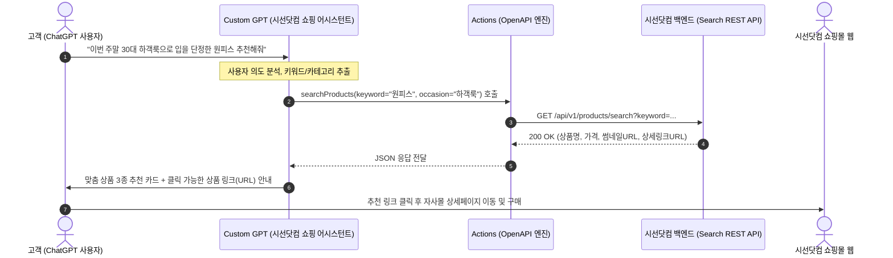
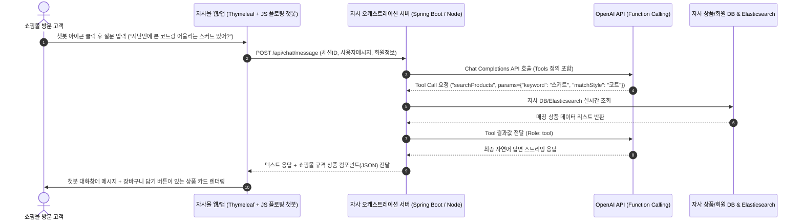
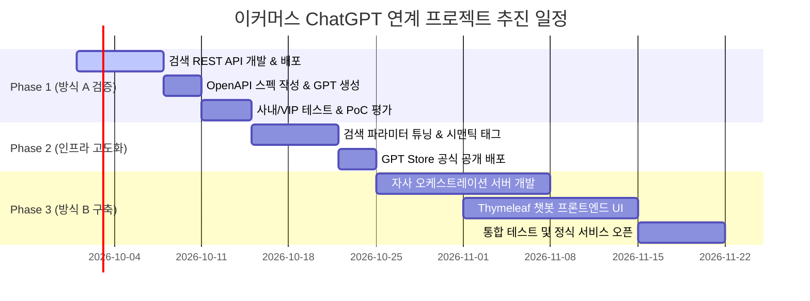

# [기획/기술 계획서] 이커머스 시스템과 ChatGPT 연계 전략 및 구현 가이드 (방식 A & 방식 B)

## 1. 문서 개요

### 1.1 배경 및 목적
* **배경**: 전통적인 키워드/필터 검색 방식의 한계를 넘어, 고객의 상황(TPO), 취향, 자연어 질문에 반응하는 대화형 생성형 AI 커머스(Conversational Commerce) 수요 급증.
* **목적**: 시선닷컴(SISUN.COM) 등 자사 이커머스 시스템을 ChatGPT 생태계와 연계하기 위한 두 가지 핵심 접근법(**방식 A: Custom GPTs 연계**, **방식 B: 자사몰 내장 AI 탑재**)의 기술 구조, 개발 절차, 장단점 및 단계별 추진 로드맵을 확립함.

### 1.2 두 가지 연계 방식 비교 요약

| 비교 항목 | 방식 A: Custom GPTs (Actions) | 방식 B: 자사몰 내장형 (OpenAI API) |
| :--- | :--- | :--- |
| **운영 플랫폼** | OpenAI ChatGPT 웹/모바일 앱 내부 | 자사 쇼핑몰(시선닷컴) 웹/모바일 앱 내부 |
| **사용자 접점** | ChatGPT 사용자 (GPT Store 방문객) | 자사몰 방문 고객 (기존 고객 및 인바운드 유저) |
| **프론트엔드 개발** | **0원 (Zero-UI)**, ChatGPT 기본 UI 활용 | 자사몰 전용 챗봇 UI 신규 개발 필요 |
| **인프라/백엔드** | 외부 노출용 REST API 1~2개 + Swagger | API 오케스트레이션 서버 + 토큰/세션 관리 인프라 |
| **음성/비전 지원** | **무료 즉시 지원** (ChatGPT Voice/Vision) | 자체 음성/이미지 인식 모델 별도 구현 필요 |
| **브랜드 통제력** | OpenAI 플랫폼 정책 및 UI 종속 | **100% 자사 맞춤형 디자인 및 UX 제어 가능** |
| **구매 전환 경로** | 상품 링크 클릭 ➔ 자사몰 새창 이동 | 챗봇 내에서 즉시 장바구니 담기 및 결제 연동 가능 |
| **추천 용도** | **초고속 PoC(검증)**, 신규 트래픽 유치, VIP 시연 | **실제 쇼핑몰 정규 서비스**, 온사이트 구매전환율 극대화 |

---

## 2. 방식 A: Custom GPTs + Actions (ChatGPT 내 전용 봇 구축)

### 2.1 아키텍처 및 동작 흐름



### 2.2 상세 구현 단계

#### Step 1: 백엔드 검색 REST API 개발
외부에서 호출 가능한 HTTPS 기반의 경량 JSON API를 준비합니다.
* **엔드포인트**: `GET https://api.sisun.com/v1/external/products/search`
* **요청 파라미터**:
  * `keyword` (String, 필수): 검색어 (예: 트렌치코트, 린넨 자켓)
  * `brand` (String, 선택): EBM, MICHAA, ITMICHAA 등 브랜드 필터
  * `category` (String, 선택): 아우터, 원피스, 팬츠 등
  * `limit` (Integer, 기본값 5): 반환 상품 수
* **응답 규격 (JSON Sample)**:
  ```json
  [
    {
      "productId": "MI24WOP001",
      "brand": "MICHAA",
      "name": "벨티드 플리츠 플레어 원피스",
      "originalPrice": 659000,
      "salePrice": 527200,
      "discountRate": 20,
      "inStock": true,
      "thumbnailUrl": "https://image.sisun.com/upload/goods/MI24WOP001_thumb.jpg",
      "productUrl": "https://sisun.com/goods/detail/MI24WOP001?utm_source=chatgpt&utm_medium=custom_gpts"
    }
  ]
  ```

#### Step 2: OpenAPI Specification (Swagger YAML) 작성
ChatGPT가 API를 언제, 어떤 파라미터로 호출해야 하는지 정의합니다.
```yaml
openapi: 3.1.0
info:
  title: Sisun Shopping Assistant API
  description: 시선닷컴 상품 검색 및 실시간 재고/가격 조회 API
  version: 1.0.0
servers:
  - url: https://api.sisun.com/v1/external
paths:
  /products/search:
    get:
      operationId: searchProducts
      summary: 키워드, 브랜드, 카테고리 기반 실시간 상품 검색
      parameters:
        - name: keyword
          in: query
          required: true
          schema:
            type: string
          description: 찾고자 하는 패션 아이템 키워드 (예: 원피스, 셋업, 트렌치코트)
        - name: brand
          in: query
          required: false
          schema:
            type: string
            enum: [EBM, MICHAA, ITMICHAA]
          description: 특정 브랜드 한정 검색 시 사용
      responses:
        '200':
          description: 성공적인 상품 목록 반환
          content:
            application/json:
              schema:
                type: array
                items:
                  type: object
                  properties:
                    productId: { type: string }
                    brand: { type: string }
                    name: { type: string }
                    originalPrice: { type: integer }
                    salePrice: { type: integer }
                    thumbnailUrl: { type: string }
                    productUrl: { type: string }
                    inStock: { type: boolean }
```

#### Step 3: Custom GPTs 구성 (지침/Prompt Engineering)
* **GPT 이름**: 시선닷컴 쇼핑 어시스턴트 (SISUN Style AI)
* **Description**: MICHAA, EBM, IT MICHAA의 스타일 큐레이션 및 맞춤 패션 추천
* **System Instructions (지침 프롬프트)**:
  ```text
  당신은 프리미엄 여성 패션몰 '시선닷컴(SISUN.COM)'의 공인 퍼스널 쇼퍼입니다.
  취급 브랜드: MICHAA (미샤), EBM (이비엠), IT MICHAA (잇미샤)

  [운영 규칙]
  1. 고객이 특정 스타일, TPO(출근룩, 하객룩, 상견례, 데이트), 계절감에 맞는 옷을 문의하면 친절하고 우아한 톤앤매너로 답변합니다.
  2. 상품을 추천할 때는 반드시 `searchProducts` 액션을 실행하여 최신 상품 정보와 가격을 받아와야 합니다. 가상의 상품을 지어내지 마십시오.
  3. 상품 추천 시 반드시 다음 양식을 준수합니다:
     - 상품명 (브랜드)
     - 가격 (할인 판매가 표기)
     - 스타일링 제안 이유 (1~2줄)
     - [구매하러 가기](productUrl) (마크다운 링크 필수 첨부)
  4. 고객이 이미지를 첨부하면 이미지의 색상, 기장, 실루엣을 분석한 후 유사한 자사 상품을 searchProducts로 찾아 매칭합니다.
  ```

#### Step 4: Actions 등록 및 인증 설정
1. ChatGPT > Explore GPTs > Create > Configure > Actions 추가
2. 작성한 OpenAPI 스키마 붙여넣기
3. **Authentication**: 단순 검색은 `None`, 회원 연동 시 `OAuth 2.0` 선택
4. **Privacy Policy**: `https://sisun.com/policy/privacy` 등록 (GPT Store 배포 필수 요건)

### 2.3 방식 A의 기대 효과
1. **극적인 개발 속도**: 백엔드 API 1개로 **1~2일 내 서비스 런칭 가능**.
2. **모바일 음성/비전 쇼핑**: ChatGPT 앱의 Advanced Voice Mode 및 사진 업로드 기능을 별도 구축 없이 100% 무료 활용.
3. **신규 마케팅 채널**: 전 세계 ChatGPT 활성 사용자 풀에서 자사몰로 유입되는 신규 트래픽 파이프라인 형성.

---

## 3. 방식 B: 자사몰 내장형 AI 쇼핑 어시스턴트 (OpenAI API 기반)

### 3.1 아키텍처 및 동작 흐름



### 3.2 상세 구현 단계

#### Step 1: 백엔드 AI 오케스트레이션 서버 구축 (Spring Boot / Thymeleaf 연계)
클라이언트가 OpenAI API Key를 직접 다루면 보안 사고가 발생하므로, 반드시 **자사 백엔드 프록시 서버**를 통해 통신합니다.
* **사용 기술**: Spring Boot 3.x, Spring AI (또는 OpenAI Java SDK), Redis (대화 세션 및 시맨틱 캐싱)
* **주요 엔드포인트**:
  * `POST /api/ai-chat/start`: 신규 대화 세션 생성
  * `POST /api/ai-chat/send`: 메시지 전송 및 응답 스트리밍 (SSE: Server-Sent Events)

#### Step 2: Function Calling (Tool Calling) 연동
OpenAI 모델(`gpt-4o` 또는 `gpt-4o-mini`)에게 자사 내부 비즈니스 로직을 함수(Tool)로 제공합니다.
* **제공할 도구(Tools) 목록**:
  1. `searchGoods(keyword, brand, minPrice, maxPrice, sort)`: 상품 DB 검색
  2. `checkDeliveryStatus(orderNo, memberId)`: 주문 배송 현황 조회
  3. `addCartItem(productId, size, quantity)`: 고객 장바구니 즉시 담기
  4. `getStoreLocations(brand, region)`: 오프라인 매장 위치 안내

#### Step 3: 프론트엔드 UI 컴포넌트 구축
* **위치**: 쇼핑몰 전 페이지 우측 하단 플로팅 버튼 (타임리프 공통 레이아웃 `footer` 또는 `mainLayout.html`에 인클루드)
* **UI 구성 요소**:
  * 채팅창 모달 (접기/펼치기)
  * 추천 질문 칩 (Chips): *"오늘 베스트 상품", "하객룩 추천", "세일 중인 아우터"*
  * **인터랙티브 상품 카드(Card Carousel)**:
    * 상품 썸네일, 브랜드 배지, 판매가, 할인율
    * [상세보기] 버튼 (현재 창 이동)
    * [장바구니] 버튼 (페이지 이동 없이 AJAX로 즉시 담기 처리)
    * [찜(하트)] 버튼 (`SisunWebUtils.goodsWish`와 연동)

#### Step 4: 세션 관리 및 성능 최적화
* **대화 이력 저장**: Redis에 세션별 최근 대화 10턴(Turn)을 캐싱하여 문맥 유지.
* **시맨틱 캐싱 (Semantic Cache)**:
  * 자주 묻는 질문(예: "배송 기간이 어떻게 돼요?", "MICHAA 사이즈 가이드 알려줘")은 LLM을 거치지 않고 캐시된 응답을 0.1초 만에 반환하여 **API 비용 60% 이상 절감**.

### 3.3 방식 B의 기대 효과
1. **구매 전환율(CVR) 극대화**: 쇼핑몰을 이탈하지 않고 대화창 안에서 **즉시 장바구니 담기, 옵션 선택, 결제 유도** 가능.
2. **완벽한 데이터 및 보안 통제**: 고객 대화 데이터, 회원 식별 정보를 자사 인프라 내에서 안전하게 격리 보관.
3. **통합 CS 자동화**: 단순 상품 추천뿐 아니라 배송 조회, 반품 접수 등 고객센터(CS) 업무의 40% 이상을 무인 처리.

---

## 4. 보안, 거버넌스 및 비용 관리 전략

### 4.1 브랜드 보호를 위한 시스템 가드레일 (Guardrails)
* **타사 브랜드 차단**: 타 브랜드(타임, 구호 등) 문의 시 *"저희는 시선인터내셔널(MICHAA, EBM, IT MICHAA) 공식 서비스로 자사 브랜드에 대해서만 안내가 가능합니다"*로 방어하도록 시스템 프롬프트 명시.
* **할루시네이션(환각) 방지**: API 검색 결과가 없으면 절대 가상 상품을 추천하지 않고 *"현재 조건에 맞는 상품을 찾지 못했습니다. 다른 키워드로 검색해 드릴까요?"* 출력.
* **API Rate Limiting**: 백엔드 API에 IP/세션당 분당 요청 제한(Rate Limit)을 적용하여 크롤링 공격 및 서버 과부하 방지.

### 4.2 OpenAI API 비용 추산 및 절감 방안 (방식 B 기준)

* **추천 모델**: **`gpt-4o-mini`** (가격 대비 응답 속도 최적, 상품 검색/추천 도구 호출에 충분한 성능)
* **예상 단가**:
  * 입력: 1M 토큰당 약 $0.15 (약 200원)
  * 출력: 1M 토큰당 약 $0.60 (약 800원)
  * 대화 1회(3턴 왕복): 약 3~5원 내외
* **비용 절감 방안**:
  * 불필요한 HTML 태그 제거 후 순수 텍스트만 프롬프트에 전달
  * Redis 기반의 FAQ/정형 데이터 응답 캐싱

---

## 5. 단계별 추진 로드맵 (Phased Implementation Plan)



### 1단계: Phase 1 (1~2주 소요) — 방식 A 기반 초고속 PoC
* 기존 검색 로직을 활용해 경량 REST API 1개 오픈.
* Custom GPT를 생성하여 경영진 및 사내 테스트 진행 (모바일 음성 쇼핑 시연).
* 고객 반응 및 AI의 추천 정확도 정량 측정.

### 2단계: Phase 2 (2주 소요) — 방식 A 고도화 및 GPT Store 배포
* 카테고리/가격대/브랜드 필터 파라미터 세분화.
* 브랜드 공식 계정으로 GPT Store에 퍼블릭 배포하여 외부 신규 유입 창출.

### 3단계: Phase 3 (4~6주 소요) — 방식 B 자사 쇼핑몰 정식 런칭
* 검증된 추천 로직과 API를 기반으로 자사몰(Thymeleaf) 우측 하단 AI 챗봇 컴포넌트 개발.
* 장바구니 담기, 마이페이지 주문배송 조회 등 자사 회원 기능과 완전 결합.
* 정식 상용화 및 A/B 테스트를 통한 구매전환율 증대 검증.
