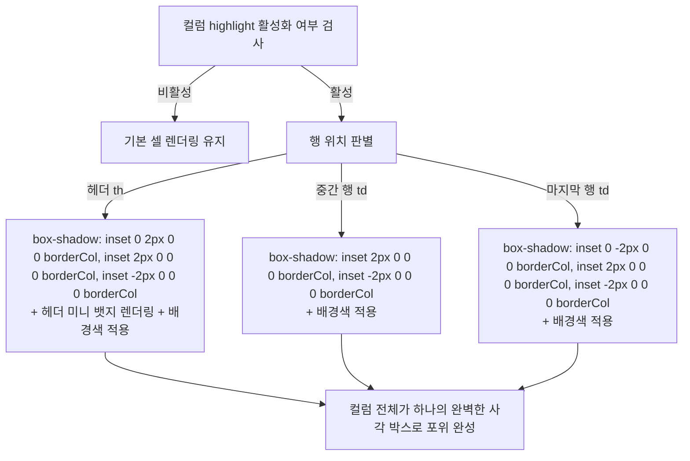

# Grid UI 특정 컬럼 강조(Highlight) 프리셋 시스템 구현 계획서

## 1. 개요 및 목적 (Overview & Goals)

본 계획서는 Workspace Editor의 **Grid UI 아톰(`.v4-grid-container`)**에 대해, 화면 기획 및 시스템 설계 시 신규로 추가되거나 변경된 컬럼을 시각적으로 직관적이게 강조(Highlight)할 수 있는 **[프리셋 중심의 원터치 컬럼 하이라이트 엔진]**을 구축하기 위한 정밀 기술 계획서입니다.

### 1.1. 해결하고자 하는 문제 및 필요성
- 쇼핑몰 백오피스, 어드민 화면, 목록 화면 설계 시 기존 컬럼(A, B, C, D) 사이에 **신규 컬럼**이 추가되거나 특정 컬럼이 **변경**되는 변경설계(As-Is / To-Be) 작업이 빈번하게 발생합니다.
- 현재의 Grid UI는 컬럼의 너비, 정렬, 타입, 링크 여부만 설정할 수 있어 특정 컬럼을 눈에 띄게 강조하려면 별도의 도형이나 주석 핀을 수동으로 덧그려야 하는 불편함이 있었습니다.
- 특정 컬럼에 대해 테두리 선(붉은색 라인 등)과 배경색(주황/레드/블루 등), 그리고 헤더 뱃지(NEW/MOD)를 원터치로 부여할 수 있는 네이티브 강조 기능이 필요합니다.

### 1.2. 핵심 목표
1. **원터치 프리셋 기반 사용자 경험 (One-Touch Preset UX)**:
   - 사이드바 인스펙터의 각 컬럼 카드에서 복잡한 수치 입력 없이 `[없음]` / `[🔴 신규(New)]` / `[🟠 변경(Mod)]` / `[🔵 포커스(Blue)]` 4대 프리셋 버튼을 원클릭하여 즉시 적용.
2. **테이블 border-collapse 충돌 회피 (Box-Shadow Inset Technique)**:
   - 그리드 테이블의 `border-collapse: collapse` 환경에서 일반 `border` 사용 시 발생하는 테두리 씹힘/우선순위 역전/1px 컬럼 폭 밀림 현상을 원천 방지하기 위해 `box-shadow: inset` 알고리즘을 적용하여 완벽한 사각 포위 렌더링 달성.
3. **헤더 미니 뱃지 자동 연동 (Header Badge Integration)**:
   - 신규(New) 또는 변경(Mod) 프리셋 선택 시 헤더 텍스트 우측에 가독성 높은 미니 알약 뱃지(`<span class="v4-col-badge">NEW</span>`)가 함께 렌더링되어 검토자 시선 유도 극대화.
4. **단일 진실 공급원(SSOT) 및 하위 호환성 100% 보장**:
   - 그리드 컨테이너의 `data-columns` JSON 속성에 `highlight` 메타데이터를 저장하며, 기존 생성된 스크린의 그리드 데이터와 100% 하위 호환.
   - 컬럼 순서 이동(▲/▼), 컬럼 삭제, 컬럼 추가 시에도 `highlight` 설정이 데이터와 함께 안전하게 추종.
5. **7대 필수 게이트웨이 및 무결성 100% 준수**:
   - `assets/vctrl_iframe_grid.js`의 백틱 충돌 0건, 브래킷 매칭 100%, 런타임 에러 0건, `scripts/check_syntax.ps1` 검증 통과.

---

## 2. 하이라이트 프리셋 사양 정의 (Preset Specifications)

| 프리셋 명칭 | 식별자 (`preset`) | 테두리 강조 (`box-shadow inset`) | 배경 강조 (`background`) | 헤더 미니 뱃지 (`badge`) | 주 용도 |
| :--- | :--- | :--- | :--- | :--- | :--- |
| **없음 (Default)** | `none` | 없음 (기본 그리드 테두리 `1.6px solid rgb(226,232,240)`) | 기본 화이트/Zebra | 없음 | 일반 컬럼 |
| **신규 (New / Red)** | `new` | `2px solid #ef4444` (선명한 붉은색) | `rgba(254, 242, 242, 0.55)` (은은한 연분홍) | `NEW` (배경: `#ef4444`, 텍스트: `#ffffff`) | 새로 추가된 신규 기능/항목 |
| **삭제 (Del / Orange)** | `del` (구 `mod`) | `2px solid #f97316` (선명한 주황색) | `rgba(255, 247, 237, 0.65)` (은은한 연주황) | `DEL` (배경: `#f97316`, 텍스트: `#ffffff`) | 삭제/폐기 예정인 항목 |
| **포커스 (Focus / Blue)** | `focus` | `2px solid #2563eb` (원스피어 블루) | `rgba(239, 246, 255, 0.65)` (은은한 연파랑) | 없음 (또는 `FOCUS`) | 주요 분석/조회 타깃 항목 |

---

## 3. 핵심 기술 아키텍처 및 렌더링 알고리즘 (Technical Architecture)

### 3.1. 데이터 모델 (SSOT) 스펙: `data-columns`
`.v4-grid-container` 요소의 `data-columns` 속성에 저장되는 컬럼 JSON 객체에 `highlight` 필드를 확장합니다.

```json
{
  "name": "전시상태",
  "type": "status",
  "width": "120px",
  "align": "center",
  "clickable": false,
  "highlight": {
    "enabled": true,
    "preset": "new",               // 'none' | 'new' | 'mod' | 'focus'
    "borderColor": "#ef4444",      // 프리셋 보더 색상
    "bgColor": "rgba(254, 242, 242, 0.55)", // 프리셋 배경 색상
    "badgeText": "NEW"             // 헤더 미니 뱃지 텍스트
  }
}
```

### 3.2. 테이블 `border-collapse: collapse` 환경에서의 `box-shadow: inset` 렌더링 로직

테이블이 `border-collapse: collapse`일 때 일반 `border`는 상하좌우 인접 셀의 선과 겹쳐서 우선순위 충돌을 일으키므로, **`box-shadow: inset`을 활용하여 레이아웃 폭을 밀어내지 않고 완벽한 박스 형태를 구성**합니다.



1. **헤더 셀 (`<th>`)**:
   - 상단(Top), 좌측(Left), 우측(Right) 3면을 닫음:
     `box-shadow: inset 0 2px 0 0 #ef4444, inset 2px 0 0 0 #ef4444, inset -2px 0 0 0 #ef4444 !important;`
   - 배경색: `background: rgba(254, 242, 242, 0.7) !important;`
   - 헤더 텍스트: `(col.name || "") + " ⇅" + <span class="v4-col-badge ...">NEW</span>`
2. **중간 데이터 셀 (`<td>`, `rIdx < rowCount - 1`)**:
   - 좌측(Left), 우측(Right) 2면만 연속 연결:
     `box-shadow: inset 2px 0 0 0 #ef4444, inset -2px 0 0 0 #ef4444 !important;`
   - 배경색: `background: rgba(254, 242, 242, 0.55) !important;`
3. **마지막 데이터 셀 (`<td>`, `rIdx === rowCount - 1`)**:
   - 하단(Bottom), 좌측(Left), 우측(Right) 3면을 닫음:
     `box-shadow: inset 0 -2px 0 0 #ef4444, inset 2px 0 0 0 #ef4444, inset -2px 0 0 0 #ef4444 !important;`
   - 배경색: `background: rgba(254, 242, 242, 0.55) !important;`

---

## 4. 사이드바 인스펙터 UI/UX 설계 (`assets/inspector/inspector_grid.js`)

각 컬럼 카드(`.grid-col-card`) 내에 정렬 및 Clickable 컨트롤 바로 아래에 **컬럼 강조 컨트롤러**를 배치합니다.

### 4.1. 컬럼 카드 내 UI 와이어프레임
```
[COLUMN 3] (신규)                     [▲] [▼] [×]
-------------------------------------------------
[항목타입: 일반 텍스트] [항목명: 신규컬럼] [가로크기: 140px]
[정렬: 좌 / 중 / 우]  [Clickable: Y / N]
-------------------------------------------------
컬럼 강조 (Highlight)
[ 없음 ]  [ 🔴 신규 (NEW) ]  [ 🟠 변경 (MOD) ]  [ 🔵 포커스 (BLUE) ]
```

### 4.2. 버튼 인터랙션 명세
- **버튼 쉐입**: 모던 알약형(Pill) 슬림 버튼 (`height: 20px`, `border-radius: 4px`, `font-size: 9.5px`)
- **선택 피드백**: 활성화된 프리셋 버튼에 컬러풀한 테두리 및 글로우 배경 부여 (예: 신규 선택 시 붉은 테두리 및 반투명 붉은 배경)
- **동작**: 클릭 즉시 `cCard.setAttribute('data-highlight-preset', presetKey)` 갱신 후 `notifyGrid({ columns: currentCols })`를 디스패치하여 캔버스 Iframe에 즉시 반영.

---

## 5. 파일별 상세 구현 계획 (File-by-File Implementation Plan)

### 5.1. `assets/vctrl_iframe_grid.js` (Iframe 렌더링 엔진)
> ⚠️ **주의**: 파일 전체가 백틱(`` ` ``)으로 감싸진 dynamic eval 모듈이므로, 중첩 백틱 금지 및 문자열 연결 연산자(`+`) 사용 엄격 준수.

1. **프리셋 맵 상수 정의 (`HIGHLIGHT_PRESETS`)**:
   ```javascript
   var HIGHLIGHT_PRESETS = {
       "none": { enabled: false },
       "new": { enabled: true, border: "#ef4444", bg: "rgba(254, 242, 242, 0.55)", badgeText: "NEW", badgeBg: "#ef4444", badgeColor: "#ffffff" },
       "mod": { enabled: true, border: "#f97316", bg: "rgba(255, 247, 237, 0.65)", badgeText: "MOD", badgeBg: "#f97316", badgeColor: "#ffffff" },
       "focus": { enabled: true, border: "#2563eb", bg: "rgba(239, 246, 255, 0.65)", badgeText: "", badgeBg: "#2563eb", badgeColor: "#ffffff" }
   };
   ```
2. **`renderGrid` 내 `th` 렌더링 업데이트**:
   - `col.highlight` 확인 후 활성화되어 있으면 상/좌/우 inset shadow 및 배경색 적용.
   - 뱃지 텍스트가 있을 경우 `<span class="v4-col-badge">` 엘리먼트 추가.
3. **`renderGrid` 내 `td` 렌더링 업데이트**:
   - `rIdx < rowCount - 1`: 좌/우 inset shadow 및 배경색 적용.
   - `rIdx === rowCount - 1`: 하/좌/우 inset shadow 및 배경색 적용.
4. **DOM 재사용 경로(Patching) 및 신규 생성 경로(Fresh HTML) 양쪽 동시 적용**:
   - 기존 테이블 요소를 재활용하는 루프와 Fresh HTML 생성 루프 양쪽에 동일한 스타일 로직 누락 없이 반영.

### 5.2. `assets/inspector/inspector_grid.js` (인스펙터 도메인 모듈)
1. **`renderColumnCards` 내 마크업 추가**:
   - 각 컬럼 카드에 `컬럼 강조` 라벨 및 4개 프리셋 버튼(`btn-col-hl-none`, `btn-col-hl-new`, `btn-col-hl-mod`, `btn-col-hl-focus`) 렌더링.
   - 현재 컬럼의 `col.highlight?.preset` 상태에 맞춰 활성 버튼 스타일 세팅.
2. **이벤트 바인딩**:
   - 각 프리셋 버튼 클릭 시 `div.setAttribute('data-highlight-preset', pKey)` 세팅 후 `triggerColUpdate()` 호출.
3. **`getCurrentColsFromInputs` 확장**:
   - 카드의 `data-highlight-preset` 값을 읽어와 `col.highlight = { enabled: pKey !== 'none', preset: pKey, ... }` 형태로 직렬화하여 반환.

### 5.3. `assets/vctrl_iframe_styles.js` (Iframe 스타일시트)
1. **`.v4-col-badge` 공통 클래스 정의**:
   - `display: inline-block !important; font-size: 9px !important; font-weight: 700 !important; line-height: 1 !important; padding: 2px 4px !important; border-radius: 3px !important; margin-left: 4px !important; vertical-align: middle !important; letter-spacing: 0.5px !important;`

---

## 6. 잠재 위험 요소 및 사전 방어 대책 (Risk Mitigation)

| 잠재 위험 요소 | 위험도 | 사전 방어 대책 |
| :--- | :---: | :--- |
| **`vctrl_iframe_grid.js` 백틱 충돌** | 높음 | 파일 전체가 백틱으로 감싸진 특성을 감안하여 중첩 백틱(`` ` ``) 및 `${...}` 사용 전면 금지, 일반 따옴표(`"`, `'`)와 `+` 연결 연산자만 사용 |
| **컬럼 폭 밀림 (Layout Shift)** | 중간 | `border` 대신 `box-shadow: inset`을 사용하여 셀의 물리적인 width/height 및 colgroup 픽셀 폭에 간섭 0건 보장 |
| **Zebra 줄무늬와 배경색 충돌** | 중간 | 하이라이트된 컬럼의 `background`는 `!important`로 강제하여 얼룩말 줄무늬 위에 일관되게 착색되도록 처리 |
| **컬럼 순서 이동(▲/▼) 시 설정 유실** | 낮음 | `getCurrentColsFromInputs`에서 모든 카드의 하이라이트 상태를 완벽히 수집하므로 순서 교체 시에도 상태 100% 보존 |
| **레거시 스크린 로드 시 undefined 에러** | 낮음 | `col.highlight?.enabled` 옵셔널 체이닝 및 기본값 fallback(`HIGHLIGHT_PRESETS['none']`) 가드 적용 |

---

## 7. 검증 및 테스트 시나리오 (Verification Scenarios)

1. **정적 검증**:
   - `powershell -ExecutionPolicy Bypass -File scripts/check_syntax.ps1` 실행하여 0 Syntax Errors 확인.
2. **컬럼 강조 프리셋 동작 검증**:
   - 신규(New) 버튼 클릭 시: 붉은 테두리(2px), 연분홍 배경, 헤더에 `NEW` 뱃지 정상 출력 확인.
   - 변경(Mod) 버튼 클릭 시: 주황 테두리(2px), 연주황 배경, 헤더에 `MOD` 뱃지 정상 출력 확인.
   - 포커스(Focus) 버튼 클릭 시: 파란 테두리(2px), 연파랑 배경 정상 출력 확인.
   - 없음(None) 버튼 클릭 시: 기본 일반 셀 스타일로 완벽 복원 확인.
3. **컬럼 추가/이동/삭제 연동 검증**:
   - 신규 컬럼을 추가하고 강조를 부여한 뒤, ▲/▼ 버튼으로 컬럼 순서를 이동해도 강조 스타일이 해당 컬럼을 정확히 따라가는지 확인.
   - 강조된 컬럼 삭제 시 깨짐 없이 나머지 컬럼들이 정상 렌더링되는지 확인.
4. **저장 및 새로고침 검증**:
   - 저장(`Ctrl+S`) 후 화면 새로고침 시 `data-columns`에 저장된 하이라이트 속성이 온전히 복원되는지 확인.
