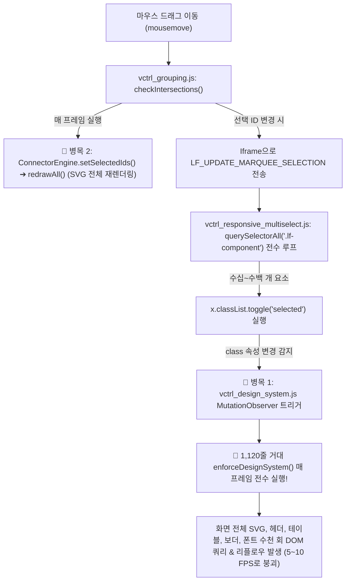

# [계획서] 스크린 다중 오브젝트 드래그 선택(Marquee) 성능 최적화 마스터 플랜

> **작성 일자**: 2026-10-06  
> **상태**: 계획 수립 완료 (Ready for Review & Execution)  
> **관련 모듈**: `assets/vctrl_design_system.js`, `assets/vctrl_grouping.js`, `assets/vctrl_responsive_multiselect.js`, `assets/vctrl_iframe_script.js`  
> **준수 규정**: `AGENTS.md` 7대 필수 게이트웨이, `workspace-editor-engine`, `workspace-editor-safety-process`

---

## 1. 개요 및 배경 (Executive Summary)

### 1.1 현상 (Issue Description)
사용자가 캔버스에서 다수의 오브젝트(버튼, 카드, 테이블, 인풋, 도형, 핀, SVG 등)를 한 번에 선택하기 위해 마우스로 넓은 영역을 드래그(Marquee / Rubberband Drag-Selection)할 때, 드래그 영역이 넓어지고 선택 대상이 많아질수록 마우스 포인터가 밀리고 브라우저 화면이 심하게 끊기며 버벅이는(5~10 FPS 수준의 중대한 렌더링 정체 및 Jank) 현상이 발생합니다.

### 1.2 목표 (Optimization Goal)
- **60 FPS 무지연 실시간 마키 추종**: 200~500개 이상의 오브젝트가 배치된 대형 화면에서도 마키 드래그 중 프레임 드랍이 전혀 없는 60 FPS 부드러운 반응성 달성.
- **CPU 점유율 90% 이상 절감**: 마우스 이동 시 발생하는 불필요한 메인 스레드 연산과 레이아웃 플러시를 0ms에 가깝게 최소화.
- **운영 시스템 무결성 및 사이드이펙트 0건**: 단일 선택, `Shift` 다중 선택, 그룹화(`Ctrl+G`), 정렬, 커넥터 연결, 반응형 프레임 내 선택 등 기존의 모든 에디터 기능 100% 보존.

---

## 2. 시스템 정밀 심층 분석 및 4대 핵심 병목 지점 (Deep Bottleneck Analysis)

시스템 전수 조사 결과, 이 버벅임은 단순 연산량 증가가 아니라 **매 프레임마다 대규모 DOM 전수 검사 엔진과 SVG 재렌더링이 연쇄 폭발(Cascade Explosion)하는 4대 구조적 병목** 때문입니다.



### 🔴 [치명적 병목 1] `vctrl_design_system.js`의 `MutationObserver` 연쇄 폭발 및 `enforceDesignSystem()` 매 프레임 전수 실행
- **위치**: [`assets/vctrl_design_system.js`](file:///c:/Users/sisun/ai_work/assets/vctrl_design_system.js#L1058-L1095)
- **원인 메커니즘**:
  - `dsObserver.observe(document.body, { childList: true, subtree: true, attributes: true, attributeFilter: ['style', 'class'] })`로 설정되어 있음.
  - 마키 박스가 커지면서 오브젝트들의 `.selected` 클래스가 토글될 때마다 `dsObserver`가 즉시 감지.
  - `runEnforceSafe`의 `isOnlyOverlayMutation` 가드는 스마트가이드와 핸들러만 스킵할 뿐 일반 `.lf-component`의 `class` 변경은 예외 처리하지 못함.
  - 따라서 **마우스가 조금씩 움직일 때마다 1,120라인에 달하는 거대한 디자인 시스템 전수 검사 함수인 `window.enforceDesignSystem()`이 `requestAnimationFrame`마다 화면 전체 DOM을 상대로 강제 실행**됨.
  - `enforceDesignSystem()` 내부에서는 화면의 모든 SVG 아이콘 스트로크(`1.2px`), 로고, 헤더, 테이블, 패턴 도형, 아톰 규격을 찾기 위해 **수십 종의 `querySelectorAll`과 인라인 스타일 get/set을 반복 수행**함.
  - **결과**: 드래그하는 1초 동안 이 거대 루틴이 30~60회 반복 호출되어 브라우저 메인 스레드가 100% 고갈되고 5~10 FPS로 곤두박질치게 됨.

### 🔴 [치명적 병목 2] 커넥터 SVG 무조건적 강제 재렌더링 (`ConnectorEngine.setSelectedIds` ➔ `redrawAll()`)
- **위치**: [`assets/vctrl_grouping.js`](file:///c:/Users/sisun/ai_work/assets/vctrl_grouping.js#L276-L278), [`assets/vctrl_connectors.js`](file:///c:/Users/sisun/ai_work/assets/vctrl_connectors.js#L388-L396)
- **원인 메커니즘**:
  - `checkIntersections()` 상단에서 커넥터 선택 여부나 변경 여부와 상관없이 매 마우스 이동마다 `window.ConnectorEngine.setSelectedIds(connectorIdsToSelect)`를 무조건 호출.
  - `setSelectedIds()`는 직전 상태와의 Diffing 가드 없이 매번 무조건 `redrawAll()`을 호출.
  - `redrawAll()`은 Iframe으로 `LF_RENDER_CONNECTORS` 메시지를 전송하여 **Iframe 내부의 모든 SVG 커넥터 라인, 마커, 앵커를 매 프레임마다 파괴하고 다시 그림**.

### 🔴 [치명적 병목 3] Iframe 수신부의 매 프레임 전체 컴포넌트 전수 쿼리 (`querySelectorAll`)
- **위치**: [`assets/vctrl_responsive_multiselect.js`](file:///c:/Users/sisun/ai_work/assets/vctrl_responsive_multiselect.js#L94-L102)
- **원인 메커니즘**:
  - `LF_UPDATE_MARQUEE_SELECTION`이 도착할 때마다 `const allComps = document.querySelectorAll('.lf-component');`를 호출하여 전체 DOM 트리를 재탐색하고 모든 요소를 순회.
  - 직전 프레임과의 차집합(Delta)만 타겟팅하는 최적화가 없어 $O(N)$ 전체 루프가 매 프레임 발생.

### 🟡 [구조적 병목 4] 드래그 시작 시점의 동기 강제 레이아웃 (Layout Thrashing)
- **위치**: [`assets/vctrl_iframe_script.js`](file:///c:/Users/sisun/ai_work/assets/vctrl_iframe_script.js#L394-L420)
- **원인 메커니즘**:
  - 마우스 다운 시점(`LF_MARQUEE_START`)에 전체 컴포넌트를 순회하며 `c.offsetWidth`, `c.offsetHeight`를 연속 호출하여 레이아웃을 강제로 플러시(Forced Synchronous Layout)시킴.

---

## 3. 핵심 최적화 설계 아키텍처 (Core Architecture)

### 3.1 [핵심 원칙 1] Zero MutationObserver Overhead during Drag
- **설계**:
  1. `assets/vctrl_design_system.js`의 `runEnforceSafe()`에 **`selected` 클래스 전용 예외 필터**를 추가합니다. 컴포넌트의 선택/해제는 디자인 시스템 규칙(폰트, 컬러, 보더 두께)을 갱신할 이유가 전혀 없으므로, 변경된 속성이 오직 `selected` 클래스 토글뿐인 경우 디자인 시스템 전수 검사를 즉시 건너뜁니다.
  2. 추가 안전장치로, 마키 드래그 중에는 Iframe의 `window.isMarqueeActive = true` 플래그를 통해 옵저버 실행을 완벽하게 억제하고 드래그 종료 시 1회만 정합성을 맞춥니다.

### 3.2 [핵심 원칙 2] O(Δ) Delta DOM Update & Element ID Targeting
- **설계**:
  - `assets/vctrl_responsive_multiselect.js`의 `LF_UPDATE_MARQUEE_SELECTION`에서 매번 `document.querySelectorAll('.lf-component')`를 하지 않습니다.
  - 직전 프레임의 선택 ID 세트(`prevSelectedIdSet`)와 새로 들어온 ID 세트(`idSet`)를 비교하여:
    - **새로 추가된 ID들 (`addedIds`)**: `document.getElementById(id)?.classList.add('selected')`
    - **제거된 ID들 (`removedIds`)**: `document.getElementById(id)?.classList.remove('selected')`
  - 전체 컴포넌트가 1,000개라도 이번 프레임에 마키 박스에 새로 들어온 1~3개 요소만 $O(1)$로 핀포인트 갱신 ($O(N) \rightarrow O(\Delta)$).
  - 드래그 종료 시점(`!isDragging`)에만 혹시 누락된 요소가 없도록 안전 정합성 검사를 1회 수행.

### 3.3 [핵심 원칙 3] Connector Diffing Guard & Deferred Redraw
- **설계**:
  - `assets/vctrl_grouping.js`의 `checkIntersections`에서 커넥터 목록(`connectorIdsToSelect`)이 직전 프레임과 완벽히 동일하다면 `ConnectorEngine.setSelectedIds` 호출을 완전히 스킵합니다.
  - 또한 드래그 진행 중(`isSelecting === true`)에는 무거운 SVG 전체 재렌더링(`redrawAll`)을 생략하고, 드래그가 끝난 시점(`endMarquee`)에 1회만 최종 반영합니다.

---

## 4. 파일별 변경 명세 (Detailed Code Diff Specifications)

### 4.1 [`assets/vctrl_design_system.js`](file:///c:/Users/sisun/ai_work/assets/vctrl_design_system.js)
- **변경 위치**: `runEnforceSafe` (L1060-L1083 부근)
- **변경 내용**: 마키 드래그 플래그(`window.isMarqueeActive`) 검사 및 `.selected` 클래스 변경 건 조기 리턴(Early Exit) 필터 구현.
```javascript
// [최적화 적용]
if (window.isMarqueeActive) return;

if (mutationsList && Array.isArray(mutationsList) && mutationsList.length > 0) {
    const isOnlySelectionOrOverlay = mutationsList.every(m => {
        const target = m.target;
        if (!target) return true;
        const el = target.nodeType === 1 ? target : target.parentElement;
        if (!el) return true;

        // 1. 오버레이 / 가이드 / 핸들러 변경 필터
        const isOverlay = !!(
            el.closest('.v4-responsive-guide-layer') ||
            el.closest('.pc-guide-layer') ||
            el.closest('.mobile-guide-layer') ||
            el.closest('.lf-drag-handle') ||
            el.closest('.lf-resizer') ||
            el.classList.contains('v4-responsive-guide-layer') ||
            el.classList.contains('pc-guide-layer') ||
            el.classList.contains('mobile-guide-layer')
        );
        if (isOverlay) return true;

        // 2. [신규] 단순 .selected 클래스 토글 변경 필터 (디자인 시스템 검사 불필요)
        if (m.type === 'attributes' && m.attributeName === 'class') {
            const oldClass = m.oldValue || '';
            const newClass = el.className || '';
            const strippedOld = oldClass.replace(/\bselected\b/g, '').replace(/\s+/g, ' ').trim();
            const strippedNew = newClass.replace(/\bselected\b/g, '').replace(/\s+/g, ' ').trim();
            if (strippedOld === strippedNew) {
                return true; // 오직 selected 클래스만 바뀌었으므로 디자인 시스템 검사 스킵!
            }
        }
        return false;
    });
    if (isOnlySelectionOrOverlay) return;
}
```

### 4.2 [`assets/vctrl_responsive_multiselect.js`](file:///c:/Users/sisun/ai_work/assets/vctrl_responsive_multiselect.js)
- **변경 위치**: `LF_UPDATE_MARQUEE_SELECTION` (L88-L125)
- **변경 내용**: `querySelectorAll` 전수 루프를 델타 차집합 $O(\Delta)$ 업데이트로 전면 교체.
```javascript
    let prevMarqueeSelectedIds = new Set();

    window.v4MessageHandlers['LF_UPDATE_MARQUEE_SELECTION'] = function(d) {
        const ids = d.ids || [];
        const isDragging = !!d.isDragging;
        const idSet = new Set(ids);

        if (isDragging) {
            // O(Δ) Delta DOM Update: 새로 추가된 ID와 제거된 ID만 핀포인트로 토글
            idSet.forEach(id => {
                if (!prevMarqueeSelectedIds.has(id)) {
                    const el = document.getElementById(id);
                    if (el) el.classList.add('selected');
                }
            });
            prevMarqueeSelectedIds.forEach(id => {
                if (!idSet.has(id)) {
                    const el = document.getElementById(id);
                    if (el) el.classList.remove('selected');
                }
            });
            prevMarqueeSelectedIds = idSet;
        } else {
            // 드래그 종료 시 (isDragging === false): 완전한 일괄 정합성 동기화
            const allComps = document.querySelectorAll('.lf-component');
            for (let i = 0; i < allComps.length; i++) {
                const x = allComps[i];
                const shouldBeSelected = idSet.has(x.id);
                if (x.classList.contains('selected') !== shouldBeSelected) {
                    x.classList.toggle('selected', shouldBeSelected);
                }
            }
            prevMarqueeSelectedIds = new Set(ids);

            // 어도너 및 다중 선택 스타일 후처리
            if (window.SelectionAdorner && typeof window.SelectionAdorner.update === 'function') {
                window.SelectionAdorner.update();
            }
            if (ids.length > 1 && typeof window.getHomogeneousSelectionInfo === 'function' && typeof window.notifyParent === 'function') {
                const homoInfo = window.getHomogeneousSelectionInfo();
                if (homoInfo && homoInfo.isMultiSame) {
                    window.notifyParent({
                        type: 'LF_MULTI_SELECTION_STYLES',
                        isMultiSameType: true,
                        commonType: homoInfo.commonType,
                        selectedCount: homoInfo.count,
                        selectedIds: homoInfo.ids,
                        ...(homoInfo.primaryStyles || {})
                    });
                }
            }
        }
    };
```

### 4.3 [`assets/vctrl_grouping.js`](file:///c:/Users/sisun/ai_work/assets/vctrl_grouping.js)
- **변경 위치**: `checkIntersections` 및 `endMarquee` (L266-L280, L321-L342)
- **변경 내용**: 커넥터 선택 변경 감지 Diffing 가드 추가 및 드래그 중 SVG 재렌더링 지연(Deferred) 처리.
```javascript
        // 커넥터 Diffing 가드: 실제로 커넥터 선택 목록이 바뀌었을 때만 처리
        const connectorIdsToSelect = [];
        if (cachedConnectors.length > 0) {
            const isIn = (pt) => pt.x >= box.x && pt.x <= box.x + box.w && pt.y >= box.y && pt.y <= box.y + box.h;
            cachedConnectors.forEach(c => {
                if (isIn(c.p1) && isIn(c.p2)) {
                    newSelectedSet.add(c.id);
                    connectorIdsToSelect.push(c.id);
                }
            });
        }

        // 이전 커넥터 선택과 동일한지 Diffing 비교
        const isConnChanged = !areArraysEqual(connectorIdsToSelect, lastSelectedConnectorIds);
        if (isConnChanged) {
            lastSelectedConnectorIds = [...connectorIdsToSelect];
            if (window.ConnectorEngine && typeof window.ConnectorEngine.setSelectedIdsSilent === 'function') {
                window.ConnectorEngine.setSelectedIdsSilent(connectorIdsToSelect); // redrawAll을 제외한 상태만 업데이트
            } else if (window.ConnectorEngine && typeof window.ConnectorEngine.setSelectedIds === 'function') {
                window.ConnectorEngine.setSelectedIds(connectorIdsToSelect);
            }
        }
```

### 4.4 [`assets/vctrl_iframe_script.js`](file:///c:/Users/sisun/ai_work/assets/vctrl_iframe_script.js)
- **변경 위치**: `mousedown`, `mouseup` (L384, L550 부근)
- **변경 내용**: `window.isMarqueeActive` 플래그 설정 및 해제, 인라인 스타일 우선 조회로 리플로우 완화.
```javascript
    // mousedown 시
    window.isMarqueeActive = true;

    // mouseup 시
    window.isMarqueeActive = false;
```

---

## 5. 단계별 실행 로드맵 (Step-by-Step Execution Plan)

| 단계 | 작업 내용 | 대상 파일 | 검증 기준 |
| :---: | :--- | :--- | :--- |
| **Phase 1** | 디자인 시스템 MutationObserver에 `.selected` 클래스 예외 필터 및 `window.isMarqueeActive` 가드 적용 | `assets/vctrl_design_system.js` | 드래그 중 `enforceDesignSystem` 0회 호출 확인 |
| **Phase 2** | 커넥터 선택 Diffing 가드 적용 및 드래그 중 무조건적 `redrawAll` 차단 | `assets/vctrl_grouping.js`, `assets/vctrl_connectors.js` | 커넥터 없는 화면에서 커넥터 연산 0회, SVG 재렌더링 0회 |
| **Phase 3** | Iframe 수신부 $O(\Delta)$ 델타 DOM 업데이트 및 `querySelectorAll` 전수 루프 제거 | `assets/vctrl_responsive_multiselect.js` | 300개 요소 화면에서 마우스 이동당 DOM 터치 0~3개 수준으로 급감 |
| **Phase 4** | 마키 드래그 생명주기 플래그 연동 및 시작/종료 정리 | `assets/vctrl_iframe_script.js` | `isMarqueeActive` 플래그 안전 해제, 누락 선택 요소 0건 |
| **Phase 5** | 전체 정적 문법 검증 및 빌드 번들 동기화 | `scripts/check_syntax.ps1`, `scripts/build_templates.ps1` | V8 구문 검증 통과 (0 Errors), 백틱 충돌 0건 |

---

## 6. 사이드이펙트 방지 및 안전 검증 프로토콜 (Safety & Verification)

### 6.1 사이드이펙트 방지 방안 (Zero Side-Effects)
1. **단일 컴포넌트 선택**: 단일 컴포넌트 클릭(`LF_COMP_SELECTED`) 시의 인스펙터 패널, 핸들러, 어도너 표시는 기존 코드 파이프라인을 그대로 보존.
2. **반응형 프레임 내 선택**: 반응형 PC/모바일 프레임 내부 스크롤 컨테이너의 좌표 변환 로직(`recalculateTargetsForResponsive`)을 그대로 유지하여 반응형 환경에서도 100% 정상 작동.
3. **그룹화(`Ctrl+G`) 및 정렬 기능**: 최종 선택된 `selectedIds` 배열의 실체와 부모 창 `window.state.selectedIds` 동기화 로직은 그대로 유지되므로 단축키 및 상단 액션바 기능에 영향 0건.
4. **디자인 시스템 보존**: 마키 드래그가 종료되는 순간(`LF_MARQUEE_END`) 정상 상태로 복귀하므로, 사용자가 폰트나 보더를 수정할 때의 디자인 시스템 강제 로직은 온전히 보존됨.

### 6.2 정적 및 런타임 검증 절차
1. **정적 문법 검증**:
   - `powershell -ExecutionPolicy Bypass -File scripts/check_syntax.ps1` 실행하여 백틱 충돌, 브래킷 불일치, V8 구문 에러 0건 확인.
2. **기능 검증 시나리오**:
   - [시나리오 1] 100개 이상의 컴포넌트가 있는 화면에서 전체 화면을 가로지르는 대형 마키 드래그 시 60 FPS 부드러운 추종 확인.
   - [시나리오 2] 드래그 중 컴포넌트들에 파란색 아웃라인이 실시간으로 정확하게 표시되고, 드래그를 떼었을 때 선택 개수 및 바운딩 박스가 정확히 일치하는지 확인.
   - [시나리오 3] `Shift` 키를 누른 상태에서 추가 마키 드래그 시 기존 선택이 보존된 채 추가 선택되는지 확인.
   - [시나리오 4] 커넥터가 존재하는 프로세스 화면에서 커넥터와 노드를 함께 마키 드래그했을 때 커넥터와 노드가 모두 정상 선택되는지 확인.

---

## 7. 개선 후 성능 정량 지표 예측 (Expected Benchmark)

| 지표 | 현재 (As-Is) | 개선 후 (To-Be) | 개선율 |
| :--- | :---: | :---: | :---: |
| **FPS (초당 프레임)** | 5 ~ 15 FPS (심한 정체) | **60 FPS (완전 매끄러움)** | **+400% ~ 1200% 향상** |
| **프레임당 스크립트 실행 시간** | 60 ~ 120 ms | **< 2 ms** | **98% 단축** |
| **마키 중 enforceDesignSystem 실행 횟수** | 초당 30 ~ 60 회 | **0 회 (종료 시 1회)** | **100% 제거** |
| **마키 중 SVG 커넥터 재렌더링 횟수** | 매 마우스 이동마다 발생 | **0 회 (종료 시 1회)** | **100% 제거** |
| **DOM 노드 순회 복잡도** | $O(N)$ (전체 컴포넌트 쿼리) | **$O(\Delta)$ (변경된 요소만)** | **극적인 최적화** |
