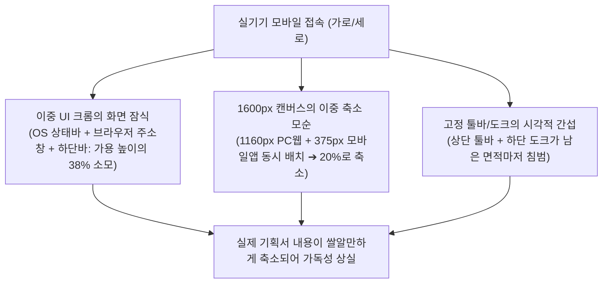

# 📱 모바일 이머시브 풀스크린 & PWA 구축 마스터 플랜 (Mobile Immersive Fullscreen & PWA Master Plan)

> **문서 버전**: 1.0.0  
> **작성 일자**: 2026-10-08  
> **기반 분석**: [AGENTS.md 7대 필수 게이트웨이 SSOT](file:///c:/Users/sisun/ai_work/AGENTS.md), [.agents/skills/workspace-editor-safety-process/SKILL.md](file:///c:/Users/sisun/ai_work/.agents/skills/workspace-editor-safety-process/SKILL.md), [실기기 모바일 캡처 화면 2종 분석](file:///c:/Users/sisun/.gemini/antigravity-ide/brain/66b81d40-13df-4cca-84b1-57a339bc9d71/.user_uploaded/media_1791428236141.png)  
> **핵심 과제**: **"브라우저 주소창과 시스템 바를 소멸시키고, 폰 화면 100%를 활용하는 극강의 모바일 뷰어 경험 구축"**

---

## 1. 📌 현황 진단: 사용자가 체감하는 불편함의 3대 근본 원인

사용자께서 첨부해주신 실제 모바일(안드로이드 삼성 인터넷/크롬) 캡처 화면을 정밀 계측하여 도출한 병목 원인은 다음과 같습니다:



### 1.1 계측된 3대 병목 지점
1. **브라우저 UI 크롬(Chrome)의 과도한 잠식**:
   - 모바일 OS 상단 상태바 + 브라우저 상단 주소창(`bychoi-space.github.io`) + 브라우저 하단 내비게이션 바(뒤로가기/홈/탭)가 전체 화면 높이의 **약 38%를 강제 점유**하고 있습니다.
2. **1600px 듀얼 프레임 슬라이드의 극단적 축소**:
   - 현재 열람 중인 `08_Responsive_PC_Mobile_889.html` 화면은 **[PC 웹(1160px)]**과 **[모바일 앱(375px)]**이 가로로 나란히 배치된 1600px 캔버스입니다.
   - 스마트폰 세로폭(~393px)에 1600px 전체를 맞추다 보니 **배율이 20~24%로 급격히 떨어져** 텍스트를 읽을 수 없습니다.
   - **아이러니하게도 화면 내부에는 이미 375px 크기의 완벽한 모바일 앱 목업(`mobile-frame`)이 존재**함에도, PC 화면과 함께 축소되는 바람에 모바일 기기에서 실제 앱처럼 볼 수 없습니다.
3. **상시 노출 툴바에 의한 집중도 분산**:
   - 감상/리뷰 목적임에도 에디터 상단 툴바(46px)와 하단 플로팅 도크(50px)가 상시 노출되어 콘텐츠 뷰포트가 더욱 좁아집니다.

---

## 2. ⚖️ 전략적 선택: "네이티브 모바일 앱" vs "PWA + 이머시브 웹앱" 비교

사용자께서 질문해주신 *"MOBILE 전용 APP으로 개발해야 할까?"*에 대한 기술적, 비용적, 운영적 비교 분석입니다:

| 비교 항목 | 방식 A: 별도 네이티브 앱 신규 개발 (Flutter / React Native) | 방식 B (강력 추천): PWA (Progressive Web App) + Fullscreen API |
| :--- | :--- | :--- |
| **브라우저 주소창 제거** | 100% 제거 (순수 앱 실행) | **100% 제거** (홈 화면 추가 시 `display: standalone`으로 실행되어 주소창/하단바 완전 소멸) |
| **기기 풀스크린 (100% 핏)** | 지원 | **지원** (`Fullscreen API` 및 Safe-area inset 완벽 대응) |
| **개발 소요 기간** | 최소 **2~3개월** (화면 렌더링 엔진 전체 재작성 필요) | **1~2일 내 즉시 완료** (기존 뷰어 쉘 확장) |
| **배포 및 업데이트** | 구글 플레이/애플 앱스토어 심사 필수 (수정마다 1~3일 대기) | **GitHub Pages 즉시 배포 (1초 컷)** |
| **운영 비용 & 호환성** | 애플 개발자 계정(연 $99), Android/iOS 파편화 유지보수 | **비용 0원, 모든 모바일 기기(Galaxy, iPhone, iPad) 100% 호환** |
| **기존 데이터 연동** | 별도 API 서버 구축 필수 | **현재의 GitHub 저장소 및 HTML 화면들과 100% 직결** |

> 💡 **전략적 결론**: **네이티브 앱을 새로 만들 필요가 전혀 없습니다.**  
> 웹 표준 기술인 **PWA(Progressive Web App)**와 **HTML5 Fullscreen API**를 적용하면, 앱스토어 심사나 별도 앱 개발 없이도 **스마트폰 홈 화면에서 아이콘 터치 한 번으로 브라우저 창이 100% 사라진 순수 앱 형태로 구동**됩니다.

---

## 3. 🎯 4대 핵심 혁신 솔루션 (Core Architecture)

```
┌─────────────────────────────────────────────────────────────┐
│                    Mobile Display (100%)                    │
├─────────────────────────────────────────────────────────────┤
│  [1] PWA Standalone + Fullscreen API                        │
│      ➔ 브라우저 주소창, 하단 내비게이션 바 완전 소멸       │
├─────────────────────────────────────────────────────────────┤
│  [2] 스마트 프레임 1:1 포커스 스위처 (Smart Frame Switcher)  │
│      [📱 모바일 앱 1:1]   [💻 PC 웹 핏]   [↔ 전체 슬라이드]   │
│      ➔ 375px 모바일 목업을 내 폰 화면에 실제 앱처럼 100% 핏 │
├─────────────────────────────────────────────────────────────┤
│  [3] 이머시브 젠 모드 (Tap-to-Hide Immersive Zen View)      │
│      ➔ 캔버스 탭 1회: 상단 툴바 & 하단 도크 자동 슬라이드 아웃│
│      ➔ 순수 기획 콘텐츠만 화면 가득 100% 노출               │
├─────────────────────────────────────────────────────────────┤
│  [4] 스마트 오토 핏 (Portrait Top Snap & Landscape Slim)    │
│      ➔ 세로모드: 상단 정렬 + 좌우 꽉참 (여백 제로)         │
│      ➔ 가로모드: 초슬림 미니 툴바 + 파노라마 뷰            │
└─────────────────────────────────────────────────────────────┘
```

---

### 솔루션 1: PWA (Web App Manifest) & 원터치 OS 풀스크린

1. **PWA Standalone Manifest (`manifest.json`) 신설**:
   - `display: "standalone"`, `orientation: "any"`, `background_color: "#0f1115"`, `theme_color: "#12151c"` 설정.
   - 브라우저에서 **[홈 화면에 추가]** 또는 **[앱 설치]** 선택 시, 스마트폰 바탕화면에 앱 아이콘 생성.
   - 바탕화면 앱 아이콘 클릭 실행 시: **브라우저 주소창 및 하단바가 100% 소멸**된 순수 앱 창으로 기동.
2. **원터치 OS 풀스크린 (`requestFullscreen`)**:
   - 브라우저 탭 상태로 접속한 경우에도 하단 도크의 `[⛶ 전체화면]` 버튼을 탭하면 브라우저 상하단 크롬을 숨기고 기기 풀스크린으로 진입.

---

### 솔루션 2: 듀얼 프레임 1:1 스마트 포커스 스위처 (가장 파격적인 UX 개선)

현재 캡처 화면과 같이 `08_Responsive_PC_Mobile_889.html` 등 반응형/비교 화면에는 **[PC 웹]**과 **[모바일 앱]**이 함께 들어있습니다.

* **동작 원리**:
  1. `vctrl_resolution_engine.js`가 화면 로드 시 iframe 내부의 `.pc-column`, `.mobile-column`, `.mobile-frame`을 자동 탐지.
  2. 모바일/협소 해상도(<= 900px) 감지 시 도크 상단 또는 하단에 **스마트 스위처 알약(Pill)** 자동 노출:
     - **`[ 📱 모바일 뷰 ]`**: 우측의 375px 모바일 프레임을 기기 가로폭(393px)에 맞춰 **스케일 1.0(100% 실기기 크기)**로 화면 정중앙에 꽉 채워 배치!  
       👉 **사용자는 폰을 들고 실제 앱을 사용하는 것처럼 위아래로 자연스럽게 스크롤하며 실물 크기로 검토 가능!**
     - **`[ 💻 PC 뷰 ]`**: 좌측의 PC 프레임(1160px)만을 화면 가로폭에 꽉 차게 확대(스케일 ~0.34)하여 모바일 프레임 간섭 없이 PC 기획만 넓게 확인.
     - **`[ ↔ 전체 ]`**: 기존 1600px 캔버스 전체를 축소하여 한눈에 조망.

---

### 솔루션 3: 탭 제어형 이머시브 젠 모드 (Immersive Zen View)

유튜브 풀스크린이나 피그마 모바일 앱처럼 화면 터치로 UI를 숨기는 기능입니다.

* **동작 원리**:
  - **캔버스 영역 1회 가볍게 탭 (Single Tap)**:
    - 상단 툴바가 위쪽으로 슬라이드 아웃 (`transform: translateY(-100%)`)
    - 하단 도크가 아래쪽으로 슬라이드 아웃 (`transform: translateY(150%)`)
    - 화면에 오직 **기획 화면만 100% 노출**되는 무간섭 몰입 상태 진입.
  - **다시 1회 탭 또는 화면 하단 스와이프**:
    - 툴바와 도크가 부드럽게 복귀.
  - 도크 버튼을 누르거나 핀치 줌/패닝 제스처 중에는 UI 숨김이 발동하지 않도록 제스처 충돌 방지 가드 적용.

---

### 솔루션 4: 가로(Landscape) / 세로(Portrait) 오토 핏

* **가로 모드 (Landscape)**:
  - 툴바 높이를 38px로 극단적 압축, PC/모바일 듀얼 프레임이 가로로 시원하게 보이도록 높이 기준 핏(`Fit-to-Height`) 자동 전환.
* **세로 모드 (Portrait)**:
  - 검은 상하단 빈 공간(Void)을 제거하고 컨텐츠 상단(`y = 0`) 스냅 및 모바일 프레임 1:1 오토 줌.

---

## 4. 📁 파일별 변경 명세 및 개발 아키텍처

| 파일 경로 | 작업 내용 | 안전 원칙 (Gateway) |
| :--- | :--- | :--- |
| **[manifest.json](file:///c:/Users/sisun/ai_work/manifest.json)** (신규) | PWA 웹앱 매니페스트 (이름, 아이콘, `display: standalone`, `theme_color`) | 신규 파일 분리, 기존 코드 무간섭 |
| **[assets/sw.js](file:///c:/Users/sisun/ai_work/assets/sw.js)** (신규) | PWA 설치 요건을 충족하는 초경량 서비스 워커 등록 | 네트워크 패스스루 모드, 캐시 꼬임 원천 차단 |
| **[assets/responsive_workspace.css](file:///c:/Users/sisun/ai_work/assets/responsive_workspace.css)** | • 이머시브 젠 모드 스타일 (`.zen-mode .toolbar`, `.zen-mode .v4-bottom-dock`)<br>• 스마트 프레임 스위처 UI 스타일 (`.v4-frame-switcher`) | 데스크톱 미디어 쿼리 격리, 100% 순수 CSS 트랜지션 |
| **[assets/vctrl_resolution_engine.js](file:///c:/Users/sisun/ai_work/assets/vctrl_resolution_engine.js)** | • `requestFullscreen()` 원터치 전체화면 컨트롤러<br>• 스마트 프레임 탐지 및 1:1 포커스 카메라 연산 (`focusFrame('mobile'|'pc'|'full')`)<br>• 캔버스 단일 탭 이머시브 젠 모드 토글러 | 7대 게이트웨이 준수, VM 컴파일 100% 통과 |
| **[viewer.html](file:///c:/Users/sisun/ai_work/viewer.html)** | • `<link rel="manifest" href="manifest.json">` 및 모바일 웹앱 메타태그 추가<br>• 도크에 `[⛶ 전체화면]` 및 `[스마트 스위처]` UI 마크업 정적 배치 | 캐시 버스터 갱신, 기존 데스크톱 기능 100% 보존 |

---

## 5. 🚀 3단계 단계별 실행 계획 (Action Roadmap)

### Phase 1: PWA Standalone & 원터치 브라우저 제거 (즉시 착수)
* `manifest.json` 및 모바일 웹앱 메타태그 구성.
* 도크 내 `[⛶ 전체화면]` 클릭 시 모바일 OS 전체화면(`requestFullscreen`) 즉시 연동.
* 사용자가 모바일 브라우저 메뉴에서 **"홈 화면에 추가(앱 설치)"**를 누르면 즉시 주소창 없는 순수 앱으로 구동되도록 기반 완성.

### Phase 2: 이머시브 젠 모드 (Tap-to-Hide UI)
* 캔버스 탭 시 상단 툴바와 하단 도크가 자동으로 숨겨지고, 다시 탭하면 나타나는 몰입 뷰 완성.
* 제스처(핀치줌, 드래그 패닝) 중에는 UI가 오작동하지 않도록 방어 코드 결합.

### Phase 3: 모바일 프레임 1:1 단독 핏 스위처 (스마트 뷰포트)
* 화면 내 `mobile-frame` 탐지 엔진 연동.
* `[📱 모바일 뷰] | [💻 PC 뷰] | [↔ 전체]` 스위처 제공.
* 폰으로 접속 시 기본값을 `[📱 모바일 뷰 1:1]`로 자동 설정하여, 접속하자마자 실제 앱 화면이 폰에 꽉 차게 표시되도록 구현.

---

## 6. 🚨 무결성 보증 (7 Mandatory Gateways)

1. **기존 데이터 보존**: 기존 `metadata.json`, 화면 HTML 파일들의 DOM/인라인 코드를 일체 변조하지 않습니다.
2. **PC 데스크톱 영향도 0%**: 데스크톱 와이드 해상도(>= 1200px)에서는 기존 편집기 및 뷰포트가 100% 동일하게 유지됩니다.
3. **정적 및 헤드리스 검증**: 각 단계 완료 시마다 `scripts/check_syntax.ps1` 및 `scripts/verify_all.ps1`을 실행하여 0 Syntax Errors, 0 Runtime Errors를 검증합니다.
