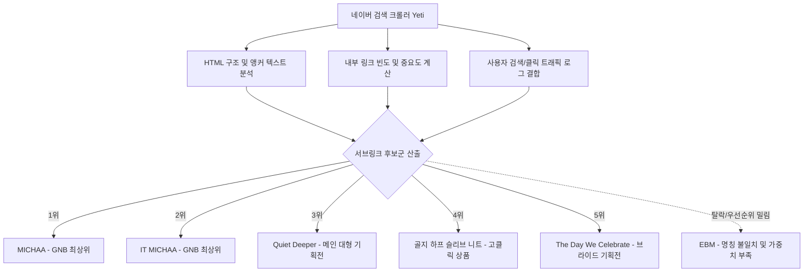
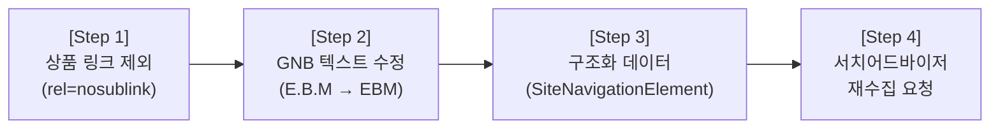

# [계획서] 시선닷컴 네이버 검색 서브링크(Sitelinks) 최적화 방안
**- 3대 대표 브랜드(MICHAA · IT MICHAA · EBM) 노출 및 서브링크 품질 개선 -**

---

## 1. 개요 및 추진 배경

### 1.1 배경
* 네이버 포털에서 **'시선닷컴'** 브랜드 검색 시, 1페이지 최상단 사이트 결과의 3번째 줄(인라인 서브링크)에 현재 다음과 같이 노출되고 있음:
  * **현재 노출 상태:** `MICHAA · IT MICHAA · Quiet Deeper · 골지 하프 슬리브 니트 · The Day We Celebrate`
* **문제점:**
  1. 시선닷컴의 핵심 3대 브랜드 중 **`EBM`**이 누락됨.
  2. 브랜드 탐색과 무관한 단발성 인기 상품명(`골지 하프 슬리브 니트`)이 서브링크 자리를 차지하여 전체적인 브랜드 브랜딩 품질 저하.
  3. 특정 컬렉션 기획전(`Quiet Deeper`, `The Day We Celebrate`) 위주로 편중 노출됨.

### 1.2 최종 개선 목표
* **목표 노출 형태:**
  $$\text{MICHAA} \cdot \text{IT MICHAA} \cdot \text{EBM} \cdot \text{(핵심 기획전 명칭 1~2개)}$$
* 사이트 방문자의 핵심 탐색 동선(3대 브랜드 몰 진입)을 최우선 확보하고, 단발성 상품 키워드를 배제하여 일관된 브랜드 아이덴티티 구축.

---

## 2. 네이버 서브링크 생성 원리 및 현황 분석

### 2.1 서브링크(Sitelinks) 추출 메커니즘
* 네이버 검색 결과의 서브링크는 어드민 관리자 화면에서 임의로 문구를 하드코딩하거나 직접 등록하는 방식이 **아닙니다**.
* **네이버 검색 로봇(Yeti)**이 웹사이트의 HTML 문서 구조, 내부 링크 구조(GNB, 본문 링크), 앵커 텍스트, 사용자 검색/클릭 로그를 분석하여 **"사이트에서 가장 중요하고 유용한 링크" 4~5개를 알고리즘으로 자동 선정**합니다.



### 2.2 EBM 누락의 3대 기술적 원인 분석

| 번호 | 원인 구분 | 상세 분석 내용 |
| :--- | :--- | :--- |
| **원인 1** | **GNB 텍스트 불일치** | `sisun.com` 메인 HTML 헤더(`<ul class="header_brand">`)에 `<a href="/EBM/">E.B.M</a>`처럼 **점이 찍힌 `E.B.M`**으로 코딩되어 있음. 메타 디스크립션(`MICHAA,EBM,ITMICHAA`) 및 실제 검색 키워드인 `EBM`과 표기가 달라 브랜드 연관성 가중치 감점 발생. |
| **원인 2** | **상품 링크의 슬롯 잠식** | 메인 화면에 배치된 인기 상품(`골지 하프 슬리브 니트`)의 클릭률과 크롤링 가중치가 높아 서브링크 5개 슬롯 중 1자리를 불필요하게 선점함. |
| **원인 3** | **내부 링크 파워(PageRank) 열세** | MICHAA, IT MICHAA 대비 EBM 브랜드 하위 페이지 수 및 메인 홈에서의 링크 노출 면적이 상대적으로 적어 알고리즘 점수에서 기획전/상품에 밀림. |

---

## 3. 최적의 4단계 실행 계획 (Action Plan)

네이버 서치어드바이저의 알고리즘 가이드라인에 입각하여, 로봇이 **EBM을 메인 서브링크로 확정하고 상품 키워드를 제외**하도록 유도하는 최적의 솔루션입니다.



---

### Step 1. 불필요한 서브링크 후보군 차단 (`rel="nosublink"` 적용)
> **핵심 전략:** 원치 않는 상품 링크를 네이버 서브링크 후보군에서 강제로 탈락시켜, 빈 슬롯에 최상위 브랜드 메뉴(`EBM`)가 자연 승격되도록 유도합니다.

* **적용 대상:** 메인 페이지(`index.html` / `mainLayout.html`)의 베스트 상품, 추천 상품 등 상품 상세페이지(`<a>` 태그)
* **적용 속성:** 네이버 공식 지원 속성 `rel="nosublink"`

```html
<!-- [Before] 기존 상품 상세 링크 -->
<a href="/product/detail.do?pdtCode=...">
    <span class="pdt_name">골지 하프 슬리브 니트</span>
</a>

<!-- [After] 네이버 서브링크 배제 속성 추가 -->
<a href="/product/detail.do?pdtCode=..." rel="nosublink">
    <span class="pdt_name">골지 하프 슬리브 니트</span>
</a>
```

---

### Step 2. 헤더 GNB 브랜드 앵커 텍스트 최적화
> **핵심 전략:** 크롤러가 읽는 앵커 텍스트를 `E.B.M`에서 `EBM`으로 통일하여 메타 데이터 및 검색어 가중치를 일치시킵니다.

* **수정 파일:** 공통 헤더 템플릿 (GNB 영역)
* **수정 내용:**
  * 링크 텍스트: `E.B.M` $\rightarrow$ `EBM`
  * 접근성 및 검색 로봇 힌트를 위한 `title` 및 `aria-label` 보강

```html
<!-- [Before] sisun_header_top_2023 -->
<ul class="header_brand disp_f_st">
    <li>
        <a href="/EBM/">E.B.M</a>
    </li>
    <li>
        <a href="/MICHAA/">MICHAA</a>
    </li>
    <li>
        <a href="/ITMICHAA/">IT MICHAA</a>
    </li>
</ul>

<!-- [After] 최적화 마크업 -->
<ul class="header_brand disp_f_st" role="navigation" aria-label="Brand Navigation">
    <li>
        <a href="/EBM/" title="EBM 공식 브랜드관">EBM</a>
    </li>
    <li>
        <a href="/MICHAA/" title="MICHAA 공식 브랜드관">MICHAA</a>
    </li>
    <li>
        <a href="/ITMICHAA/" title="IT MICHAA 공식 브랜드관">IT MICHAA</a>
    </li>
</ul>
```
*(참고: 비주얼 디자인상 점 표기가 반드시 필요하다면 CSS 가상 요소나 폰트 렌더링으로 처리하고, HTML 텍스트 원본은 `EBM`으로 유지하는 방안 권장)*

---

### Step 3. 구조화 데이터(Structured Data) 마크업 추가
> **핵심 전략:** Google 및 네이버 검색 로봇이 사이트의 핵심 3대 브랜드 메뉴 구조를 기계적으로 명확히 이해하도록 `Schema.org`의 `SiteNavigationElement` JSON-LD를 메인 헤더에 삽입합니다.

* **삽입 위치:** 메인 페이지 `<head>` 태그 내부

```html
<!-- 사이트 핵심 네비게이션 구조화 데이터 (JSON-LD) -->
<script type="application/ld+json">
{
  "@context": "https://schema.org",
  "@graph": [
    {
      "@type": "WebSite",
      "name": "시선닷컴 SISUN.COM",
      "url": "https://sisun.com/"
    },
    {
      "@type": "SiteNavigationElement",
      "name": "MICHAA",
      "description": "미샤 공식 브랜드관",
      "url": "https://sisun.com/MICHAA/"
    },
    {
      "@type": "SiteNavigationElement",
      "name": "IT MICHAA",
      "description": "잇미샤 공식 브랜드관",
      "url": "https://sisun.com/ITMICHAA/"
    },
    {
      "@type": "SiteNavigationElement",
      "name": "EBM",
      "description": "EBM 공식 브랜드관",
      "url": "https://sisun.com/EBM/"
    }
  ]
}
</script>
```

---

### Step 4. 사이트맵(`sitemap.xml`) 가중치 점검 및 네이버 서치어드바이저 재수집

#### 4.1 `sitemap.xml` 가중치(`priority`) 설정
* `/EBM/` URL의 가중치를 MICHAA, IT MICHAA와 동일하게 최상위 등급(`0.9` 이상)으로 설정:
```xml
<url>
    <loc>https://sisun.com/MICHAA/</loc>
    <changefreq>daily</changefreq>
    <priority>0.9</priority>
</url>
<url>
    <loc>https://sisun.com/ITMICHAA/</loc>
    <changefreq>daily</changefreq>
    <priority>0.9</priority>
</url>
<url>
    <loc>https://sisun.com/EBM/</loc>
    <changefreq>daily</changefreq>
    <priority>0.9</priority>
</url>
```

#### 4.2 네이버 서치어드바이저 재수집 요청
1. [네이버 서치어드바이저(Search Advisor)](https://searchadvisor.naver.com) 로그인
2. 등록된 도메인 `https://sisun.com` 선택
3. **[웹마스터 도구] $\rightarrow$ [요청] $\rightarrow$ [웹페이지 수집]** 이동
4. 입력창에 메인 URL(`/`) 및 브랜드 URL(`/EBM/`, `/MICHAA/`, `/ITMICHAA/`) 입력 후 각각 **[확인]** 클릭하여 수집 요청

---

## 4. 추진 일정 및 역할 분담 (Timeline & Roles)

| 단계 | 소요 기간 | 담당 부서/담당자 | 주요 수행 업무 |
| :--- | :---: | :---: | :--- |
| **1. 마크업 수정** | 0.5일 | 웹개발 / 퍼블리싱 | • GNB 텍스트 수정 (`E.B.M` $\rightarrow$ `EBM`)<br>• 메인 상품 링크에 `rel="nosublink"` 추가<br>• 메인 헤더에 `SiteNavigationElement` JSON-LD 삽입 |
| **2. 스테이징 검증 & 배포** | 0.5일 | QA / 웹개발 | • PC/모바일 GNB 레이아웃 이상 유무 확인<br>• 운영 서버 배포 |
| **3. 서치어드바이저 수집 요청** | 배포 당일 | 마케팅 / SEO | • 네이버 웹마스터도구에서 메인 및 브랜드 페이지 수집 요청<br>• sitemap.xml 갱신 제출 |
| **4. 검색 결과 모니터링** | D+3 ~ D+14 | 마케팅 / 기획 | • 네이버 '시선닷컴' 검색 결과 서브링크 갱신 추적<br>• 3대 브랜드 노출 확인 |

---

## 5. 기대 효과 및 향후 관리 방안

### 5.1 기대 효과
1. **3대 브랜드 동등 노출 달성:** `MICHAA · IT MICHAA · EBM`이 전면에 고정 노출되어 신규 브랜드인 EBM의 고객 인지도 및 검색 유입 증대.
2. **검색 결과 가독성 향상:** 단발성 개별 상품명(`골지 하프...`)이 제거되어 이커머스 포털로서의 프리미엄 브랜드 신뢰도 제고.
3. **사용자 이탈률 감소:** 원하는 브랜드 관으로 검색 결과에서 1클릭으로 직행 가능.

### 5.2 향후 관리 가이드 (기획전 변경 시)
* `Quiet Deeper`나 `The Day We Celebrate`처럼 서브링크 뒷부분에 노출되는 기획전은 메인 화면의 대형 배너 앵커 텍스트를 기준으로 네이버가 주기적으로 자동 갱신합니다.
* 시즌이 지난 종료 기획전의 경우 메인 화면에서 링크를 내리거나 해당 링크에 `rel="nosublink"`를 부여하면 네이버 검색 결과에서도 1~2주 내에 자연스럽게 최신 기획전으로 대체됩니다.
