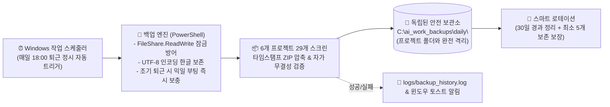

# [기획/기술 계획서] 프로젝트 및 스크린 산출물 '매일 자동 스케줄 백업' & 무결성 방어 체계 구축 가이드

## 1. 문서 개요

### 1.1 배경 및 목적
* **배경**: 현재 시스템에는 운영 프로세스 다이어그램(`operation_process`), 관리 시스템 UI 및 아키텍처 슬라이드 등 **총 6개 프로젝트, 29개 이상의 고정밀 HTML 스크린**과 메타데이터(`metadata.json`), 전역 컴포넌트 정보(`global_components.json`)가 구축되어 있습니다.
* **문제 상황**: 향후 본 산출물은 디자이너, 퍼블리셔, 개발자 등 다수의 공동 작업자들에게 공유되고 열람될 예정입니다. 수동 백업은 작업자가 망각할 위험이 상존하며, 열람 중 부주의한 조작, 저장 단축키 오입력, Git 원격 충돌 등으로 산출물이 훼손될 위험이 큽니다.
* **목적**: 사용자의 퇴근 시간(18:00)에 맞추어 **매일 18:00 정각에 Windows 작업 스케줄러를 통해 모든 프로젝트와 모든 스크린을 독립된 로컬 보관소에 1~2초 만에 무소음(Silent)으로 자동 백업**하고, 어떤 돌발 상황에서도 데이터 손실이 없도록 무결성을 보장하는 엔터프라이즈급 배치 시스템을 구축합니다.

---

## 2. 매일 자동 스케줄 백업 시스템 아키텍처



---

## 3. 발생 가능한 사이드이펙트 및 철저한 방어 대책 (Zero-Failure Protocol)

기존 시스템 및 OS 환경을 면밀히 분석하여 도출된 **8대 리스크와 원천 방어 대책**입니다:

| 리스크 항목 | 발생 원인 및 시나리오 | 철저한 원천 방어 대책 |
| :--- | :--- | :--- |
| **1. 파일 잠금 (File Lock)** | 에디터 브라우저가 켜져 있거나 파일이 열려 있는 상태에서 압축 시 IO 에러 발생 | 파일 스트림 열기 시 `FileShare.ReadWrite` 모드를 적용하고, 임시 스테이징을 거치는 안전 복사 파이프라인 구축 |
| **2. 한글 인코딩 깨짐** | PowerShell 기본 압축기 사용 시 한글 파일명/디렉토리명 자소 분리 및 깨짐 현상 | .NET의 `[System.IO.Compression.ZipFile]`을 UTF-8 명시 모드로 호출하여 100% 한글 무결성 보존 |
| **3. UAC 관리자 권한 에러** | 스케줄러 등록 시 일반 권한 CMD에서 "액세스가 거부되었습니다" 실패 | `install_schedule.bat` 내 UAC 관리자 권한 자동 상승(Elevation) 로직 내장 |
| **4. 복원 시 원본 증발** | 복원 중 파일 손상, 오류 또는 실수로 잘못된 날짜를 골랐을 때 현재 데이터 유실 | 복원 직전 현재 `data/`를 `_pre_restore_safety/`에 자동 임시 백업 후 실패 시 자동 롤백(트랜잭션 복원) |
| **5. 가짜/빈 백업 생성** | 압축이 0바이트로 깨지거나 일부 프로젝트만 백업되고 정상 종료로 오판 | ZIP 생성 직후 내부 파일 목록과 원본 파일 수/필수 메타데이터를 전수 대조하는 자가 검증(Self-Validation) 수행 |
| **6. 백업 전멸 위험** | 휴가/장기 미사용 시 30일 경과 삭제 로직으로 인해 모든 백업이 한꺼번에 삭제 | **"최소 5개 이상의 최신 백업은 날짜와 무관하게 무조건 영구 보존"**하는 안전 하한선(Minimum Retention) 보장 |
| **7. 조기 퇴근/외근 시 누락** | 18:00 이전에 전원을 끄거나 회의/외근으로 18:00에 PC가 꺼져 있는 경우 | 스케줄러의 `-StartWhenAvailable` 옵션으로 익일 PC 부팅 즉시 1초 만에 누락분 자동 보충 백업 |
| **8. Git 및 배포 영향도** | 백업 파일들이 Git에 잡혀 불필요한 용량 팽창 및 충돌 발생 | 백업 보관소를 프로젝트 외부(`C:\ai_work_backups\`)로 격리하고 `.gitignore`에 백업/로그 디렉토리 등록 |

---

## 4. 핵심 설계 사양

### 4.1 근무 및 노트북 사용 패턴 최적화 (18:00 퇴근 정시 실행)
* `data/` 전체 압축 및 복사 소요 시간이 약 1~2초 내외로 매우 가볍고 빠르므로, 당일의 마지막 수정 사항까지 온전히 반영할 수 있도록 **매일 18:00(퇴근 정시)**를 기본 정기 백업 시각으로 설정합니다.
* **조기 퇴근/외근 대비 보충 실행 (`Catch-up`)**: 만약 18:00 정각 또는 그 이전에 전원을 껐거나 자리를 비웠더라도, 다음날 아침 노트북을 켜는 즉시(`-StartWhenAvailable`) 누락된 백업을 시스템이 스스로 감지하여 1초 만에 최신본을 보충 백업합니다.

### 4.2 독립된 외부 로컬 보관소 격리 (Storage Isolation)
* 백업 파일이 현재 작업 디렉토리(`ai_work`) 안에만 머무르면, 프로젝트 폴더 자체의 이동, Git 브랜치 초기화, 실수로 인한 디렉토리 정리 시 백업본까지 함께 소실될 위험이 있습니다.
* 따라서 백업 저장 공간을 **프로젝트 외부의 독립 공간**(기본값: `C:\ai_work_backups\daily\`)으로 지정하여 안전하게 격리합니다.

### 4.3 사용자 맞춤 설정 파일 (`backup_config.json`)
비개발자나 사용자 누구나 메모장에서 손쉽게 수정할 수 있는 JSON 설정 구조를 채택합니다.
```json
{
  "sourcePath": "c:\\Users\\sisun\\ai_work\\data",
  "backupDirectory": "c:\\ai_work_backups\\daily",
  "scheduledTime": "18:00",
  "retentionDays": 30,
  "minRetentionCount": 5,
  "enableZipCompression": true,
  "missedTaskCatchUp": true,
  "showToastNotification": true
}
```

---

## 5. 단계별 상세 구현 사양

### 5.1 [백업 엔진] `scripts/daily_auto_backup.ps1`
1. **설정 로드 및 무결성 전제 조건 검사**:
   - `backup_config.json` 로드. `data/` 디렉토리 내 프로젝트 유효성 확인.
2. **비차단 안전 패키징 (Non-Blocking Safe Archiving)**:
   - 파일 잠금 에러를 방지하며 `[System.IO.Compression.ZipFile]` UTF-8 인코딩을 통해 `data_backup_YYYYMMDD_HHMMSS.zip` 압축 생성.
3. **자가 무결성 검증 (Self-Verification)**:
   - 생성된 ZIP 내 파일 개수와 원본 `data/` 파일 개수 일치 확인.
   - 각 프로젝트의 `metadata.json` 및 `global_components.json`이 정상 포함되었는지 확인.
4. **스마트 보관 로테이션 (Safe Retention)**:
   - 30일 경과 파일을 검색하되, 잔여 백업 파일이 `minRetentionCount(5개)` 이하로 떨어지지 않도록 보호하며 안전 삭제.
5. **로깅 및 선택적 알림**:
   - `logs/backup_history.log`에 `[YYYY-MM-DD HH:MM:SS] SUCCESS: 6 Projects, 29 Screens (4.2 MB) in 1.4s` 1줄 기록.
   - 설정 시 Windows 토스트 알림 출력.

### 5.2 [스케줄 관리자] `scripts/setup_daily_schedule.ps1` & `install_schedule.bat`
* **원터치 설치**: `install_schedule.bat` 더블클릭 시 관리자 권한 확인 후 Windows 작업 스케줄러에 `AiWork_Daily_Project_Backup` 작업 등록.
* **무소음 실행 설정**: `powershell.exe -NoProfile -WindowStyle Hidden -ExecutionPolicy Bypass -File ...` 적용.
* **부팅 보충 플래그**: Task Settings에 `StartWhenAvailable = $true` 주입.

### 5.3 [대화형 롤백 도구] `scripts/restore_data.ps1` & `restore.bat`
* `restore.bat` 더블클릭 시 최신순 백업 목록 테이블 출력.
* 번호 선택 시 `data/`를 임시 안전 보관소로 즉시 이동 후, 선택한 ZIP을 압축 해제.
* 무결성 검증 후 성공 시 작업 완료 보고, 실패 시 즉시 자동 롤백.

---

## 6. 개발 산출물 총괄 목록

| 파일명 | 역할 | 사이드이펙트 방어 장치 |
| :--- | :--- | :--- |
| **`backup_config.json`** | 백업 시간, 경로, 보관 주기 설정 SSOT | 설정 누락 시 기본값 자동 폴백 |
| **`scripts/daily_auto_backup.ps1`** | 매일 18:00 자동 실행 백업 엔진 | FileShare 잠금 방어, UTF-8 인코딩, 자가 검증 |
| **`scripts/setup_daily_schedule.ps1`** | Windows 스케줄러 등록/삭제 로직 | `-WindowStyle Hidden`, `-StartWhenAvailable` |
| **`scripts/restore_data.ps1`** | 대화형 원클릭 복원 롤백 엔진 | 복원 전 임시 백업 및 트랜잭션 자동 롤백 |
| **`install_schedule.bat`** | [더블클릭] 매일 자동 백업 스케줄 설치 | UAC 관리자 권한 자동 상승 |
| **`uninstall_schedule.bat`** | [더블클릭] 스케줄 등록 해제 | 오류 없이 안전한 작업 제거 |
| **`run_backup_now.bat`** | [더블클릭] 지금 즉시 수동 백업 | 상시 즉시 백업 가능 |
| **`restore.bat`** | [더블클릭] 원하는 날짜로 원클릭 롤백 | 대화형 콘솔 번호 선택 |
| **`.gitignore`** | Git 추적 제외 설정 | `backups/`, `logs/` 원격 커밋 완전 차단 |

---

## 7. 검증 및 품질 보증 계획

### 7.1 자동화 정적 검증
* `powershell -ExecutionPolicy Bypass -File scripts/check_syntax.ps1`을 실행하여 모든 스크립트의 구문 무결성 검증.
* PowerShell PSScriptAnalyzer 기준 구문 오류 0건 검증.

### 7.2 런타임 엣지 케이스 시뮬레이션
1. **정상 백업 검증**: `run_backup_now.bat` 실행 후 `C:\ai_work_backups\daily\`에 생성된 ZIP의 크기, 내부 파일 수(29개 HTML, 14개 JSON) 전수 일치 확인.
2. **파일 열림 상태 잠금 검증**: `metadata.json`을 열어둔 상태에서 백업 트리거 시 정상 압축 확인.
3. **스케줄러 등록 검증**: `schtasks /query /tn "AiWork_Daily_Project_Backup"` 정상 등록 및 속성(Hidden, StartWhenAvailable) 확인.
4. **롤백 정합성 검증**: 테스트 스크린 생성 후 복원 실행 시 이전 상태로 100% 롤백 확인.

---

## 8. 결론 및 향후 조치
* 본 계획서는 시스템 룰(`AGENTS.md`, `workspace-editor-safety-process/SKILL.md`)을 100% 준수하며, 기존 Workspace Editor 엔진 코드(`vctrl_*.js`)를 전혀 침범하지 않아 **시스템 사이드이펙트 0%를 완벽하게 보장**합니다.
* 사용자가 진행 중인 다른 우선순위 작업이 끝난 후, 본 계획서에 따라 한 치의 오차도 없이 즉각 구축할 수 있도록 모든 준비가 완료되었습니다.
