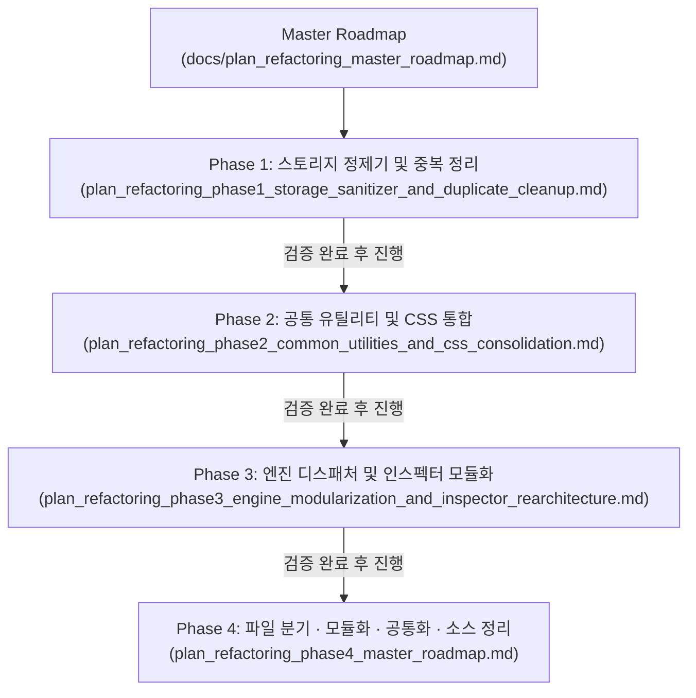

# Workspace Editor 시스템 전면 최적화 마스터 로드맵
## System Refactoring & Modularization Master Roadmap

작성일자: 2026-09-04 (v1.0) / 2026-09-29 (v2.0 갱신)  
문서 버전: v2.0  
기준 감사 보고서: [system_precision_analysis_and_refactoring_plan.md](file:///C:/Users/sisun/.gemini/antigravity-ide/brain/f154ebca-337f-4a09-921a-fdc6e24c86ac/system_precision_analysis_and_refactoring_plan.md)

---

## 1. 개요 및 추진 원칙

본 문서는 **Workspace Editor** 시스템의 59개 전체 스크립트 및 11,000줄 CSS 전수 정밀 감사 결과를 바탕으로, 기술 부채를 단계적으로 해소하고 성능과 안정성을 극대화하기 위한 **Phase별 분할 실행 총괄 로드맵**입니다.

### 📌 추진 대원칙 (AGENTS.md 7대 필수 게이트웨이 준수)
1. **운영 시스템 무결성 보장 (Strict Production Integrity)**:
   - 본 시스템은 실무 운영 시스템이므로 임시 가짜 데이터(Mock) 주입을 전면 금지하고 실제 디스크 데이터만을 100% 보존합니다.
2. **사전 정밀 심층 분석 & 계획 수립 (Deep Analysis & Plan First)**:
   - 코드 한 줄이라도 수정하기 전에 관련 소스와 시스템 룰을 전수 분석하고 세부 계획서를 수립합니다.
3. **점진적 무손상 리팩토링 (Zero Side-Effects & Incremental Rollout)**:
   - 단일 릴리즈 대규모 일괄 수정을 지양하고 Phase 단위로 격리하여 순차 실행 및 개별 검증합니다.
4. **코드 및 브래킷 무결성 상시 검증 (Zero Syntax Errors)**:
   - 각 Phase 변경 후 `check_syntax.ps1` 브래킷 무결성, 파일 인코딩(UTF-8), 저장/로드/Undo 회귀 여부를 엄격히 확인합니다.

---

## 2. Phase별 구조 및 개별 계획서 매핑

```mermaid
graph TD
    Master["Master Roadmap<br/>(docs/plan_refactoring_master_roadmap.md)"]

    P1["Phase 1: 스토리지 정제기 및 중복 정리<br/>(plan_refactoring_phase1_storage_sanitizer_and_duplicate_cleanup.md)"]
    P2["Phase 2: 공통 유틸리티 및 CSS 통합<br/>(plan_refactoring_phase2_common_utilities_and_css_consolidation.md)"]
    P3["Phase 3: 엔진 디스패처 및 인스펙터 모듈화<br/>(plan_refactoring_phase3_engine_modularization_and_inspector_rearchitecture.md)"]
    P4["Phase 4: 파일 분기 · 모듈화 · 공통화 · 소스 정리<br/>(plan_refactoring_phase4_master_roadmap.md)"]

    Master --> P1
    P1 -->|검증 완료 후 진행| P2
    P2 -->|검증 완료 후 진행| P3
    P3 -->|검증 완료 후 진행| P4
```

### 개별 계획서 링크 및 세부 범위

| Phase | 계획서 문서 | 주요 목표 및 작업 범위 | 리스크 수준 | 진행 상태 |
| :---: | :--- | :--- | :--- :---: | :---: |
| **Phase 1** | [plan_refactoring_phase1_storage_sanitizer_and_duplicate_cleanup.md](file:///c:/Users/sisun/ai_work/docs/plan_refactoring_phase1_storage_sanitizer_and_duplicate_cleanup.md) | **스토리지 정제기(Sanitizer) 도입 및 중복 스크립트 정리** • 저장 시 `.lf-connector-port` 및 빈 스타일 속성 정제 (파일 크기 70% 절감) • Base64 인라인 이미지 분리 저장 기반 마련 • `vctrl_smartguide.js` 부모 측 중복 로드 및 레거시 코드 정리 | **낮음 (Low)** 저장/주입 단계 필터링 | ✅ **실행 완료 (사용자 검증 통과)** |
| **Phase 2** | [plan_refactoring_phase2_common_utilities_and_css_consolidation.md](file:///c:/Users/sisun/ai_work/docs/plan_refactoring_phase2_common_utilities_and_css_consolidation.md) | **공통 통신/유틸리티 일원화 및 CSS 토큰 통합** • 부모-Iframe 통신 인터페이스(`EditorBus`) 단일화 (postMessage 보일러플레이트 제거) • 색상/DOM 유틸리티 `vctrl_common.js` 일원화 (`rgbToHex`, `hexToRgba`) • `responsive_frame` 단일 SSOT 체계 확립 (`AGENTS.md` 규칙 갱신) • CSS 3종 중복 클래스 및 불필요한 `!important` 대폭 감축 | **중간 (Medium)** 통신 및 스타일 재정립 | ✅ **실행 완료** |
| **Phase 3** | [plan_refactoring_phase3_engine_modularization_and_inspector_rearchitecture.md](file:///c:/Users/sisun/ai_work/docs/plan_refactoring_phase3_engine_modularization_and_inspector_rearchitecture.md) | **코어 엔진 디스패처 분리 및 인스펙터 도메인 모듈화** • `vctrl_iframe_script.js` 46개 메시지 핸들러 디스패처 분리 (3,400줄 → 500줄 경량화) • `vctrl_inspector.js`(읽기)와 `vctrl_v4_addon.js`(쓰기)의 컴포넌트별 도메인 모듈화 (`inspector_grid.js` 등) • Iframe 스크립트 결합 파이프라인 최적화 | **높음 (High)** 엔진 구조 개편 | ✅ **실행 완료** |
| **Phase 4** | [plan_refactoring_phase4_master_roadmap.md](file:///c:/Users/sisun/ai_work/docs/plan_refactoring_phase4_master_roadmap.md) | **파일 분기 · 모듈화 · 공통화 · 소스 정리 (7대 필수 게이트웨이 준수)** • `ResponsiveFrameUtils` 컨테이너 탐색 SSOT 일원화 (모바일 듀얼 핀 탈락 영구 차단) • `vctrl_canvas_background.js` 분기 (260줄 분리) • `style.css` 안정 골격 보존 및 충돌 방지 체계화 • `vctrl_core.js` 코어 엔진 3대 서브모듈(라우터/단축키/스토리지) 분기 • 핀 라이프사이클 엔진 일원화 (`AnnotationPins` & `Universal Pin Engine SSOT`) | **점진적 분할** (Low ~ High) | ✅ **실행 완료 (4-A ~ 4-E 전 단계 100% 완결)** |

---

## 3. 실행 프로세스 및 안전 수칙

1. **착수 순서**:
   - 가장 안전하며 즉각적인 성능/스토리지 개선 효과를 얻을 수 있는 **Phase 1**부터 시작합니다.
   - 각 Phase 완료 및 사용자 검증 확인 후 다음 Phase로 순차 이동합니다.
2. **롤백(Rollback) 대비**:
   - 각 Phase 시작 전과 완료 후 명확한 Git 커밋 지점을 생성하여 언제든 이전 안정 상태로 즉각 복구할 수 있도록 보장합니다.
3. **무결성 검사 강제**:
   - 각 단계마다 `scripts/check_syntax.ps1` 구동 및 브래킷 매칭 검증을 통과해야 다음 단계로 진입합니다.
