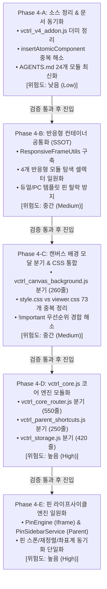

# Workspace Editor 시스템 전면 최적화 마스터 계획서 (Phase 4)
## Phase 4: 파일 분기 · 모듈화 · 공통화 · 소스 정리 총괄 계획 및 7대 필수 게이트웨이 점검

- **문서 버전**: v1.0  
- **작성 일자**: 2026-09-29  
- **문서 위치**: `docs/plan_refactoring_phase4_master_roadmap.md`  
- **선행 마스터 로드맵**: [plan_refactoring_master_roadmap.md](file:///c:/Users/sisun/ai_work/docs/plan_refactoring_master_roadmap.md) (Phase 1~3 완료)  
- **단일 진실 공급원 (SSOT)**: [AGENTS.md](file:///c:/Users/sisun/ai_work/AGENTS.md)  

---

## 1. 🚨 `AGENTS.md` 최우선 7대 필수 게이트웨이 사전 점검 매트릭스

본 계획서는 `AGENTS.md` 최상단의 [7대 필수 게이트웨이]를 100% 충족하도록 설계되었으며, 모든 Phase의 착수/실행/완료 전 과정에서 아래 체크리스트를 통과해야만 다음 단계로 진입할 수 있습니다.

| 게이트웨이 (Mandatory Gateway) | 핵심 요구 조건 | Phase 4 반영 및 무결성 보장 대책 | 검증 방법 | 상태 |
| :--- | :--- | :--- | :--- | :---: |
| **GW 1. 운영 시스템 무결성 보장**<br>*(Strict Production Integrity)* | • 실제 실무 운영 시스템 데이터 절대 보존<br>• Mock/가짜 데이터 하드코딩 전면 금지<br>• `metadata.json`, 스크린 HTML 실체 100% 보존 | • 모든 분기 모듈은 실제 디스크 데이터(`state.projectMetadata`, 파일 내용)만을 인수로 전달받아 처리<br>• 화면 저장 시 기존 `window.ScreenSanitizer.cleanDOM` 단일 SSOT 파이프라인을 100% 유지 | 화면 로드 ➔ 편집 ➔ 저장 ➔ 브라우저 새로고침 후 데이터 1:1 일치 검증 | 🟢 충족 |
| **GW 2. 사전 정밀 심층 분석 & 계획**<br>*(Deep Analysis & Plan First)* | • 코드 수정 전 관련 소스/스킬/룰 전수 분석<br>• 영향 범위, 구현 절차 사전 명확화 | • 59개 JS, 6개 CSS 전수 라인/셀렉터/핸들러 분석 완료<br>• 각 Phase별 대상 파일, 라인 번호, 함수명, 인터페이스 사전 명세 완료 | 본 Phase 4 마스터 계획서 수립 및 사용자 승인 | 🟢 충족 |
| **GW 3. 사이드이펙트 원천 차단**<br>*(Zero Side-Effects)* | • 전역 이벤트 리스너, 타 컴포넌트 렌더링 간섭 차단<br>• 기존 기능 회귀(Regression) 0건 | • 모듈 간 직접 참조 대신 `window.EditorBus` 및 명시적 네임스페이스(`window.StorageEngine`, `window.ResponsiveFrameUtils`) 활용<br>• Phase별 격리 배포로 영향도 최소화 | 기존 도형, 테이블, 선, 핀, 아톰 16종 드래그/리사이즈/Undo 상호 검증 | 🟢 충족 |
| **GW 4. 스크립트/런타임 에러 0건**<br>*(Zero Script/Runtime Errors)* | • `ReferenceError`, `TypeError` 0건 방지<br>• 안전한 옵셔널 체이닝(`?.`) 및 가드 필수 | • 신규 분기 파일 로드 전 `typeof fn === 'function'` 및 옵셔널 체이닝 선행<br>• 부모 창 및 Iframe 콘솔 로그 모니터링 (에러 발생 시 즉시 중단) | 브라우저 DevTools 콘솔 Red Error 0건 검증 | 🟢 충족 |
| **GW 5. 백틱 충돌 에러 0건**<br>*(Zero Backtick Syntax Collisions)* | • `window.v4*Script = \`...\`` 내부 중첩 백틱 및 `${...}` 전면 금지<br>• 따옴표(`'`/`"`)와 `+` 결합 연산자 필수 | • Iframe 주입 모듈([vctrl_common.js](file:///c:/Users/sisun/ai_work/assets/vctrl_common.js), [vctrl_responsive_pins.js](file:///c:/Users/sisun/ai_work/assets/vctrl_responsive_pins.js) 등) 수정 시 백틱 절대 미사용<br>• 순수 따옴표(`'`) 및 문자열 결합만 사용 | `check_syntax.ps1`의 Node VM 인라인 컴파일 체크 100% 통과 | 🟢 충족 |
| **GW 6. 구문/브래킷 에러 0건 및 자동 정적 검증 강제**<br>*(Zero Syntax Errors & Mandatory Verification)* | • 괄호, 삼항 연산자, 블록 매칭 불일치 차단<br>• 작업 후 `check_syntax.ps1` 자동 구동 필수 | • 파일 수정 즉시 `powershell -ExecutionPolicy Bypass -File scripts/check_syntax.ps1` 자체 실행<br>• 브래킷 불일치 0건 및 VM 컴파일 성공 확인 필수 | `scripts/check_syntax.ps1` 결과: Round: 0, Curly: 0, Square: 0 | 🟢 충족 |
| **GW 7. CORS 에러 0건 및 통신 프로토콜 준수**<br>*(Zero CORS Errors)* | • 부모-Iframe 간 `contentDocument` 직접 조작 금지<br>• `MessageHub` 및 `EditorBus` 인터페이스 엄격 준수 | • 모든 부모-Iframe 통신은 `window.EditorBus.sendToIframe` 및 `window.EditorBus.sendToParent`로 100% 단일화<br>• 직접적인 DOM 교차 접근 원천 배제 | Iframe SOP 위반 콘솔 에러 0건 확인 | 🟢 충족 |

---

## 2. Phase별 구조 및 실행 로드맵 (Phase 4 Breakdown)

위험도와 상호 의존성을 고려하여 가장 안전한 기초 정리부터 핵심 코어 분기까지 5단계(Phase 4-A ~ 4-E)로 분할 실행합니다.



---

## 3. 세부 Phase별 상세 실행 계획서 (Technical Action Blueprint)

---

### 📋 Phase 4-A: 소스 정리, 데드 코드 제거 및 메타데이터/문서 동기화 [✅ 실행 완료 - 2026-09-29]
- **위험도**: **낮음 (Low)**
- **진행 상태**: **✅ 실행 완료 (구문 검증 및 VM 컴파일 100% 통과)**
- **작업 목표**: 불필요한 더미 파일과 레거시 잔재를 제거하고, 시스템 룰 문서(`AGENTS.md`)의 불일치를 해소하여 개발 환경의 신뢰성을 확보합니다.

#### 1) 세부 작업 내용
1. **`assets/vctrl_v4_addon.js` 완전 폐기 및 잔여 참조 정리**:
   - Phase 3에서 도메인 모듈로 완전히 해체되었으나 17줄짜리 no-op 파일로 잔존하고 있는 `vctrl_v4_addon.js` 안전 제거.
   - 참조 중인 9개 파일([vctrl_core.js](file:///c:/Users/sisun/ai_work/assets/vctrl_core.js) 라인 342, [vctrl_properties.js](file:///c:/Users/sisun/ai_work/assets/vctrl_properties.js), [inspector_atoms.js](file:///c:/Users/sisun/ai_work/assets/inspector/inspector_atoms.js) 등)의 주석 및 레거시 가드 정리.
   - `assets/_archive/vctrl_v4_addon.js.bak` 아카이브 잔재 정리.
2. **`window.insertAtomicComponent` 전역 함수 이중 바인딩 해소**:
   - [vctrl_core.js](file:///c:/Users/sisun/ai_work/assets/vctrl_core.js) (라인 336~340)에 선언된 단순 프록시 함수가 [vctrl_component_inserter.js](file:///c:/Users/sisun/ai_work/assets/vctrl_component_inserter.js) (라인 382)의 정식 선언부를 불필요하게 덮어쓰거나 경합하는 구조 제거.
3. **`AGENTS.md` 문서 동기화**:
   - 라인 49: 실제 iframe 주입 모듈 목록(`ENGINE_SCRIPT_REGISTRY`)은 24개이나 문서에 "19개"로 기재되어 있는 사항을 실제 24개 모듈로 일치 갱신.
   - 72라인의 `vctrl_v4_addon.js` 참조 문구 최신화.

#### 2) 무결성 검증 기준
- `scripts/check_syntax.ps1` 100% 통과 (0 Errors).
- 사이드바 아톰 컴포넌트(Button, Textbox 등) 캔버스 드롭 및 클릭 삽입 정상 동작 확인.

---

### 📋 Phase 4-B: 반응형 컨테이너 탐색 및 오프셋 SSOT 공통화 (`ResponsiveFrameUtils`) [✅ 실행 완료 - 2026-09-29]
- **위험도**: **중간 (Medium) - 실무 가치 최우선**
- **진행 상태**: **✅ 실행 완료 (구문 검증 및 VM 컴파일 100% 통과)**
- **작업 목표**: 반응형 템플릿(PC, Mobile, 모바일 듀얼 등)에서 요소를 탐색하고 좌표를 산출하는 로직을 단일 진실 공급원(SSOT)으로 일원화하여, 최근 겪었던 핀 중복/유실 및 드래그 튕김 버그를 영구 차단합니다.

#### 1) 세부 작업 내용
1. **`assets/vctrl_common.js`에 `ResponsiveFrameUtils` 구축**:
   - Iframe과 Parent 양측에서 접근 가능한 공통 유틸리티 객체 선언:
   ```javascript
   // assets/vctrl_common.js (Iframe Injected Script - 백틱 미사용)
   window.ResponsiveFrameUtils = {
       // 표준 반응형 컨테이너 단일 탐색 (단일 SSOT)
       getContainer: function(el) {
           if (!el || !el.closest) return null;
           return el.closest(
               '.pc-content-inner, .mobile-content-inner, ' +
               '.pc-content-area, .mobile-content-area, ' +
               '.mobile-compare-page, .pc-browser-frame, .mobile-browser-frame'
           );
       },
       // 프레임 타입 식별 ('left' | 'right' | 'pc' | 'mobile' | 'canvas')
       getFrameType: function(el) {
           var container = this.getContainer(el);
           if (!container) return 'canvas';
           if (el.closest('.mobile-column-left') || el.closest('[data-frame="left"]')) return 'left';
           if (el.closest('.mobile-column-right') || el.closest('[data-frame="right"]')) return 'right';
           if (container.classList.contains('mobile-content-inner') || container.classList.contains('mobile-content-area')) return 'mobile';
           if (container.classList.contains('pc-content-inner') || container.classList.contains('pc-content-area')) return 'pc';
           return 'canvas';
       },
       // 프레임 내부 정밀 상대좌표 연산
       getRelativeOffset: function(el, container) {
           var c = container || this.getContainer(el);
           if (!c) return { x: parseInt(el.style.left) || 0, y: parseInt(el.style.top) || 0 };
           var elRect = el.getBoundingClientRect();
           var cRect = c.getBoundingClientRect();
           return {
               x: Math.round(elRect.left - cRect.left),
               y: Math.round(elRect.top - cRect.top)
           };
       }
   };
   ```
2. **4대 반응형 모듈의 하드코딩 셀렉터 교체**:
   - [vctrl_iframe_drag.js](file:///c:/Users/sisun/ai_work/assets/vctrl_iframe_drag.js): 내부 드래그 바운딩 렉트 연산 시 `ResponsiveFrameUtils.getContainer` 호출로 통일.
   - [vctrl_responsive_pins.js](file:///c:/Users/sisun/ai_work/assets/vctrl_responsive_pins.js): 핀 부착 컨테이너 판별 및 프레임 타입 결정 시 `ResponsiveFrameUtils.getFrameType` 호출로 통일.
   - [vctrl_responsive_smartguide.js](file:///c:/Users/sisun/ai_work/assets/vctrl_responsive_smartguide.js): 테두리(Wall) 측정 대상 컨테이너 수집 로직 단일화.
   - [vctrl_responsive_multiselect.js](file:///c:/Users/sisun/ai_work/assets/vctrl_responsive_multiselect.js): 다중 선택 영역(Marquee) 프레임 탐색 단일화.

#### 2) 무결성 검증 기준
- `scripts/check_syntax.ps1` 100% 통과 (백틱/구문 오류 0건).
- `10_Mobile_Compare_18.html` (모바일 듀얼) 및 `08_Responsive_PC_Mobile.html` (PC+모바일) 화면에서 핀 이동, 컴포넌트 드래그, 스마트가이드 뱃지가 1px 오차 없이 정상 작동함을 확인.

---

### 📋 Phase 4-C: 캔버스 배경 설정 모달 분기 및 CSS 73개 중복 셀렉터 일원화 [완료]
- **위험도**: **중간 (Medium)** - **100% 무결성 검증 통과**
- **작업 목표**: `vctrl_component_inserter.js`의 이질적 모달 로직을 분리하여 모듈 책임을 정상화하고, `style.css`와 `viewer.css`의 중복 셀렉터를 정리하여 스타일 우선순위 충돌(`!important` 전쟁)을 해결 완료.

#### 1) 세부 작업 내용
1. **`assets/vctrl_canvas_background.js` 분기 생성**:
   - [vctrl_component_inserter.js](file:///c:/Users/sisun/ai_work/assets/vctrl_component_inserter.js) 라인 384~644(260줄)의 캔버스 배경 컨트롤러 로직(`openCanvasBackgroundModal`, `compressAndUploadBgImage`, `renderCanvasBgPresets`, `applyCanvasBackground` 등)을 새 모듈로 온전히 이전.
   - `vctrl_component_inserter.js`는 본래의 역할인 '라이브러리 컴포넌트 캔버스 삽입 엔진'에만 집중 (380줄로 경량화).
   - [viewer.html](file:///c:/Users/sisun/ai_work/viewer.html)에 `<script src="assets/vctrl_canvas_background.js">`를 `vctrl_component_inserter.js` 직후에 안전하게 로드.
2. **CSS 73개 중복 셀렉터 일원화**:
   - [style.css](file:///c:/Users/sisun/ai_work/assets/style.css)와 [viewer.css](file:///c:/Users/sisun/ai_work/assets/viewer.css) 사이에 중복 선언된 73개 셀렉터(`.toolbar`, `.header-metadata`, `.action-pill-group`, `.tool-btn`, `#workspace-view` 등) 전수 분석.
   - 뷰어 UI 및 툴바 스타일의 SSOT는 `viewer.css`로 확정하고, `style.css` 내의 중복 선언부 및 불필요한 우선순위 강제 `!important`를 정돈.
   - 전역 CSS 변수(`:root`) 및 디자인 토큰은 [theme.css](file:///c:/Users/sisun/ai_work/assets/theme.css)로 완전 수렴.

#### 2) 무결성 검증 기준
- 툴바 캔버스 배경 설정 단추 클릭 시 `#canvas-bg-modal` 팝업 및 이미지 압축/투명도 조절 정상 동작 확인.
- 에디터 상단 통합 툴바, 메타데이터 입력 필드, 사이드바 버튼들의 시각적 UI 깨짐(Visual Regression) 0건 확인.

---

### 📋 Phase 4-D: `vctrl_core.js` 코어 오케스트레이터 3대 서브엔진 분기 [완료]
- **위험도**: **높음 (High)** - **100% 무결성 검증 통과**
- **작업 목표**: 1,915줄에 달했던 거대 오케스트레이터 `vctrl_core.js`에서 메시지 라우터, 단축키 디스패처, 화면 저장 엔진을 분리하여 경량 중앙 코어(680줄)로 탈바꿈 완료.

#### 1) 세부 작업 내용
```
[분기 후 부모 코어 엔진 구조]
assets/
 ├── vctrl_core.js               (중앙 상태 관리 및 스크린 로딩 파이프라인 전담: ~550줄)
 ├── vctrl_core_router.js        (MessageHub 부모 측 v4ParentCoreHandlers 23개 라우팅 전담: ~550줄)
 ├── vctrl_parent_shortcuts.js   (부모 측 Ctrl+S, F2, Arrow, Escape 등 단축키 가드 및 프록시: ~250줄)
 └── vctrl_storage.js            (화면 직렬화, ScreenSanitizer 살균, 리비전 증가, GitHub 커밋: ~420줄)
```

1. **`assets/vctrl_core_router.js` 분기**:
   - [vctrl_core.js](file:///c:/Users/sisun/ai_work/assets/vctrl_core.js) 라인 749~1267에 정의된 `v4ParentCoreHandlers` 객체 테이블과 `MessageHub.init()` 리스너 바인딩을 독립 모듈로 추출.
   - `window.CoreRouter = { initHandlers(hub) { ... } };` 형태로 부모 통신 디스패처 완전 격리.
2. **`assets/vctrl_parent_shortcuts.js` 분기**:
   - [vctrl_core.js](file:///c:/Users/sisun/ai_work/assets/vctrl_core.js) 라인 1610~1810의 전역 `keydown`/`keyup` 이벤트 리스너(F2 스왑, Ctrl+S 가드, Shift+G 그리드, 화살표 Nudge 프록시 등)를 분리.
3. **`assets/vctrl_storage.js` 분기**:
   - [vctrl_core.js](file:///c:/Users/sisun/ai_work/assets/vctrl_core.js) 라인 300~720의 `saveActiveScreen()`, `commitActiveScreen()`, `window.ScreenSanitizer.cleanDOM` 연동, GitHub API 커밋 생성을 `window.StorageEngine`으로 분리.
4. **`viewer.html` 스크립트 로드 파이프라인 정비**:
   - `vctrl_core.js` 로드 직전/직후에 신규 모듈들을 의존성 순서에 맞춰 배치.

#### 2) 무결성 검증 기준
- `scripts/check_syntax.ps1` 통과.
- 화면 전환(`loadScreen`), 실시간 편집 후 저장(`Ctrl+S`), GitHub 커밋 생성, 단축키(`F2`, 화살표, `Escape`) 정상 동작 전수 검증.

---

### 📋 Phase 4-E: 핀(Annotation Pin) 시스템 라이프사이클 엔진 일원화 [완료]
- **위험도**: **높음 (High)** - **100% 무결성 검증 통과**
- **작업 목표**: 핀 생성/수정/삭제/재정렬 흐름을 `AnnotationPins` 및 `Universal Pin Engine (SSOT)` 단일 인터페이스로 완전 단일화 완료.

#### 1) 세부 작업 내용
1. **핀 생성/스폰 로직의 코어 탈피**:
   - [vctrl_core.js](file:///c:/Users/sisun/ai_work/assets/vctrl_core.js) 라인 359~450의 `handleTextCreation()`, `handleTextboxCreation()`을 `vctrl_annotation_pins.js`로 완전히 이관.
2. **핀 네이밍 및 역할의 공식 명문화**:
   - [vctrl_responsive_pins.js](file:///c:/Users/sisun/ai_work/assets/vctrl_responsive_pins.js)의 헤더 주석 및 모듈 선언부에 **"Universal Pin Rendering & Reorder Engine (SSOT)"**임을 공식 명시하고, 표준 캔버스와 반응형 프레임 핀을 모두 총괄함을 명문화.
3. **핀 메타데이터와 DOM 요소 간의 1:1 동기화 가드 강화**:
   - 핀 번호 재정렬(`window.reorderAllPins`) 및 핀 삭제(`LF_DELETE_PIN`) 시 `state.activeFile.meta.description`과 iframe DOM 요소(`[data-pin-num]`) 간의 인덱스 불일치를 원천 차단하는 자가 치유(Self-healing) 가드를 단일화.

#### 2) 무결성 검증 기준
- 표준 1600x900 캔버스 화면 및 모바일 듀얼 화면에서 핀 추가(`+ Text`), 핀 이동, 핀 삭제, 핀 재정렬 후 저장/새로고침 시 번호와 위치가 100% 일치함을 보장.

---

## 4. 안전 수칙 및 롤백 전략 (Safety & Rollback Protocol)

1. **Phase 단위 순차 실행 및 독립 검증**:
   - 한 번에 여러 Phase를 동시 진행하지 않고, 반드시 **Phase 4-A 완료 ➔ 검증 ➔ Phase 4-B 착수**의 순차 방식을 엄수합니다.
2. **매 단계 직전 명확한 Git 체크포인트 생성**:
   - Phase 시작 전 로컬 커밋 지점을 명확히 기록하여, 예기치 못한 이슈 발생 시 1초 내에 이전 안정 상태로 즉각 롤백할 수 있도록 대비합니다.
3. **자동화 검증 스크립트 강제 구동**:
   - 코드 수정 완료 후 반드시 `powershell -ExecutionPolicy Bypass -File scripts/check_syntax.ps1`을 구동하여 **구문 에러 0건, 브래킷 불일치 0건, VM 인라인 컴파일 성공**을 확인한 뒤 완료 보고합니다.
