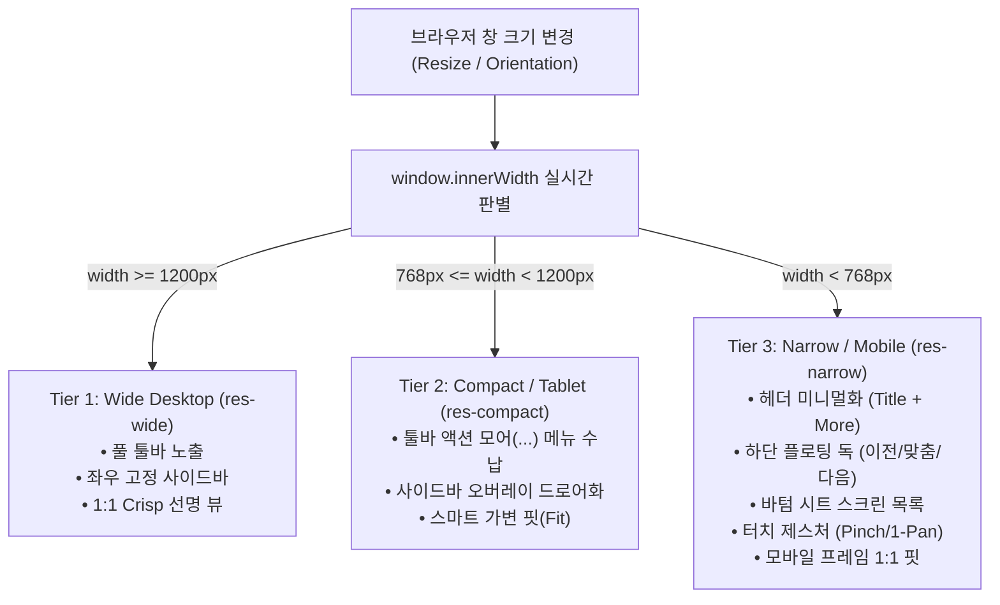
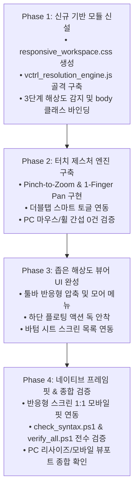

# 📱 순수 해상도 기반 반응형 워크스페이스 마스터 플랜 (Resolution-Driven Responsive Architecture Master Plan)

> **문서 버전**: 1.0.0  
> **작성 일자**: 2026-10-08  
> **기반 분석**: [AGENTS.md 7대 필수 게이트웨이 SSOT](file:///c:/Users/sisun/ai_work/AGENTS.md), [.agents/skills/workspace-editor-safety-process/SKILL.md](file:///c:/Users/sisun/ai_work/.agents/skills/workspace-editor-safety-process/SKILL.md), [.agents/skills/workspace-editor-engine/SKILL.md](file:///c:/Users/sisun/ai_work/.agents/skills/workspace-editor-engine/SKILL.md), [.agents/skills/workspace-editor-ui-components/SKILL.md](file:///c:/Users/sisun/ai_work/.agents/skills/workspace-editor-ui-components/SKILL.md)  
> **핵심 철학**: **"Device-Agnostic, Pure Resolution-Driven (디바이스 종속 배제, 순수 뷰포트 해상도 기준 반응형)"**  
> **목표**: PC 브라우저 창 분할(Snap), 소형 노트북, 태블릿, 스마트폰 등 어떤 환경에서도 유효 해상도에 따라 자동으로 완벽한 가독성과 최적의 조작성(Figma/Whimsical급 UX)을 보장.

---

## 1. 📌 개요 및 추진 배경 (Overview & Core Philosophy)

### 1.1 현 시스템의 병목 현상
* **PC 전용 고정 픽셀 뷰포트**: 1600×900 캔버스를 기준으로 설계되어 있어, 좁은 화면(폭 768px 미만)에서는 배율이 20%대로 급격히 축소되어 텍스트(14px 기준 2.8px 체감)가 뭉개집니다.
* **상단 헤더 툴바의 고정 가로 레이아웃**: 1200px 이상에 맞춰 가로 일렬 배치되어, 창 크기를 줄이거나 모바일에서 접속할 경우 우측 액션 버튼들이 화면 밖으로 넘치거나 겹칩니다.
* **터치 인터랙션 미지원**: `vctrl_canvas_viewport.js`가 마우스 휠과 키보드(`Space`)에만 의존하여, 터치스크린 및 모바일/태블릿 환경에서 핀치 줌(Pinch-to-zoom)이나 손가락 패닝(Pan)이 불가능합니다.
* **반응형 모바일 프레임의 이중 축소 모순**: 캔버스 내부에 375px 모바일 화면이 그려져 있음에도, PC 캔버스(1600px) 내부에서 축소되어 실기기 모바일 확인 시 실제 앱처럼 볼 수 없습니다.

### 1.2 핵심 개발 원칙 (Core Principles)
1. **절대적 디바이스 무관 (Device-Agnostic)**:
   - `navigator.userAgent`, `iPhone`, `Android` 등 기기 식별자를 판별하는 안티 패턴을 전면 배제합니다.
   - 오직 **"현재 브라우저 창의 유효 뷰포트 해상도(`window.innerWidth` / `clientHeight`, CSS 미디어 쿼리)"**만을 기준으로 동작합니다.
   - 따라서 **PC 사용자가 브라우저 창을 좌우 분할(Windows Snap, 400~800px)하여 좁게 보더라도 즉시 최적화된 반응형 뷰어 UI로 부드럽게 자동 전환**됩니다.
2. **독립 신규 파일 분리를 통한 안정성 극대화 (Modular Isolation)**:
   - 기존의 안정적인 엔진(`vctrl_canvas_viewport.js`, `viewer.css`)을 거대하게 부풀리지 않고, 전용 신규 모듈 **`assets/vctrl_resolution_engine.js`**와 **`assets/responsive_workspace.css`**로 격리 개발합니다.
   - 기존 PC 데스크톱 기능(1:1 선명뷰, 줌/팬, 단축키, 인스펙터)에 단 1건의 사이드이펙트도 주지 않도록 완벽히 가드합니다.
3. **Figma & Whimsical 벤치마크 UX 접목**:
   - 좁은 해상도에서는 복잡한 편집기를 닫고 **"가독성 높은 초경량 뷰어 쉘"**로 전환.
   - 엄지손가락 영역의 **"하단 플로팅 액션 독(Bottom Floating Dock)"** 및 **"바텀 시트(Bottom Sheet) 스크린 목록"** 제공.
   - 캔버스 내 모바일 프레임 감지 시 실기기 1:1 핏 자동 지원 (**Native Frame Preview**).

---

## 2. 🚨 7대 무결성 절대 원칙 (7 Mandatory Gateways Compliance)

본 작업은 `AGENTS.md`의 [7대 필수 게이트웨이]를 100% 엄격하게 준수하여 진행됩니다:

| 게이트웨이 | 준수 전략 |
| :--- | :--- |
| **1. 운영 시스템 무결성 보장** | 기존 `metadata.json` 및 화면 HTML 데이터를 일체 변조하지 않으며, 순수 뷰포트 렌더링 쉘 레이어만 확장. |
| **2. 사전 정밀 심층 분석 & 계획** | 본 마스터 플랜을 수립하고 모듈 인터페이스, 브레이크포인트, 터치 좌표계를 사전 전수 설계 후 착수. |
| **3. 사이드이펙트 원천 차단** | 신규 모듈 격리. 와이드 해상도(>= 1200px)에서는 기존 데스크톱 UI/엔진이 100% 동일하게 유지되도록 스코프 가드 적용. |
| **4. 스크립트/런타임 에러 0건** | 옵셔널 체이닝(`?.`), 브라우저 터치 이벤트 지원 여부(`'ontouchstart' in window`) 유효성 가드 적용. |
| **5. 백틱 충돌 에러 0건** | 부모 창 전용 모듈로 구성되며, 향후 iframe 주입 스크립트 작성 시에도 백틱 중첩을 원천 배제하고 문자열 결합 연산자(`+`) 사용. |
| **6. 구문/브래킷 에러 0건 & 정적 검증** | 파일 생성/수정 즉시 `powershell -ExecutionPolicy Bypass -File scripts/check_syntax.ps1`을 실행하여 0 Errors 통과 필수. |
| **7. CORS 에러 0건 & 통신 준수** | 부모 창과 iframe 간 좌표 통신은 기존 표준 버스인 `MessageHub` 및 `window.EditorBus`만을 경유. |

---

## 3. 📐 3단계 해상도 브레이크포인트 아키텍처 (Resolution Breakpoint Architecture)

디바이스 종류에 관계없이, 화면 가로폭(`Viewport Width`)에 따라 3개 계층으로 자동 적응합니다.



### 3.1 브레이크포인트 상세 규격

| 브레이크포인트 티어 | 해상도 범위 (`innerWidth`) | 적용 환경 예시 | 레이아웃 & 뷰어 정책 |
| :--- | :--- | :--- | :--- |
| **Tier 1: Wide** | `≥ 1200px` | 일반 데스크톱 모니터, 와이드 창 | • 기존 UI 100% 보존<br>• 좌측 스크린 패널 + 우측 인스펙터 패널 풀 노출<br>• 마우스/키보드 중심 저작 및 1:1 픽셀 스냅 |
| **Tier 2: Compact** | `768px ~ 1199px` | 노트북, 태블릿 가로모드, PC 1/2 분할 창 | • 좌측 사이드바 기본 접힘(`collapsed`), 열기 시 오버레이 드로어(Drawer)로 슬라이드<br>• 툴바 부가 액션(PDF, URL 복사)은 `...` 모어 드롭다운으로 수납<br>• 터치스크린 감지 시 핀치줌/터치패닝 자동 활성화 |
| **Tier 3: Narrow** | `< 768px` | 스마트폰, 태블릿 세로모드, PC 좁은 분할 창 | • **초경량 모바일 리뷰어 모드 (Mobile Review Mode)**<br>• 헤더: 뒤로가기 + 스크린 타이틀 + 모어 메뉴(`more_vert`)<br>• 인스펙터 패널 숨김<br>• 좌측 스크린 목록 ➔ **바텀 시트(Bottom Sheet)**로 전환<br>• 하단 중앙 **플로팅 액션 독(Bottom Floating Dock)** 안착<br>• 핀치 줌, 1핑거 터치 패닝, 더블탭 스마트 핏 활성화<br>• 반응형 스크린 감지 시 1:1 실기기 핏 자동 활성화 |

---

## 4. 🏗️ 신규 모듈 설계 및 파일 구성 (Dedicated Modular Architecture)

시스템의 단일 책임 원칙(SRP)과 안전성을 위해 2개의 신규 전용 파일을 신설합니다.

```
ai_work/
 ├── assets/
 │    ├── responsive_workspace.css         # [신규] 순수 해상도 기반 UI 쉘 스타일 (반응형 툴바, 바텀 독, 바텀 시트)
 │    ├── vctrl_resolution_engine.js      # [신규] 해상도 감지, 상태 머신, 터치 제스처, 스마트 뷰포트 컨트롤러
 │    ├── vctrl_canvas_viewport.js         # [기존 유지] PC 캔버스 코어 연산 (안전한 인터페이스 연동)
 │    ├── viewer.css                       # [기존 유지] 데스크톱 기본 스타일
 └── viewer.html                           # [신규 에셋 링크 추가]
```

### 4.1 신규 CSS: `assets/responsive_workspace.css`
* **역할**: 미디어 쿼리(`@media`) 및 해상도 티어 클래스(`.res-narrow`, `.res-compact`, `.res-wide`)에 따른 UI 쉘 반응형 스타일 정의.
* **주요 스타일 블록**:
  1. `.toolbar`: 좁은 해상도에서의 가로 오버플로우 방지, 불필요 요소 숨김 및 모어 메뉴 스타일링.
  2. `.v4-bottom-dock`: 하단 중앙 알약형 플로팅 컨트롤러 (`[◀ 이전]`, `[맞춤]`, `[100%]`, `[다음 ▶]`, `[목록]`).
  3. `.v4-bottom-sheet`: 좁은 화면에서 화면 목록과 메타데이터를 아래에서 위로 보여주는 글래스모피즘 슬라이드 시트.
  4. `.sidebar-left.overlay-mode`: 태블릿/좁은 화면에서 캔버스를 밀어내지 않고 부드럽게 덮는 오버레이 드로어.

### 4.2 신규 JS: `assets/vctrl_resolution_engine.js`
* **역할**: 뷰포트 해상도 감지 및 상태 동기화, 터치 인터랙션 엔진, 뷰포트 스마트 카메라 제어.
* **객체 구조**: `window.ResolutionEngine` (전역 SSOT)
  ```javascript
  window.ResolutionEngine = {
      currentTier: 'wide', // 'wide' | 'compact' | 'narrow'
      isTouchDevice: false,
      init: function() { ... },
      updateBreakpoint: function() { ... },
      initTouchGestures: function() { ... },
      openBottomSheet: function() { ... },
      closeBottomSheet: function() { ... },
      smartFocusFrame: function() { ... },
      navigateScreen: function(direction) { ... }
  };
  ```

---

## 5. 🔬 세부 구현 명세 (Detailed Technical Specifications)

### 5.1 [Feature 1] 순수 해상도 실시간 감지 및 상태 머신 (Pure Resolution Watcher)
* `ResizeObserver` 및 `window.addEventListener('resize')`를 결합하여 실시간 뷰포트 폭 계산.
* 디바운싱(Debounce 60ms)을 적용하여 창 크기 드래그 리사이즈 시 끊김 없는 60fps 전환 보장.
* 폭 변화 시 `document.body` 클래스를 즉각 갱신:
  - `body.res-wide` / `body.res-compact` / `body.res-narrow`
* 해상도 전환 시 캔버스 뷰포트 자동 재정렬 (`window.centerView(false)`).

### 5.2 [Feature 2] 헤더 툴바 반응형 압축 & 모어(`...`) 메뉴
* **Tier 1 (Wide)**: 모든 버튼 정상 노출.
* **Tier 2 (Compact)**: 메타데이터 패널 압축, 줌 컨트롤 간소화, `PDF 다운로드`와 `URL 복사` 버튼을 `...` 툴바 모어 드롭다운으로 수납.
* **Tier 3 (Narrow)**:
  - 툴바 높이를 40px로 슬림화.
  - `[뒤로가기]` + `[현재 스크린명 (터치 시 바텀시트 호출)]` + `[전체저장/더보기]`만 노출.
  - 복잡한 줌/화면맞춤 컨트롤은 하단 플로팅 독으로 위임.

### 5.3 [Feature 3] 하단 플로팅 액션 독 (Bottom Floating Dock)
* **노출 조건**: `body.res-narrow` 활성화 시 화면 하단 중앙(SafeArea 감안 `bottom: 16px`)에 자연스럽게 페이드인.
* **버튼 구성 (Pill Shape Glassmorphism)**:
  1. `[◀]` : 이전 스크린으로 즉시 전환
  2. `[fit_screen]` : 화면 맞춤(Fit to Screen) 원터치
  3. `[100%]` : 1:1 선명 뷰 스냅
  4. `[▶]` : 다음 스크린으로 즉시 전환
  5. `[layers / menu]` : 스크린 목록 바텀 시트 열기
* **디자인**: 다크모드 반투명 아크릴 글래스 (`rgba(22, 27, 34, 0.85)`, `backdrop-filter: blur(12px)`, 1px 슬림 보더).

### 5.4 [Feature 4] 바텀 시트 스크린 브라우저 (Bottom Sheet Drawer)
* 좁은 화면에서 좌측 사이드바 대신 아래에서 솟아오르는 슬라이드 시트.
* 드래그 핸들(Drag Handle Pill) 제공으로 아래로 스와이프하면 닫힘.
* 내부 내용:
  - 프로젝트 메타데이터 요약 (버전, 수정일, 작성자)
  - 스크린 목록 (탭하여 즉시 이동)
  - 재개정 이력 버튼 및 PDF 다운로드 링크 포함.

### 5.5 [Feature 5] 네이티브 터치 제스처 엔진 (Touch & Pinch Engine)
* **마우스/키보드 무간섭 원칙**: 데스크톱 이벤트에 간섭하지 않도록 터치 이벤트(`touchstart`, `touchmove`, `touchend`)만 독립 수신.
* **1. Pinch-to-Zoom (두 손가락 줌)**:
  - 2개 터치 포인트 간 유클리드 거리($d = \sqrt{\Delta x^2 + \Delta y^2}$) 계산.
  - 두 손가락의 중심점(Center Point)을 피벗(Pivot)으로 삼아 직관적으로 줌인/줌아웃.
  - 배율 제한: 0.15x ~ 10.0x.
* **2. 1-Finger Touch Pan (한 손가락 이동)**:
  - 좁은 해상도 뷰어 모드(`res-narrow`)에서는 캔버스 배경 터치 드래그 시 즉시 캔버스 이동(Pan).
  - 터치 감도 1:1 즉각 반영 및 관성(Inertia / Smooth Decay) 가속 지원.
* **3. Double-Tap Smart Fit (더블 탭)**:
  - 300ms 이내 더블 탭 시 `화면 맞춤` ↔ `100% 선명 뷰` 토글.

### 5.6 [Feature 6] 지능형 모바일 프레임 1:1 핏 (Native Frame Smart Preview)
* 우리 시스템의 특장점인 반응형 스크린(`isResponsiveDocument` 검출) 연동:
* iframe 문서 내부에서 `.mobile-content-inner` 또는 `.mobile-browser-frame`이 발견되고, 현재 브라우저 뷰포트가 `res-narrow`인 경우:
  - 1600×900 전체 캔버스를 20%로 축소하는 대신,
  - **모바일 프레임의 실제 가로폭(예: 375px)을 기기 화면 너비(`window.innerWidth`)에 1:1 픽셀로 맞추도록 카메라 스케일 및 좌표를 자동 센터링**.
  - 결과: 사용자가 모바일 폰으로 접속했을 때 마치 **실제 네이티브 모바일 앱이 실행된 것처럼 화면에 꽉 찬 100% 선명한 프로토타입**을 경험!

---

## 6. 📅 단계별 실행 로드맵 (Execution Plan)

시스템 안정성을 100% 담보하기 위해 4단계 순차 실행 및 단계별 정적 검증을 진행합니다.



| 단계 | 작업 내용 | 검증 및 산출물 | 위험도 |
| :--- | :--- | :--- | :--- |
| **Phase 1** | • `assets/responsive_workspace.css` 생성<br>• `assets/vctrl_resolution_engine.js` 생성 및 `viewer.html`에 안전하게 링크<br>• `ResizeObserver` 기반 해상도 감지 및 body 클래스(`res-wide`, `res-compact`, `res-narrow`) 바인딩 | `scripts/check_syntax.ps1` 구문 검증 통과, 창 리사이즈 시 body 클래스 실시간 전환 확인 | 🟢 낮음 (기반 구축) |
| **Phase 2** | • `vctrl_resolution_engine.js`에 터치 제스처 파이프라인 구현<br>• 핀치 줌, 1핑거 패닝, 더블탭 리스너 바인딩<br>• `window.state.transform` 및 `window.updateTransform()`과 완벽 동기화 | 마우스 동작 및 키보드 단축키에 영향 없음 확인, 터치 에뮬레이션 테스트 | 🟢 낮음 (격리 개발) |
| **Phase 3** | • `responsive_workspace.css`에 툴바 반응형 스타일, 바텀 독, 바텀 시트 구현<br>• `vctrl_resolution_engine.js`에서 이전/다음 스크린 이동 및 바텀 시트 열기/닫기 DOM 제어 연동 | PC 창을 400px로 줄였을 때 툴바 잘림 없이 플로팅 바텀 독과 바텀시트가 자연스럽게 작동하는지 확인 | 🟡 보통 (UI 쉘 고도화) |
| **Phase 4** | • `isResponsiveDocument` 연동 모바일 프레임 1:1 핏 스마트 스케일러 적용<br>• 일반 1600x900 스크린 가로 맞춤(Fit Width) 최적화<br>• 전체 시스템 무결성 검증 (`scripts/check_syntax.ps1`, `scripts/verify_all.ps1`) | 68개 전 파일 문법 무결성 100% 확인, 최종 완료 보고서 작성 | 🟢 안전 (최종 마감) |

---

## 7. 🛡️ 검증 프로토콜 및 롤백 대책 (Verification & Rollback Strategy)

### 7.1 자동화 정적 검증
1. **구문 및 백틱 무결성 검사**:
   ```powershell
   powershell -ExecutionPolicy Bypass -File scripts/check_syntax.ps1
   ```
   신규 파일 및 수정 파일 전체에서 브래킷 불일치, 백틱 충돌, 문법 오류 0건 필수 확인.
2. **종합 엔진 VM 검증**:
   ```powershell
   powershell -ExecutionPolicy Bypass -File scripts/verify_all.ps1
   ```
   V8 가상 머신 기반 전수 컴파일 및 링크 무결성 검증.

### 7.2 실시간 해상도 전환 시나리오 테스트
1. **PC 창 리사이즈 테스트**:
   - `1920px` (와이드 모니터) ➔ 정상 PC 에디터 모드 유지.
   - `1000px` (Compact 모드) ➔ 좌측 사이드바 드로어 전환, 툴바 모어 메뉴 동작.
   - `500px` (Narrow 윈도우 스냅 모드) ➔ 모바일 뷰어 모드, 하단 플로팅 독 노출, 바텀 시트 정상 동작.
2. **데스크톱 마우스/단축키 역회귀(Regression) 방지 검증**:
   - 마우스 휠 줌, 스페이스바 패닝, `F` 풀스크린, `Ctrl+S` 전체저장이 평소와 동일하게 100% 작동하는지 확인.

### 7.3 안전 롤백(Rollback) 대책
* 모든 신규 로직이 `assets/vctrl_resolution_engine.js`와 `assets/responsive_workspace.css`에 완전히 모듈화되어 격리되어 있으므로, 만에 하나 예기치 못한 이슈 발생 시 `viewer.html`의 2개 링크 태그만 주석 처리하면 즉시 1초 만에 100% 이전 상태로 원상 복구됩니다.

---

본 마스터 플랜에 따라 신규 모듈 분리 방식을 통해 시스템 안정성을 완벽히 보장하면서, 순수 해상도 기반의 차세대 반응형 워크스페이스를 단계적으로 안전하게 구축하겠습니다.
