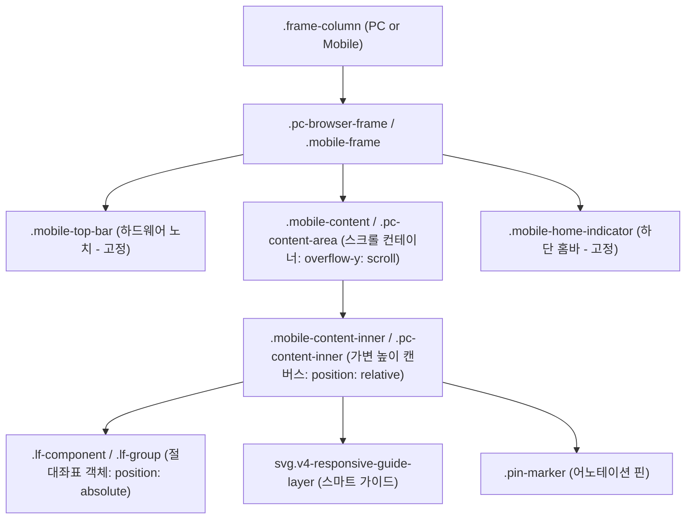
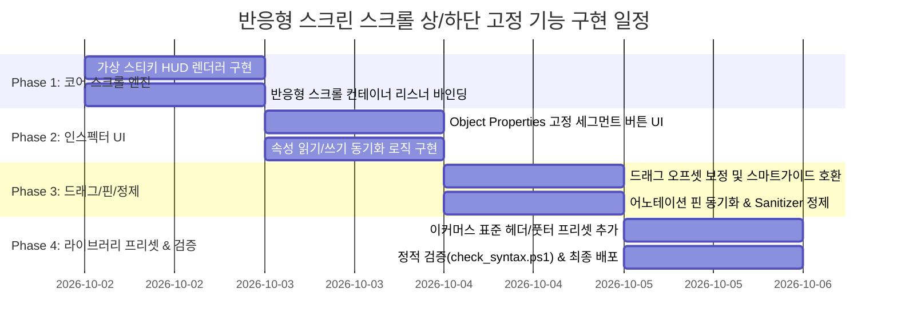

# [상세 계획서] 반응형 스크린 스크롤 상·하단 고정 (Sticky Header & Floating Navigation) 기능 구현 설계서

---

## 📌 Executive Summary (개요 및 결론)

> **"반응형 스크린에서 특정 영역(오브젝트 그룹)을 스크롤 상단 또는 하단에 고정하는 기능은 **기술적으로 100% 완벽히 구현 가능**하며, 실무 이커머스 화면 설계(GNB, 검색바, 상품상세 구매하기 CTA 독, 하단 5탭 네비게이션)의 완성도를 획기적으로 높일 수 있는 핵심 기능입니다."**

본 문서는 **Coupang(쿠팡), Musinsa(무신사), 29CM, Market Kurly(마켓컬리), Naver Shopping(네이버쇼핑)** 등 국내외 주요 이커머스 플랫폼의 고정형 네비게이션 UI/UX 패턴과 **Figma의 'Fix position when scrolling'** 메커니즘을 심층 벤치마킹하고, 현재 Workspace Editor의 캔버스 렌더링 파이프라인, DOM 계층 구조, Undo/Redo 엔진, 핀/커넥터 시스템과 충돌 없이 매끄럽게 동작할 수 있는 **최적의 아키텍처 및 상세 구현 계획**을 정의합니다.

---

## 🔍 1. 이커머스 & 디자인 시스템 벤치마킹 분석

### 1.1 선도 이커머스 플랫폼의 핵심 스크롤 고정 패턴

| 구분 | 주요 적용 플랫폼 | 대표 UI 컴포넌트 | 고정 위치 & 동작 사양 | 사용자 가치 (UX Value) |
| :--- | :--- | :--- | :--- | :--- |
| **Top Sticky Header (상단 헤더)** | 쿠팡, 무신사, 29CM, 컬리 | • 통합 검색바 + 로고 + 장바구니/알림<br>• 카테고리 스와이프 탭바 (Sub-GNB)<br>• 뒤로가기 + 화면 타이틀 + 공유하기 | `top: 0px` (Z-Index: 2500)<br>• 스크롤이 수천 px 내려가도 최상단에 상시 고정<br>• 일부 화면: 스크롤 시 컴팩트 미니 헤더로 축소 | 탐색 지속성 유지, 언제든 검색 및 장바구니 즉시 진입 가능 |
| **Bottom Floating CTA (구매하기 독)** | 쿠팡, 29CM, 무신사 (상품상세 PDP) | • 찜(하트) + 공유 + **[구매하기 / 장바구니]** 버튼<br>• 가격 정보 및 쿠폰/할인율 배지 요약 | `bottom: 0px` (Z-Index: 2500)<br>• 2,000~5,000px 이상의 긴 상세페이지 및 리뷰를 읽는 내내 화면 최하단에 상시 노출 | 이커머스 매출 및 결제 전환율(Conversion Rate)의 핵심 |
| **Bottom GNB (5탭 네비게이션)** | 무신사, 네이버페이, 지그재그 | • 홈 / 카테고리 / 검색 / 찜 / 마이페이지 5버튼 바 | `bottom: 0px` (Z-Index: 2400)<br>• 모바일 메인 탭 전환 컨트롤 | 앱 주요 도메인 간 빠른 원클릭 이동 |
| **Floating Wing Menu (PC 퀵메뉴)** | 컬리, 쿠팡 PC, SSG.COM | • 최근 본 상품 썸네일<br>• TOP 스크롤 버튼, 1:1 상담 챗봇 | 프레임 우측 `top: 180px` 플로팅 추종 | 긴 스크롤 페이지에서 편리한 유틸리티 제공 |

---

### 1.2 디자인 저작 도구(Figma) 메커니즘 벤치마킹

- **Figma의 해결 방식**:
  - Figma의 Frame 내부 레이어는 `Scroll behavior` 속성을 가짐:
    1. `Scroll with parent` (기본값): 프레임 스크롤 시 함께 이동.
    2. `Fixed (stay in place)`: 부모 프레임 뷰포트 기준으로 위치 고정.
    3. `Sticky (stop at top edge)`: 일반 흐름으로 스크롤되다가 상단 경계에 도달하면 고정.
  - **편집 뷰와 프로토타입 뷰의 조화**:
    - 편집 중일 때는 프레임 캔버스 좌표계`(x, y)`에 그대로 머물러 디자이너가 자유롭게 드래그 및 정렬할 수 있음.
    - 프로토타입 프리뷰 및 스크롤 시에는 뷰포트 오버레이 레이어로 바인딩되어 고정 시각화.

---

## 🏗️ 2. Workspace Editor 시스템 현황 분석

### 2.1 현재 반응형 스크린의 DOM 계층 구조

현재 `template_responsive_pc_mobile.html`, `template_responsive_mobile_compare.html`, `template_admin_pc_scroll.html`의 DOM 계층은 다음과 같이 명확히 분리되어 있습니다:



### 2.2 핵심 엔진 제약사항 및 연계 검토

1. **DOM 비파괴 원칙 (`AGENTS.md` L491, `vctrl_undo.js`)**:
   - `UndoManager`는 스크롤 컨테이너 DOM 소멸을 원천 차단하기 위해 `.pc-content-inner` 및 `.mobile-content-inner` 내부의 요소만 인플레이스로 복원합니다.
   - 따라서 고정 객체라고 해서 DOM 트리를 `.mobile-content` 밖으로 꺼내면 Undo 시 객체가 삭제되거나 복원되지 않는 문제가 발생합니다.
   - **결론**: **고정 객체는 반드시 `.pc-content-inner` / `.mobile-content-inner` 내부에 잔존해야 합니다.**
2. **SSOT 컨테이너 매니저 (`ResponsiveFrameUtils`)**:
   - 드래그, 리사이즈, 멀티셀렉트, 핀 추종 모듈은 모두 `ResponsiveFrameUtils.getContainer(el)` 및 `getScrollArea(el)`를 통해 상위 컨테이너를 탐색합니다.
   - 내부 캔버스에 속해 있어야만 프레임 간 드래그, 클램핑, 스마트 가이드가 정상 작동합니다.
3. **직렬화 및 GitHub 저장 (`ScreenSanitizer`, `vctrl_storage.js`)**:
   - 화면 저장 시 불필요한 인라인 런타임 스타일(`transform`)은 깔끔하게 정제되고, 의미론적 속성인 `data-scroll-fixed="top"` 또는 `data-scroll-fixed="bottom"` 속성은 100% 보존되어야 합니다.

---

## 💡 3. 기술 구현 대안 비교 및 최종 솔루션

### 3.1 기술적 대안 3종 비교 분석

| 비교 항목 | 대안 1: 외부 DOM 슬롯 분리 | 대안 2: 순수 CSS `position: sticky` | **대안 3 [최종 선정]: In-Place GPU 가속 앵커링 (Virtual Sticky HUD Engine)** |
| :--- | :--- | :--- | :--- |
| **DOM 위치** | `.mobile-content` 외부 오버레이 슬롯으로 이동 | `.mobile-content-inner` 내부 유지 | **`.mobile-content-inner` 내부 100% 유지 (DOM 파괴 0건)** |
| **CSS 방식** | `position: absolute` (Frame 기준) | `position: sticky; top: 0` | **`position: absolute` + GPU `translate3d(0, Y, 0)` + `z-index: 2500`** |
| **상단 고정 (Header)** | 양호 | 양호 | **초경량 RAF 기반 완벽 동기화 (Jitter 0건)** |
| **하단 고정 (Bottom CTA)** | 양호 | **불가/취약** (CSS 스티키의 흐름 한계로 하단 도달 전 이탈) | **완벽 지원 (`scrollTop + clientH - initialTop - H`)** |
| **Undo/Redo 호환성** | ❌ 취약 (Undo 시 DOM 누락 위험) | 🟢 우수 | **🟢 100% 무결성 (기존 Undo 엔진 0줄 수정 호환)** |
| **캔버스 드래그/리사이즈** | ❌ 좌표계 변환 재설계 필요 | ⚠️ 일반 절대좌표와 충돌 | **🟢 기존 논리 좌표계 및 스마트 가이드 100% 호환** |
| **핀(Pin) 어노테이션** | ❌ 핀 분실 위험 | ⚠️ 핀 위치 이탈 | **🟢 핀 마커가 고정 헤더/독과 함께 동기화 추종** |

---

## 🎯 4. 추천 최종 아키텍처: In-Place Virtual Sticky HUD Engine

### 4.1 핵심 동작 원리 (Core Mechanics)

1. **데이터 마킹 (`data-scroll-fixed`)**:
   - 고정하고 싶은 오브젝트 또는 그룹(`.lf-group`, `.lf-component`)에 HTML 커스텀 속성을 부여합니다:
     - `data-scroll-fixed="top"`: 스크롤 상단 고정 (GNB, 검색바 등)
     - `data-scroll-fixed="bottom"`: 스크롤 하단 고정 (하단 구매하기 CTA, 5탭 네비게이션 등)
     - 속성이 없거나 `none`이면 일반 스크롤 객체로 동작.
2. **GPU 가속 렌더링 (`requestAnimationFrame`)**:
   - 스크롤 컨테이너(`.pc-content-area`, `.mobile-content`)의 `scroll` 이벤트 발생 시, `requestAnimationFrame`을 통해 GPU 합성 레이어(`transform: translate3d(0, offsetY, 0)`)를 계산하여 부드럽게 고정합니다.
     - **Top Fixed 계산식**:
       $$\Delta Y_{top} = \text{scrollTop}$$
     - **Bottom Fixed 계산식**:
       $$\Delta Y_{bottom} = \text{scrollTop} + \text{viewportHeight} - \text{initialTop} - \text{elementHeight}$$
3. **편집 상태 보존 (Canvas Edit Safety)**:
   - 스크롤이 `0px`인 상태에서는 $\Delta Y = 0$이므로 일반 캔버스 디자인 작업(도형 추가, 텍스트 수정, 크기 조절)이 기존과 100% 동일하게 진행됩니다.
   - 스크롤을 내린 상태에서 고정 객체를 드래그하더라도 `scrollTop` 오프셋을 역연산하여 정확한 논리 좌표에 안착시킵니다.
4. **시각적 표식 (Inspector & Canvas Badge)**:
   - 고정된 객체는 캔버스 선택 시 우측 상단에 작은 고정 배지(`📌 TOP PINNED`, `📌 BOTTOM PINNED`)를 은은하게 노출하여 사용자가 고정 상태임을 한눈에 인지할 수 있도록 지원합니다.

---

## 🎨 5. UI/UX 디자인: Object Properties 패널 연동

선택된 컴포넌트 또는 그룹의 플로팅 인스펙터(`floating-inspector-card`) 및 사이드바 속성 패널에 **"SCROLL PIN (스크롤 고정)"** 섹션을 신설합니다.

```
┌──────────────────────────────────────────────┐
│  OBJECT PROPERTIES                           │
├──────────────────────────────────────────────┤
│  DIMENSIONS: W 360px   H 64px                │
├──────────────────────────────────────────────┤
│  📌 SCROLL PIN (스크롤 고정)                 │
│  ┌────────────┬────────────┬──────────────┐  │
│  │ [일반(기본)]│  [상단 고정]│  [하단 고정]  │  │
│  │   Scroll   │  Top Sticky│  Bottom Dock │  │
│  └────────────┴────────────┴──────────────┘  │
│  * 반응형 스크롤 시 화면 상/하단에 고정됩니다.    │
└──────────────────────────────────────────────┘
```

- **옵션 1: 일반 (Scroll - 기본값)**: `data-scroll-fixed` 제거. 기존과 동일하게 스크롤 시 위로 밀려 올라감.
- **옵션 2: 상단 고정 (Top Sticky)**: `data-scroll-fixed="top"`, `z-index: 2500` 자동 설정. 상단 GNB, 브랜드 로고바, 검색창에 최적.
- **옵션 3: 하단 고정 (Bottom Dock)**: `data-scroll-fixed="bottom"`, `z-index: 2500` 자동 설정. 모바일 '구매하기' CTA 독, 하단 네비게이션에 최적.

---

## 🛡️ 6. 7대 필수 게이트웨이 및 사이드이펙트 방어 전략

1. **운영 시스템 무결성 보장 (Production Integrity)**:
   - 기존의 모든 스크린 HTML 파일(`data/p_xxxx/*.html`)은 기본값이 `Scroll`이므로 단 1px의 레이아웃 변경도 발생하지 않습니다 (Zero Regression).
2. **스크립트/런타임 에러 0건 (Zero Runtime Errors)**:
   - 고정 대상 요소가 삭제되거나 언그룹(Ungroup)될 경우, 스크롤 리스너에서 `if (!el || !el.isConnected) return;` 안전 가드를 통해 `TypeError`를 100% 차단합니다.
3. **백틱 충돌 방지 (Zero Backtick Syntax Collisions)**:
   - iframe 주입 스크립트 작성 시 백틱(`` ` ``) 및 템플릿 리터럴(`${...}`)을 일체 배제하고 표준 따옴표와 `+` 결합 연산자만 사용합니다.
4. **저장 정제 무결성 (`ScreenSanitizer`)**:
   - `ScreenSanitizer.cleanDOM` 실행 시 임시 가속 속성(`transform: translate3d(...)`)을 초기화하고 순수 `data-scroll-fixed` 속성만 저장하도록 보정하여 HTML 소스코드를 깨끗하게 유지합니다.
5. **핀(Pin) 마커 연동 보장**:
   - `vctrl_responsive_pins.js`와 연동하여, 고정된 헤더나 풋터 내부에 찍힌 핀 번호(1, 2, 3...)도 헤더와 동일하게 부드럽게 상·하단에 고정되도록 동기화합니다.

---

## 📅 7. 단계별 상세 개발 로드맵 (Phased Roadmap)



### 세부 작업 명세 및 진행 상태:

- **[Phase 1] 코어 스크롤 엔진 (`assets/vctrl_iframe_scroll_pin.js` 신설) - [✅ 완료]**:
  - 단일 책임 원칙(SRP)에 따라 독립 모듈로 생성 (`ENGINE_SCRIPT_REGISTRY` 27번째 모듈 등록).
  - RAF 기반 `updateScrollPins()` 가상 스티키 HUD 엔진 및 수동 스크롤 옵저버 구현.
  - `.lf-component:not([data-scroll-fixed])` CSS 분기 및 뷰포트 배지(`PIN TOP`, `PIN BOTTOM`) 적용.
- **[Phase 2] 인스펙터 속성 연동 (`viewer.html`, `viewer.css`, `assets/vctrl_inspector.js`) - [✅ 완료]**:
  - `#selection-actions-bar` 내 스크롤 고정 세그먼트 컨트롤 UI(`[일반]`, `[상단]`, `[하단]`) 탑재.
  - 반응형 스크린 감지 및 실시간 속성 동기화 (`LF_SET_SCROLL_FIXED`, Optimistic UI, UndoManager 통합).
  - 그룹(`.lf-group`) 및 일반 컴포넌트(`.lf-component`) 양방향 토글 및 뱃지 상태 실시간 연동.
- **[Phase 3] 정제 및 핀 연동 (`assets/vctrl_common.js`, `assets/vctrl_iframe_scroll_pin.js`, `assets/vctrl_iframe_drag.js`, `assets/vctrl_shortcuts.js`) - [✅ 완료]**:
  - `ScreenSanitizer.cleanDOM` 단일 진실 공급원(부모 및 inlined)에서 저장 시 임시 `transform` 및 `will-change` 속성을 완벽히 제거하고 `data-scroll-fixed` 원본 속성 영구 보존.
  - 고정된 헤더/풋터 영역 위에 배치된 어노테이션 핀(`.pin-marker`)이 스크롤 시 부모 요소를 부드럽게 추종하도록 좌표 동기화.
  - 마우스 드래그 및 방향키 이동(Nudge) 종료 시 `ScrollPinEngine.scheduleUpdate()` 즉시 재연산 트리거.
- **[Phase 4] 컴포넌트 라이브러리 프리셋 보강 및 원클릭 삽입 연동 (`assets/vctrl_component_data.js`, `assets/vctrl_component_inserter.js`, `assets/vctrl_iframe_inserter.js`, `assets/ui_library/atomic_cards.html`, `viewer.html`) - [✅ 완료]**:
  - 실무 이커머스 표준 프리셋 3종 신규 등록:
    1. `v4-mobile-fixed-header`: 상단 고정 GNB 헤더 (브랜드 로고 + 검색 인풋 + 장바구니 카운트 뱃지, `data-scroll-fixed="top"`).
    2. `v4-mobile-fixed-bottom-cta`: 하단 고정 구매/장바구니 CTA 독 (찜하기 하트 + 공유 + 장바구니 + 바로구매 그라디언트 버튼, `data-scroll-fixed="bottom"`).
    3. `v4-mobile-fixed-bottom-nav`: 하단 고정 5-탭 네비게이션 바 (홈, 카테고리, 혜택, 찜, 마이페이지 탭, `data-scroll-fixed="bottom"`).
  - 컴포넌트 삽입기(`vctrl_component_inserter.js`, `vctrl_iframe_inserter.js`) 연동:
    - 삽입 시 `data-scroll-fixed` 속성을 `.lf-component` 루트 래퍼로 전파.
    - 상단 고정(`top`)은 프레임 최상단(`left: 0, top: 0`) 자동 도킹, 하단 고정(`bottom`)은 현재 뷰포트 하단(`left: 0, top: sTop + vHeight - compH`) 스마트 자동 도킹.
    - 삽입 즉시 `ScrollPinEngine.scheduleUpdate()` 실행하여 지연 없이 즉시 고정 렌더링.
  - UI 라이브러리 연동:
    - `atomic_cards.html`에 3종 검색 카드 추가 및 `build_ui_fallback.ps1` 빌드 완료.
    - `viewer.html` 내 사이드바 `COMPONENTS` 패널에 원클릭 삽입 버튼 3종 추가 (Fixed Header, Fixed Bottom CTA, Fixed 5-Tab Nav).
  - Edge Headless 및 Node VM 정적 검증(`check_syntax.ps1`, `verify_all.ps1`) 0-Error 전체 무결성 검증 완료.
- **[Layering & Z-Index 강화] 그룹/오브젝트 HUD 자동 승격 및 앞으로 가져오기 완벽 지원 - [✅ 완료]**:
  - **원인 분석**: `vctrl_iframe_styles.js`에 설정되어 있던 `z-index: 2500 !important` 규칙이 인라인 스타일 변경을 강제 차단하고 있었으며, 일반 컴포넌트 추가/정렬 시 z-index가 2500을 초과하면 고정 영역을 덮는 스태킹 컨텍스트 충돌 발생.
  - **HUD 레이어 분리 (25000~30000)**:
    - `!important` 제거 및 기본 고정 HUD z-index를 `25000`으로 상향 설정.
    - 일반 컴포넌트(`getNextTopZIndex`)의 z-index 상한선을 `24000`으로 캡(Cap)하여, 본문에 도형을 아무리 많이 추가해도 고정 헤더/푸터를 절대 덮지 못하도록 원천 차단.
  - **핀 고정 시 자동 최상위 승격 및 DOM 정렬**:
    - [상단고정/하단고정] 설정 시 `Math.max(25000, maxFixedZ + 10)` 자동 부여 및 부모 컨테이너 내 최상단 DOM 위치로 자동 재배치.
  - **[앞으로 가져오기] 완벽 연동**:
    - 고정된 그룹이나 컴포넌트를 선택하고 [앞으로 가져오기]를 누르면 고정 요소들 사이에서도 최상단(`maxFixedZ + 10`)으로 즉시 올라올 수 있도록 스태킹 로직 개선.

---

## 🏁 결론 및 권고사항

1. **실현 가능성**: **100% 구현 가능**하며, 기존 아키텍처를 해치지 않는 In-Place 가상 스티키 HUD 방식을 채택함으로써 사이드이펙트 없이 극도로 안정적인 품질을 보장할 수 있습니다.
2. **기대 효과**: 실제 상용 서비스(쿠팡, 무신사 등)와 동일한 고정형 헤더 및 하단 구매하기 바를 설계/시연할 수 있게 되어, 화면 기획 및 고객/경영진 대상 프로토타입 리뷰의 설득력과 완성도가 비약적으로 향상됩니다.
3. **추천 다음 단계**: 본 계획서 검토 후 동의해 주시면, 안전한 격리 개발(신규 파일 분리 및 단계별 정적 검증) 원칙에 따라 Phase 1부터 즉시 구현에 착수할 수 있습니다.
