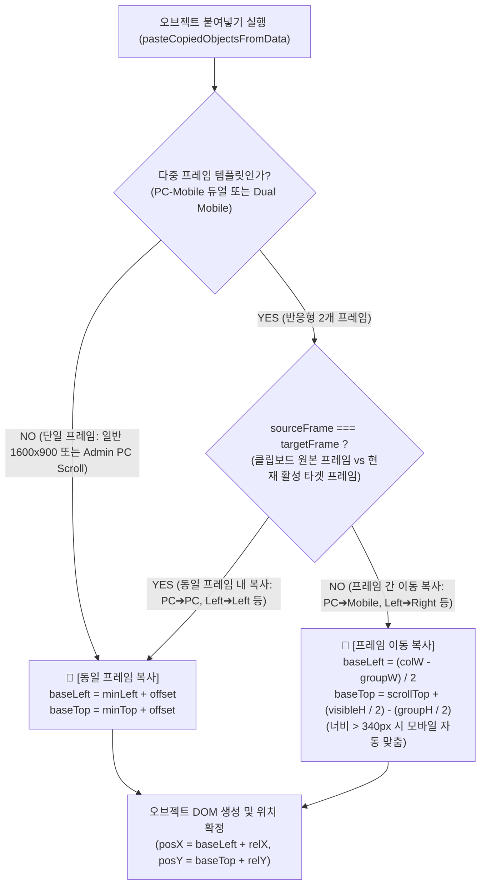

# 동일 프레임(우측하단 +15px) 및 반응형 프레임 이동(정중앙) 스마트 붙여넣기 위치 최적화 구현 계획서

## 1. 개요 및 목적 (Overview & Goals)

### 1.1. 배경 및 문제 상황
- **기존 동작**: 스크린 내 특정 오브젝트를 복사(`Ctrl+C`) 후 붙여넣기(`Ctrl+V`)하면, 원본 오브젝트의 우측하단(`+15px, +15px`)에 복사본이 자연스럽게 배치되었습니다.
- **반응형 템플릿 도입 후 발생한 문제**:
  - 반응형(PC-Mobile 듀얼, Mobile-Mobile 듀얼) 템플릿에서 **서로 다른 프레임 간 복사/이동** 기능이 추가되면서, 프레임이 바뀌는 경우 원본 좌표가 타겟 프레임 규격에 맞지 않아 화면 밖으로 벗어나는 것을 막고자 **타겟 프레임 정중앙(Viewport Center)** 에 붙여넣어지도록 개선했습니다.
  - 그러나 이 과정에서 [vctrl_clipboard_objects.js](file:///c:/Users/sisun/ai_work/assets/vctrl_clipboard_objects.js)의 뷰포트 센터링 로직이 **프레임이 1개뿐인 일반 템플릿 스크린** 및 **반응형 템플릿 내의 동일 프레임 복사** 케이스까지 일괄 적용되면서, 모든 복사+붙여넣기가 무조건 화면/프레임 정중앙에 생성되는 불편함이 발생하고 있습니다.

### 1.2. 핵심 개선 목표
1. **[조건 1] 동일 프레임 내 복사+붙여넣기**:
   - 단일 프레임 템플릿(1600x900 표준 캔버스, 단일 PC 스크롤 등) 전체
   - 반응형 템플릿이라도 동일한 프레임 내부(`PC ➔ PC`, `Left ➔ Left`, `Right ➔ Right`)에서 복사+붙여넣기 실행 시
   - 👉 **기존처럼 원본 오브젝트의 우측하단(+15px, +15px)에 정확히 생성**
2. **[조건 2] 반응형 템플릿 내 프레임 간 이동 복사+붙여넣기**:
   - 반응형 템플릿에서 서로 다른 프레임(`PC ➔ Mobile`, `Left ➔ Right`, `Right ➔ Left` 등)으로 이동하여 붙여넣기 실행 시
   - 👉 **지금처럼 대상 프레임의 현재 스크롤 뷰포트 정중앙에 생성 (모바일 너비 340px 자동 맞춤 유지)**

---

## 2. 7대 필수 게이트웨이 및 스킬 원칙 사전 점검 (Pre-Flight Gateway Audit)

| 게이트웨이 원칙 | 점검 항목 및 대응 계획 | 준수 여부 |
| :--- | :--- | :---: |
| **1. 운영 시스템 무결성 (Strict Production Integrity)** | 임의의 가짜 데이터나 모의 객체를 주입하지 않으며, 실제 클립보드 데이터(`v4Clipboard`, `window.top.__lf_global_clipboard__`)와 디스크 HTML/`metadata.json` 구조를 100% 보존합니다. | ✅ 준수 |
| **2. 사전 정밀 심층 분석 & 계획 수립 (Deep Analysis First)** | `assets/vctrl_clipboard_objects.js`, `assets/vctrl_iframe_script.js`, `assets/vctrl_clipboard.js`, 템플릿 구조를 전수 분석하고 전용 구현 계획서를 사전 확정합니다. | ✅ 준수 |
| **3. 사이드이펙트 원천 차단 (Zero Side-Effects)** | 커넥터(Line), 그룹(Group), 잘라내기(`Ctrl+X`), 인스펙터 동기화, 스마트가이드 및 Z-Index 재배치 파이프라인의 기존 동작을 100% 유지합니다. | ✅ 준수 |
| **4. 스크립트/런타임 에러 0건 (Zero Runtime Errors)** | `item.left`, `item.top`, `detectFrameType`, `targetCol` 객체 접근 시 철저한 널 가드(`?.`, `|| 0`)를 적용하여 콘솔 에러를 차단합니다. | ✅ 준수 |
| **5. 백틱 충돌 에러 0건 (Zero Backtick Syntax Collisions)** | `vctrl_clipboard_objects.js` 파일 전체가 백틱(`` ` ``) 템플릿 리터럴로 감싸져 있으므로 내부에서 백틱 및 `${}` 변수 보간을 일절 사용하지 않고 표준 따옴표와 문자열 연결 연산자(`+`)만 사용합니다. | ✅ 준수 |
| **6. 구문/브래킷 에러 0건 & 정적 검증 (Mandatory Static Verification)** | 작업 완료 즉시 `powershell -ExecutionPolicy Bypass -File scripts/check_syntax.ps1`을 실행하여 브래킷 밸런스 및 Node VM 인라인 스크립트 컴파일 0 Error를 자체 확인합니다. | ✅ 준수 |
| **7. CORS 에러 0건 및 통신 프로토콜 준수 (Zero CORS Errors)** | Iframe과 부모 창 간의 `contentDocument` 직접 접근을 배제하고 `window.top.__lf_global_clipboard__` 및 `MessageHub`/`EditorBus` 규격을 준수합니다. | ✅ 준수 |

---

## 3. 관련 시스템 및 소스코드 전수 분석 (Architecture Analysis)

### 3.1. 모듈별 역할 및 변경 영향도
| 모듈 파일 | 현재 역할 및 분석 내용 | 이번 작업에서의 변경 사항 |
| :--- | :--- | :--- |
| **`assets/vctrl_clipboard_objects.js`** | **[핵심 대상]** Iframe 내부의 오브젝트 복사/잘라내기/붙여넣기 직렬화 및 역직렬화 전담 엔진 (`window.v4ClipboardObjectsScript`). 현재 `isResponsiveTemplate` 여부와 무관하게 뷰포트 센터링이 강제 적용되어 있음. | - `sourceFrame` vs `targetFrame` 및 `isMultiFrame` 판정 로직 추가<br>- **동일 프레임**: `baseLeft = minLeft + offset`, `baseTop = minTop + offset`<br>- **프레임 이동**: 기존 뷰포트 정중앙 산출 유지<br>- 경계 가드(Clamping) 및 안전 보정 |
| **`assets/vctrl_iframe_script.js`** | Iframe 내부의 이벤트 처리 및 프레임 감지 (`detectFrameType`), 프레임 클릭 시 활성 컬럼(`active-column`, `window.lastActiveFrame`) 실시간 추적. | - **수정 불필요 (기존 기능 100% 활용)**: 마우스 클릭/휠 시 `window.lastActiveFrame`이 정확히 갱신되고 있음을 확인 완료. |
| **`assets/vctrl_clipboard.js`** | 부모 창의 글로벌 클립보드 SSOT (`window.top.__lf_global_clipboard__`) 저장 및 통신 핸들러. | - **수정 불필요**: 복사된 전체 오브젝트 속성(`frameContainer`, `left`, `top` 등)을 온전히 중계하고 있음을 확인 완료. |
| **`assets/vctrl_shortcuts.js`** | `Ctrl+C`, `Ctrl+V`, `Ctrl+X` 핫키 바인딩 및 부모 프록시. | - **수정 불필요**: `window.pasteCopiedObjects()` 및 `LF_REQUEST_CLIPBOARD` 파이프라인 정상 유지. |

---

## 4. 세부 기술 설계 명세 (Detailed Technical Specification)

### 4.1. 프레임 판정 및 분기 매트릭스 (Frame Decision Matrix)



### 4.2. 세부 판정 변수 정의
1. **`sourceFrame` (복사 원본 프레임)**:
   - 복사 시 각 아이템에 저장된 `item.frameContainer` (예: `'pc'`, `'left'`, `'right'`, `'mobile'`, `'canvas'`, `'root'`)
   - `const sourceFrame = componentItems[0] ? (componentItems[0].frameContainer || 'root') : 'root';`
2. **`targetFrame` (붙여넣기 대상 프레임)**:
   - 붙여넣기 직전 선택된 요소가 속한 프레임(`initialSelectedFrameType`)
   - 또는 활성 컬럼(`document.querySelector('.frame-column.active-column')`)의 타입
   - 또는 `window.lastActiveFrame`
3. **`isMultiFrame` (다중 프레임 화면 여부)**:
   - PC 컬럼과 모바일 컬럼이 함께 있거나, 모바일 컬럼이 2개 이상 존재하는 진정한 다중 프레임 환경:
     `const isMultiFrame = (pcCol && (mobileLeftCol || mobileRightCol || mobileCols.length > 0)) || (mobileCols.length > 1);`
4. **`isSameFrame` (동일 프레임 판정 플래그)**:
   - `const isSameFrame = (!isMultiFrame) || (sourceFrame === targetFrame) || (sourceFrame === 'root' && targetFrame === 'canvas') || (sourceFrame === 'canvas' && targetFrame === 'canvas');`

### 4.3. 위치 산출 수식 및 경계 가드

#### ① 동일 프레임 복사 (`isSameFrame === true`)
```javascript
const offset = isCutOperation ? 0 : 15;
baseLeft = minLeft + offset;
baseTop = minTop + offset;

// 경계 이탈 방지 가드 (Clamping)
if (isResponsiveTemplate && targetCol) {
    const colInner = targetCol.querySelector('.mobile-content-inner, .pc-content-inner');
    const colW = (colInner ? colInner.offsetWidth : targetCol.offsetWidth) || (targetFrame === 'pc' ? 1160 : 360);
    baseLeft = Math.max(10, Math.min(baseLeft, colW - groupW - 10));
    baseTop = Math.max(10, baseTop);
} else {
    const maxW = Math.max(1600, document.body.scrollWidth || 0);
    const maxH = Math.max(900, document.body.scrollHeight || 0);
    baseLeft = Math.max(15, Math.min(baseLeft, maxW - groupW - 15));
    baseTop = Math.max(15, Math.min(baseTop, maxH - groupH - 15));
}
```

#### ② 프레임 간 이동 복사 (`isSameFrame === false`)
```javascript
if (targetCol) {
    const colInner = targetCol.querySelector('.mobile-content-inner, .pc-content-inner');
    const colScroll = targetCol.querySelector('.mobile-content-area, .mobile-content, .pc-content-area');
    const scrollTop = colScroll ? colScroll.scrollTop : 0;
    const visibleH = colScroll ? (colScroll.clientHeight || 810) : 810;
    const colW = (colInner ? colInner.offsetWidth : targetCol.offsetWidth) || (targetFrame === 'pc' ? 1160 : 360);
    
    // 대상 프레임 컬럼의 가로 정중앙 + 현재 스크롤 뷰포트의 세로 정중앙
    baseLeft = Math.max(10, Math.round((colW - groupW) / 2));
    baseTop = Math.max(15, Math.round(scrollTop + (visibleH / 2) - (groupH / 2)));
}
```

---

## 5. 실제 코드 변경 상세 설계 (Implementation Blueprint)

대상 파일: [assets/vctrl_clipboard_objects.js](file:///c:/Users/sisun/ai_work/assets/vctrl_clipboard_objects.js)

### [수정 대상 영역: 260행 ~ 354행]

```javascript
            // 1. 원본 프레임 및 다중 프레임 환경 판정
            const sourceFrame = componentItems[0] ? (componentItems[0].frameContainer || 'root') : 'root';
            const isMultiFrame = !!((pcCol && (mobileLeftCol || mobileRightCol || mobileCols.length > 0)) || (mobileCols.length > 1));

            // 2. 타겟 컬럼 및 타겟 프레임 감지
            let targetFrame = 'root';
            let targetHost = document.body;
            let targetCol = null;
            let baseLeft = 0;
            let baseTop = 0;
            let visibleW = 360;

            if (isResponsiveTemplate) {
                if (initialSelectedCol) {
                    targetCol = initialSelectedCol;
                    targetFrame = initialSelectedFrameType || (typeof window.detectFrameType === 'function' ? window.detectFrameType(initialSelectedCol) : 'mobile');
                } else if (document.querySelector('.frame-column.active-column')) {
                    targetCol = document.querySelector('.frame-column.active-column');
                    targetFrame = typeof window.detectFrameType === 'function' ? window.detectFrameType(targetCol) : 'mobile';
                } else if (window.lastActiveFrame) {
                    targetFrame = window.lastActiveFrame;
                    if (targetFrame === 'left' && mobileLeftCol) targetCol = mobileLeftCol;
                    else if (targetFrame === 'right' && mobileRightCol) targetCol = mobileRightCol;
                    else if (targetFrame === 'pc' && pcCol) targetCol = pcCol;
                    else if (targetFrame === 'mobile') targetCol = mobileLeftCol || mobileCols[0] || null;
                } else {
                    const origFrame = componentItems[0] ? componentItems[0].frameContainer : 'left';
                    if (origFrame === 'right' && mobileRightCol) { targetCol = mobileRightCol; targetFrame = 'right'; }
                    else if (origFrame === 'pc' && pcCol) { targetCol = pcCol; targetFrame = 'pc'; }
                    else if (origFrame === 'canvas') { targetFrame = 'canvas'; }
                    else {
                        targetCol = mobileLeftCol || mobileCols[0] || pcCol || null;
                        targetFrame = targetCol ? (typeof window.detectFrameType === 'function' ? window.detectFrameType(targetCol) : 'left') : 'left';
                    }
                }

                if (targetFrame === 'canvas') {
                    targetHost = document.querySelector('.mobile-compare-page, .page, .canvas, #canvas-page, #canvas') || document.body;
                } else if (targetCol) {
                    const colInner = targetCol.querySelector('.mobile-content-inner, .pc-content-inner');
                    targetHost = colInner || targetCol;
                    window.lastActiveFrame = targetFrame;
                    if (typeof window.updateActiveFrameUI === 'function') {
                        window.updateActiveFrameUI(targetCol);
                    }
                }
            } else {
                targetHost = document.querySelector('.canvas, .page, #canvas-page, #canvas') || document.body;
                targetFrame = 'root';
            }

            // 3. 동일 프레임 vs 프레임 이동에 따른 최종 좌표 결정
            const isSameFrame = (!isMultiFrame) || (sourceFrame === targetFrame) || (sourceFrame === 'root' && targetFrame === 'canvas') || (sourceFrame === 'canvas' && targetFrame === 'canvas');

            if (isSameFrame) {
                // [조건 1] 동일 프레임 내 복사: 원본 오브젝트 우측하단(+offset)에 생성
                baseLeft = minLeft + offset;
                baseTop = minTop + offset;

                // 영역 벗어남 방지 클램핑
                if (isResponsiveTemplate && targetCol) {
                    const colW = targetHost.offsetWidth || (targetFrame === 'pc' ? 1160 : 360);
                    visibleW = colW;
                    baseLeft = Math.max(10, Math.min(baseLeft, colW - groupW - 10));
                    baseTop = Math.max(10, baseTop);
                } else {
                    const maxW = Math.max(1600, document.body.scrollWidth || 0);
                    const maxH = Math.max(900, document.body.scrollHeight || 0);
                    baseLeft = Math.max(15, Math.min(baseLeft, maxW - groupW - 15));
                    baseTop = Math.max(15, Math.min(baseTop, maxH - groupH - 15));
                }
            } else {
                // [조건 2] 프레임 간 이동 복사: 대상 프레임 정중앙에 생성
                if (targetFrame === 'canvas') {
                    baseLeft = Math.max(15, Math.round((1600 - groupW) / 2));
                    baseTop = Math.max(15, Math.round((900 - groupH) / 2));
                } else if (targetCol) {
                    const colScroll = targetCol.querySelector('.mobile-content-area, .mobile-content, .pc-content-area');
                    const scrollTop = colScroll ? colScroll.scrollTop : 0;
                    const visibleH = colScroll ? (colScroll.clientHeight || 810) : 810;
                    const isColMobile = targetCol.classList.contains('mobile-column') || (!targetCol.classList.contains('pc-column'));
                    const colW = targetHost.offsetWidth || (isColMobile ? 360 : 1160);
                    visibleW = colW;

                    baseLeft = Math.max(10, Math.round((colW - groupW) / 2));
                    baseTop = Math.max(15, Math.round(scrollTop + (visibleH / 2) - (groupH / 2)));
                } else {
                    baseLeft = Math.max(10, Math.round((360 - groupW) / 2));
                    baseTop = Math.max(15, Math.round((810 - groupH) / 2));
                }
            }
```

---

## 6. 안전 검증 및 테스트 계획 (Verification Plan)

### 6.1. 자체 무인 정적 검증 (Autonomous Verification)
1. **`powershell -ExecutionPolicy Bypass -File scripts/check_syntax.ps1`**:
   - `assets/vctrl_clipboard_objects.js`의 브래킷 매칭 및 백틱 템플릿 리터럴 문법 충돌 0건 확인.
   - Node VM 19개 인라인 스크립트 결합 파이프라인 100% 통과 확인.
2. **`powershell -ExecutionPolicy Bypass -File scripts/verify_all.ps1`**:
   - Headless 환경에서 40여 개 전체 엔진 모듈 컴파일 및 런타임 이상 유무 종합 점검.

### 6.2. 사용자 브라우저 기능 테스트 시나리오
| 테스트 케이스 | 조작 단계 | 기대 결과 |
| :--- | :--- | :--- |
| **TC-1. 일반 캔버스 스크린 복사** | 1600x900 표준 스크린에서 버튼 또는 카드 선택 후 `Ctrl+C` ➔ `Ctrl+V` | 원본 오브젝트의 **우측하단(+15px, +15px)** 에 정확히 생성됨 |
| **TC-2. 반응형 템플릿 동일 프레임 복사** | PC-Mobile 화면의 PC 프레임 내 오브젝트 선택 후 `Ctrl+C` ➔ `Ctrl+V` | 프레임 중앙으로 점프하지 않고, 원본의 **우측하단(+15px, +15px)** 에 생성됨 |
| **TC-3. 반응형 템플릿 프레임 간 이동 복사** | PC 프레임의 오브젝트 `Ctrl+C` ➔ 우측 Mobile 프레임 클릭 ➔ `Ctrl+V` | 모바일 프레임의 **스크롤 뷰포트 정중앙**에 배치되며 너비 340px로 자동 피팅됨 |
| **TC-4. 잘라내기(Cut) 테스트** | 오브젝트 선택 후 `Ctrl+X` ➔ 동일 프레임에서 `Ctrl+V` | 오프셋 이동 없이 **원래 있던 제자리**에 복원됨 |

---

## 7. 롤백 대비책 (Rollback Strategy)
- 변경 대상 파일이 `assets/vctrl_clipboard_objects.js` 단 1개 파일로 격리되어 있어, 문제 발생 시 즉각적인 1줄 단위 원복이 가능합니다.
- Git 변경 사항 추적을 통해 언제든지 직전 커밋 상태로 완전 롤백할 수 있도록 안전망을 확보합니다.
