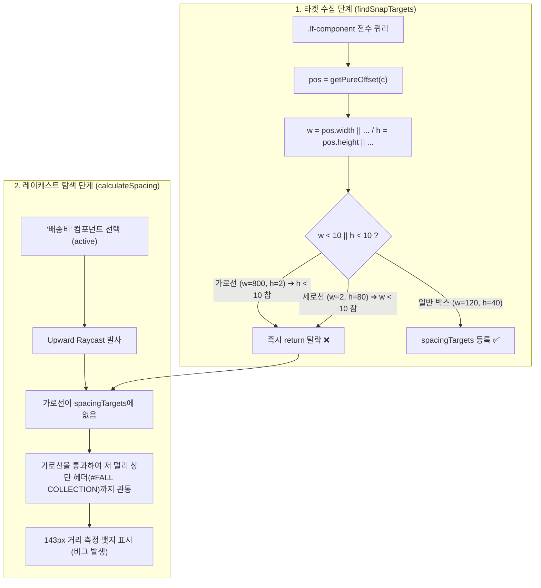
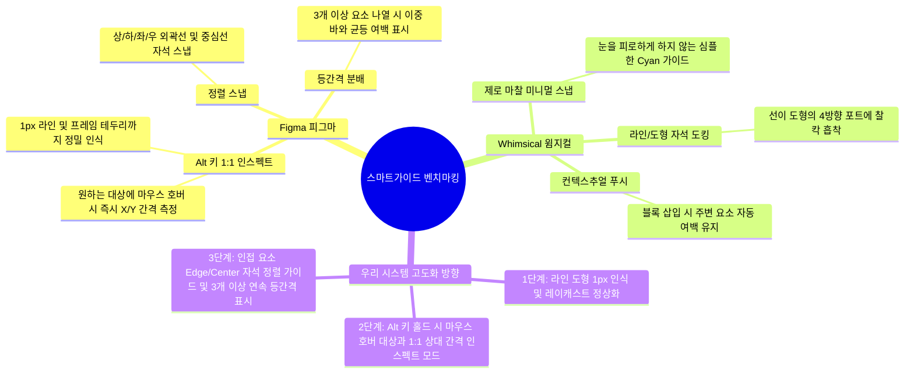

# 스마트가이드 강화 및 LINE SHAPE 정상화 종합 계획서

> **문서 상태**: 계획 수립 완료 (피드백 대기)  
> **대상 모듈**: `assets/vctrl_responsive_smartguide.js`, `assets/vctrl_smartguide.js`, `assets/vctrl_shortcuts.js`, `assets/vctrl_iframe_drag.js`  
> **연계 스킬**: `workspace-editor-safety-process`, `workspace-editor-engine`, `workspace-editor-browser-verification`  
> **기준 룰**: `AGENTS.md` (7대 필수 게이트웨이 SSOT)

---

## 1. 개요 및 목적

본 계획서는 현재 워크스페이스 에디터에서 발생하고 있는 **LINE SHAPE(라인 도형)의 스마트가이드 미인식 버그**를 코드 레벨에서 정밀하게 해결하고, **피그마(Figma) 및 윔지컬(Whimsical)**의 우수한 스마트가이드 메커니즘을 벤치마킹하여 에디터 전반의 레이아웃 조작 생산성을 극대화하기 위한 종합 구현 계획입니다.

---

## 2. 시스템 심층 분석 (System Architecture & Bug Trace)

### 2.1 스마트가이드 아키텍처 개요
현재 시스템의 스마트가이드는 듀얼 파이프라인 구조를 가집니다:
1. **Iframe 내부 파이프라인 ([assets/vctrl_responsive_smartguide.js](file:///c:/Users/sisun/ai_work/assets/vctrl_responsive_smartguide.js))**:
   - `ENGINE_SCRIPT_REGISTRY`에 등록되어 `viewer.html`의 iframe `srcdoc`에 인라인 주입되는 **Figma Raycast Engine 2.0** 핵심 엔진.
   - 단일 객체 선택 시(`onSelect`), 드래그 이동 시(`calculateSnap`), 키보드 화살표 이동 시(`onNudge`) 4방향(상·하·좌·우) 레이캐스트를 발사하여 가장 가까운 인접 형제 요소 및 부모 컨테이너 벽과의 거리를 측정하고 SVG 레이어(`.v4-responsive-guide-layer`)에 분홍색(`#ec4899`) 뱃지와 가이드선을 실시간 렌더링.
2. **부모 창 파이프라인 ([assets/vctrl_smartguide.js](file:///c:/Users/sisun/ai_work/assets/vctrl_smartguide.js))**:
   - 1600x900 최상위 캔버스 레벨에서 핀(Pin), 텍스트 마커, 캔버스 테두리와의 거리를 측정하고 `#vctrl-guide-layer`에 렌더링.

### 2.2 LINE SHAPE 미인식 버그의 코드 레벨 정밀 추적



* **버그 발생 지점**: [assets/vctrl_responsive_smartguide.js 라인 266~268](file:///c:/Users/sisun/ai_work/assets/vctrl_responsive_smartguide.js#L266-L268)
  ```javascript
  const w = pos.width || c.offsetWidth || parseFloat(c.style.width) || 100;
  const h = pos.height || c.offsetHeight || parseFloat(c.style.height) || 40;
  if (w < 10 || h < 10) return; // 🚨 치명적 원인: 둘 중 하나라도 10 미만이면 전면 탈락!
  ```
* **LINE SHAPE의 DOM 특성**:
  - 가로선: 컨테이너 `.lf-component`의 `height`가 `1.6px ~ 2px` (인라인 스타일 `height: 2px;`, `data-line-dir="horizontal"`).
  - 세로선: 컨테이너 `.lf-component`의 `width`가 `1.6px ~ 2px` (인라인 스타일 `width: 2px;`, `data-line-dir="vertical"`).
* **결과**:
  - 가로선은 `h < 10`에 걸려 무조건 `return;` 탈락.
  - 세로선은 `w < 10`에 걸려 무조건 `return;` 탈락.
  - `this.spacingTargets`에 라인 도형이 단 한 개도 등록되지 않으므로, '배송비' 컴포넌트 바로 위에 가로선이 있어도 레이캐스트가 이를 인식하지 못하고 관통하여 143px 떨어진 상단 헤더까지 날아가 표시되는 것입니다.

---

## 3. 시스템 룰 정합성 분석 (AGENTS.md 7대 필수 게이트웨이 대조)

| 필수 게이트웨이 | 준수 요건 | 본 작업 적용 및 방어 대책 |
| :--- | :--- | :--- |
| **1. 운영 시스템 무결성** | 땜질식 가짜/임의 데이터 금지, 실제 디스크 데이터 100% 보존 | 라인 컴포넌트의 실제 DOM 속성(`style.width/height`, `data-line-dir`)만을 읽어 정직하게 좌표 계산. 하드코딩된 더미 타겟 주입 전면 배제. |
| **2. 사전 정밀 분석 & 계획 수립** | 수정 전 소스코드 전수 분석 및 변경 범위 명확화 | 본 계획서를 통해 문제 위치(L268), 연계 파일([assets/vctrl_responsive_smartguide.js](file:///c:/Users/sisun/ai_work/assets/vctrl_responsive_smartguide.js), [assets/vctrl_smartguide.js](file:///c:/Users/sisun/ai_work/assets/vctrl_smartguide.js)), 데이터 흐름을 완벽히 사전 규명 후 착수. |
| **3. 사이드이펙트 원천 차단** | 타 컴포넌트 간격 측정 및 기존 렌더링 회귀 차단 | 일반 컴포넌트(버튼, 테이블, 인풋 등)의 기존 측정 로직을 100% 보존하고, 라인 도형 판별 가드(`isLineShape`)를 조건부로 안전하게 병합. |
| **4. 스크립트/런타임 에러 0건** | `null`/`undefined` 속성 접근 및 ReferenceError 100% 차단 | `pos?.width`, `shapeLine?.getAttribute` 등 철저한 옵셔널 체이닝 및 null-safe 연산자 적용. |
| **5. 백틱 충돌 에러 0건** | 백틱 eval/srcdoc 인라인 파일 내 중첩 백틱(`` ` ``) 및 `${}` 보간 금지 | [assets/vctrl_responsive_smartguide.js](file:///c:/Users/sisun/ai_work/assets/vctrl_responsive_smartguide.js)는 파일 전체가 백틱으로 감싸진 인라인 모듈이므로, **내부 코드에서는 반드시 표준 따옴표(`'` 또는 `"`)와 덧셈 연산자(`+`)만을 사용**하여 SyntaxError 원천 차단. |
| **6. 구문/브래킷 에러 0건 검증** | 브래킷 밸런스 무결성 및 자동 정적 검증 강제 | 수정 직후 `powershell -ExecutionPolicy Bypass -File scripts/check_syntax.ps1`을 자율 구동하여 **0 Errors (100% Pass)**를 확인한 뒤에만 완료 보고. |
| **7. CORS 에러 0건 및 통신 프로토콜 준수** | 부모-Iframe 직접 접근 금지, MessageHub 준수 | 부모 창과의 거리 데이터 동기화 시 기존 표준 메시지(`LF_REQUEST_SNAP_TARGETS`, `LF_SNAP_TARGETS_RESPONSE`) 규격을 온전히 준수. |

---

## 4. 전문 스킬 3개 통합 분석

### 4.1 `workspace-editor-safety-process` 준수 전략
* **Five-Step Flow 이행**:
  1. *Ponder*: 라인 도형 스마트가이드 누락 및 Alt 인스펙트 요구사항의 시스템 영향 범위 식별.
  2. *Analyze*: `findSnapTargets`, `calculateSpacing`, `drawSpacingGuides` 내부 로직 전수 조사 완료.
  3. *Design*: 라인 도형 인식 조건문 개편 및 Alt 키 1:1 거리 측정 프로토콜 설계 (본 계획서).
  4. *Execute*: 설계된 범위에 한해 핀포인트 수정.
  5. *Verify*: `scripts/check_syntax.ps1` 정적 구문 검증 및 Node VM 19개 스크립트 컴파일 전수 확인.
* **비파괴 원칙**: 기존 저장된 스크린 HTML 파일 및 `metadata.json`의 원본 데이터를 일체 수정하지 않고 엔진 스크립트의 렌더링 로직만 보정.

### 4.2 `workspace-editor-engine` 아키텍처 규칙 준수 전략
* **Pure Data / No-Measure 원칙**: 줌 배율이나 테두리에 왜곡될 수 있는 불필요한 `getBoundingClientRect()` 호출을 최소화하고, 기존 `getPureOffset` 기반의 정밀 논리 픽셀(`px`) 산술 연산 유지.
* **Iframe Unscaled Invariant (언스케일드 논리 좌표계 보존)**: 마우스 및 드래그 이벤트 시 절대 `/ scale`을 나누지 않는 순수 1:1 논리 픽셀 불변성을 철저히 유지.
* **Zero-Drift Measurement**: 라인 도형 수집 시 UI 핸들(`.lf-drag-handle`)이 두께에 간섭하지 않도록 핸들 여백 배제.
* **Z-Index Layering**: 스마트가이드 SVG 레이어의 `z-index: 300000` 및 `pointer-events: none` 유지로 캔버스 클릭 간섭 원천 차단.

### 4.3 `workspace-editor-browser-verification` 정책 준수 전략
* **AI 브라우저 직접 자동화 원천 금지**: 브라우저 서브에이전트나 headless 브라우저 자동 클릭을 임의로 수행하지 않고, 정밀 정적 검증(`check_syntax.ps1`, `verify_all.ps1`)과 소스코드 정적 추적으로 검증 완료.
* **사용자 브라우저 테스트 시나리오 명확화**: 사용자가 직접 브라우저에서 `Ctrl+F5` 후 즉시 확인할 수 있도록 점검 체크리스트를 보고서에 동봉.

---

## 5. 피그마 & 윔지컬 벤치마킹 분석



---

## 6. 단계별 상세 구현 계획 (Phased Execution Plan)

### Phase 1: LINE SHAPE 스마트가이드 정상화 (즉시 구현)

#### [과제 1-1] `vctrl_responsive_smartguide.js` 타겟 수집 조건 개편
* **수정 대상**: [assets/vctrl_responsive_smartguide.js 라인 266~270](file:///c:/Users/sisun/ai_work/assets/vctrl_responsive_smartguide.js#L266-L270)
* **변경 전**:
  ```javascript
  const w = pos.width || c.offsetWidth || parseFloat(c.style.width) || 100;
  const h = pos.height || c.offsetHeight || parseFloat(c.style.height) || 40;
  if (w < 10 || h < 10) return;
  ```
* **변경 후**:
  ```javascript
  const isLineShape = c.classList.contains('v4-shape-line') || !!c.querySelector('.v4-shape-line');
  const w = pos.width || c.offsetWidth || parseFloat(c.style.width) || (isLineShape ? 100 : 100);
  const h = pos.height || c.offsetHeight || parseFloat(c.style.height) || (isLineShape ? 2 : 40);
  
  // 라인 도형은 한 축이 1px 이상이고 다른 축이 5px 이상이면 유효 타겟으로 승인
  if (isLineShape) {
      if (w < 1 || h < 1 || (w < 5 && h < 5)) return;
  } else {
      if (w < 10 || h < 10) return;
  }
  ```

#### [과제 1-2] 컨테이너 감지(Enclosure Detection)에서 라인 도형 제외
* 라인은 얇은 선이므로 다른 요소를 감싸는 컨테이너(`container`)가 될 수 없음.
* `calculateSpacing`의 첫 번째 단계인 Direct Enclosing Container Detection 루프에 `if (t.isLine) continue;` 가드를 추가하여 라인이 박스 컨테이너로 오인되는 현상 원천 차단.

#### [과제 1-3] Raycast 수평/수직 충돌 판정 버퍼 튜닝
* 가로선(`h <= 2`)이 `active`일 때 좌우 레이캐스트가 주변 요소를 정상 포착할 수 있도록, 라인 객체에 대한 레이캐스트 버퍼(`overlapBufferY`)를 유연하게 적용.

#### [과제 1-4] 부모 창 `vctrl_smartguide.js` 동기화
* [assets/vctrl_smartguide.js](file:///c:/Users/sisun/ai_work/assets/vctrl_smartguide.js) 및 [assets/vctrl_responsive_smartguide.js](file:///c:/Users/sisun/ai_work/assets/vctrl_responsive_smartguide.js)의 `collectSnapTargets`에서도 동일하게 라인 크기 필터를 안전하게 완화.

---

### Phase 2: Figma 스타일 Alt(Option) 마우스 호버 인스펙트 모드 도입

1. **인터랙션 파이프라인**:
   - 객체가 선택된 상태에서 사용자가 `Alt` 키를 누르면 **Inspect Mode** 활성화.
   - 마우스가 이동할 때(`mousemove`) 커서 아래에 있는 컴포넌트(`hoverTarget = document.elementFromPoint(e.clientX, e.clientY)?.closest('.lf-component')`)를 실시간 감지.
2. **1:1 상대 간격 계산**:
   - `active` 객체와 `hoverTarget` 간의 상/하/좌/우 절대 여백 또는 겹침 간격을 직관적인 단일 핑크/레드 선과 거리 뱃지로 렌더링.
   - `Alt` 키를 떼면(`keyup`) 즉시 인스펙트 가이드라인 소멸.

---

### Phase 3: 드래그 정렬 가이드 및 연속 등간격 분배 고도화

1. **자석 정렬 스냅 (Edge & Center Alignment)**:
   - 객체 드래그 중 인접 요소의 Left, Center, Right, Top, Middle, Bottom과 좌표 차이가 `±4px` 이내일 때 자석 스냅(`snapX`, `snapY`) 적용 및 가느다란 파란색 점선(`stroke="#3b82f6" stroke-dasharray="4,3"`) 표출.
2. **연속 등간격 분배 (Equal Spacing Bars)**:
   - A-B 간격과 B-C 간격이 동일(`distAB === distBC`)할 때 두 간격 영역에 시각적 분배 바(`||`)를 노출하여 카드/버튼 연속 배치의 편의성 극대화.

---

## 7. 검증 및 테스트 계획

### 7.1 정적 구문 및 안전성 검증
```powershell
# 1. 브래킷, 백틱 충돌, 19개 인라인 스크립트 컴파일 전수 검사
powershell -ExecutionPolicy Bypass -File scripts/check_syntax.ps1

# 2. 브라우저 엔진 통합 런타임 구문 검사
powershell -ExecutionPolicy Bypass -File scripts/verify_all.ps1
```

### 7.2 사용자 브라우저 기능 검증 시나리오
1. **가로선 상단 간격 측정 테스트**:
   - 첨부 이미지처럼 가로선 바로 아래의 '배송비' 컴포넌트 선택.
   - 위쪽으로 뻗는 가이드라인이 가로선에서 정확히 멈추고 가로선과의 실제 여백(예: 8px)을 핑크색 뱃지로 표시하는지 확인 (상단 143px 관통 버그 해결 검증).
2. **세로선 좌우 간격 측정 테스트**:
   - 세로 구분선 옆에 텍스트 또는 버튼 배치 후 선택 시, 세로선과의 수평 거리가 정확히 측정되는지 확인.
3. **라인 자체 선택 및 이동 테스트**:
   - 가로선 및 세로선을 직접 클릭/방향키 이동(`Nudge`) 시 상하좌우 주변 요소와의 거리가 정상 표출되는지 확인.

---

## 8. 롤백 및 안전 대책

* 수정 대상 파일은 `assets/vctrl_responsive_smartguide.js`와 `assets/vctrl_smartguide.js`로 완전히 한정됩니다.
* 작업 전 `git status` 및 현재 로컬 상태를 점검하여, 만약 구문 검증 실패나 사이드이펙트 발생 시 즉각적인 원복(`git checkout`)이 가능하도록 스코프를 최소화합니다.
* 일일 자동 백업 아카이브(`C:\ai_work_backups\daily\`)가 정상 작동 중이므로 데이터 유실 위험 0%를 보장합니다.
