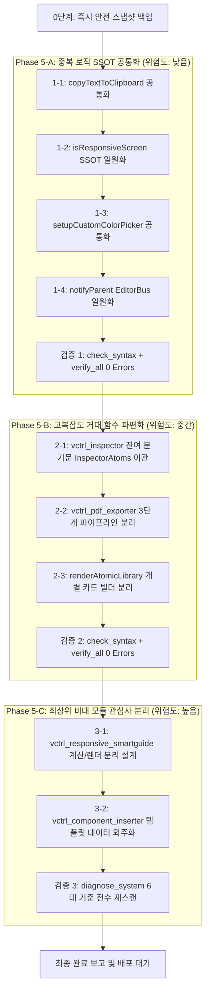

# 🛡️ 시스템 무결성 보장 리팩토링 종합 마스터 계획서 (Phase 5 Master Plan)

> **문서 버전**: 1.0.0  
> **기준 일자**: 2026-10-01  
> **적용 규정**: [AGENTS.md](file:///c:/Users/sisun/ai_work/AGENTS.md) (7대 필수 게이트웨이 SSOT), [.agents/skills/workspace-editor-safety-process/SKILL.md](file:///c:/Users/sisun/ai_work/.agents/skills/workspace-editor-safety-process/SKILL.md), [.agents/skills/workspace-editor-system-diagnosis/SKILL.md](file:///c:/Users/sisun/ai_work/.agents/skills/workspace-editor-system-diagnosis/SKILL.md)  
> **진단 기반**: 전체 65개 JS 및 22개 JSON 전수 조사 결과

---

## 1. 📌 개요 및 추진 배경 (Overview & Objectives)

시스템 전체 정밀 진단 결과, 워크스페이스 에디터의 모든 구문(Syntax) 및 빌드, 룰/스킬 동기화 상태는 100% 정상이나 다음과 같은 **잠재적 부채 및 구조적 개선점**이 확인되었습니다:
1. **모듈 비대화**: 35KB 이상 또는 750줄을 초과하는 무거운 모듈 23개 존재 (최대 `vctrl_responsive_smartguide.js` 80.6KB / 1,664줄).
2. **거대 함수(Oversized Functions)**: 단일 함수가 150줄 이상인 복합 로직 4건 존재 (최대 `exportProjectToPDF` 260줄).
3. **중복 로직(Duplicate Logic)**: 서로 다른 파일에 개별 구현된 유틸리티 4건 (`copyTextToClipboard`, `setupCustomColorPicker`, `isResponsiveScreen`, `notifyParent`).

본 계획서는 **운영 중인 시스템에 단 1건의 사이드이펙트나 런타임 오류도 발생하지 않도록**, 철저한 3단계 위험도 분리(낮음 ➔ 중간 ➔ 높음)와 단계별 정적/VM 검증 게이트웨이를 적용하여 안전하게 시스템을 고도화하는 완벽한 실행 가이드를 제공합니다.

---

## 2. 🚨 7대 무결성 절대 원칙 (Absolute Safety Protocols)

모든 작업은 아래 7대 원칙을 단 하나의 예외도 없이 100% 준수하며 진행됩니다:

1. **실제 데이터 보존 및 가짜/더미 데이터 절대 금지**:
   - `metadata.json`, 화면 HTML 파일 등 실제 데이터를 왜곡하거나 임의로 변경하지 않으며 더미 폴백 코드를 삽입하지 않습니다.
2. **작업 착수 전 무조건 즉각 백업 스냅샷 생성**:
   - 착수 직전 `powershell -ExecutionPolicy Bypass -File scripts/daily_auto_backup.ps1`을 구동하여 `C:\ai_work_backups\daily\`에 즉시 롤백 가능한 스냅샷을 생성합니다.
3. **인라인 템플릿 백틱(`` ` ``) 충돌 원천 차단**:
   - iframe 주입 대상 파일(`vctrl_core.js`, `vctrl_iframe_*.js`) 수정 시 템플릿 리터럴 내부 중첩 백틱 및 `${}` 변수 보간을 금지하고 일반 따옴표와 문자열 결합(`+`)을 사용합니다.
4. **공개 API 및 글로벌 네임스페이스 시그니처 100% 보존**:
   - `window.EditorBus`, `window.InspectorAtoms`, `window.handleInsertComponent`, `window.ScreenSanitizer` 등 기존 외부 노출 인터페이스 시그니처를 절대 변경하지 않고 내부 구현만 위임/공통화합니다.
5. **`ENGINE_SCRIPT_REGISTRY` 25개 모듈 파이프라인 정합성 유지**:
   - iframe 주입 스크립트 수정 시 25개 모듈 순서 및 키 바인딩을 유지하며, 누락/순서 뒤바뀜이 발생하지 않도록 엄격 관리합니다.
6. **단계별 독립 정적/VM 컴파일 검증 통과 필수**:
   - 각 단계(Sub-task) 완료 시마다 `scripts/check_syntax.ps1`(브래킷 밸런스 + Node VM 25개 전 모듈 컴파일) 및 `scripts/verify_all.ps1`(Edge Headless 런타임)을 실행하여 0 Errors를 확인합니다.
7. **사용자 명시적 승인 기반 배포 원칙**:
   - 사용자가 명시적으로 배포("배포해줘")를 요청하기 전까지 원격 저장소(`origin/main`)에 푸시하지 않고 로컬 브랜치에서 안전하게 검증합니다.

---

## 3. 🗺️ 3단계 점진적 리팩토링 로드맵 (Phased Roadmap)

---

### 🟢 Phase 5-A: 중복 로직 SSOT 공통화 (위험도: 낮음)
> 기존 로직의 내부 동작은 일절 변경하지 않고, 2곳 이상 분산된 중복 구현을 공통 유틸리티 파일로 위임하는 작업.

#### [Task 1-1] `copyTextToClipboard` 단일화
- **현황**: [assets/app.js](file:///c:/Users/sisun/ai_work/assets/app.js)와 [assets/vctrl_clipboard.js](file:///c:/Users/sisun/ai_work/assets/vctrl_clipboard.js)에 각각 구현됨.
- **조치**: [assets/vctrl_clipboard.js](file:///c:/Users/sisun/ai_work/assets/vctrl_clipboard.js)의 `copyTextToClipboard`를 SSOT로 지정하고, `app.js`에서는 `window.copyTextToClipboard` 호출로 위임.
- **방어책**: `window.copyTextToClipboard`가 없는 극단적 상황을 대비해 기존 로직 폴백 가드 유지.

#### [Task 1-2] `isResponsiveScreen` 판별식 일원화
- **현황**: [assets/vctrl_responsive_pins.js](file:///c:/Users/sisun/ai_work/assets/vctrl_responsive_pins.js)와 [assets/vctrl_responsive_multiselect.js](file:///c:/Users/sisun/ai_work/assets/vctrl_responsive_multiselect.js)에 중복 구현됨.
- **조치**: [assets/vctrl_common.js](file:///c:/Users/sisun/ai_work/assets/vctrl_common.js)의 `window.isResponsiveDocument`를 SSOT로 일원화하고, 각 파일에서는 `isResponsiveScreen = window.isResponsiveDocument` 참조로 통일.
- **방어책**: iframe 내부 및 부모 창 모두에서 호출 가능하도록 `window.isResponsiveScreen` 바인딩 보존.

#### [Task 1-3] `setupCustomColorPicker` 컬러 피커 통합
- **현황**: [assets/inspector/inspector_quill.js](file:///c:/Users/sisun/ai_work/assets/inspector/inspector_quill.js)와 [assets/vctrl_color_picker.js](file:///c:/Users/sisun/ai_work/assets/vctrl_color_picker.js) 중복.
- **조치**: `vctrl_color_picker.js`의 공통 함수를 재활용하도록 통일.

---

### 🟡 Phase 5-B: 고복잡도 거대 함수 파편화 (위험도: 중간)
> 단일 함수 내부에 누적된 분기문을 순수 서브 함수 및 전략 패턴으로 나누어 가독성과 유지보수성을 극대화하는 작업.

#### [Task 2-1] `_syncComponentTypeProperties` 잔여 분기문 이관 ([vctrl_inspector.js](file:///c:/Users/sisun/ai_work/assets/vctrl_inspector.js), 209줄)
- **현황**: 체크박스, 라디오, 텍스트박스, 데이트피커, 서치바의 속성 UI 동기화 분기가 `vctrl_inspector.js`에 여전히 모놀리식으로 남아있음.
- **조치**: 이미 독립 모듈로 완성된 [assets/inspector/inspector_atoms.js](file:///c:/Users/sisun/ai_work/assets/inspector/inspector_atoms.js) (`window.InspectorAtoms`)의 각 도메인 메서드로 호출을 위임하여 `_syncComponentTypeProperties`의 라인 수를 20줄 이내로 축소.
- **방어책**: 분기문 이전 시 DOM ID 매핑 및 셀렉터 일치 여부 1:1 정밀 검증.

#### [Task 2-2] `exportProjectToPDF` 3단계 파이프라인 분리 ([vctrl_pdf_exporter.js](file:///c:/Users/sisun/ai_work/assets/vctrl_pdf_exporter.js), 260줄)
- **현황**: PDF 내보내기 시 모달 UI 제어, 비동기 스크린 캔버스 캡처, jsPDF 조립이 거대한 단일 함수에 혼재됨.
- **조치**:
  1. `renderPdfProgressModal(totalScreens)`: 모달 UI 렌더링 및 진행률 제어
  2. `captureScreenToCanvas(screenItem)`: html2canvas 비동기 캡처 및 긴 캔버스 보정
  3. `compilePdfDocument(captures, metadata)`: jsPDF 인스턴스에 페이지 추가 및 다운로드 저장
- **방어책**: 비동기 Promise 체인의 예외 처리(`try-catch-finally`)로 모달이 닫히지 않는 현상 방지.

#### [Task 2-3] `renderAtomicLibrary` 카드 빌더 분리 ([vctrl_component_library.js](file:///c:/Users/sisun/ai_work/assets/vctrl_component_library.js), 160줄)
- **현황**: 40여 종의 아토믹 컴포넌트 HTML 생성 및 클릭/드래그 이벤트 바인딩이 160줄의 거대 루프에 집중됨.
- **조치**: `createAtomicLibraryCard(item)` 서브 함수로 분리하여 루프 간결화.

---

### 🔴 Phase 5-C: 최상위 비대 모듈 관심사 분리 (위험도: 높음)
> 파일 용량이 80KB에 달하는 복합 모듈을 단일 책임 원칙에 따라 분리하는 아키텍처 개편 작업.

#### [Task 3-1] `vctrl_responsive_smartguide.js` (80.6KB, 1,664줄) 분리
- **현황**: 수평/수직 스냅 좌표 계산 수학(Math) 알고리즘과 화면에 가이드 점선/치수 라벨을 그리는 SVG 렌더링(Renderer) 로직이 한 파일에 혼재.
- **조치**:
  - `vctrl_responsive_smartguide_math.js`: 순수 스냅 타겟 계산 및 거리 측정 엔진.
  - `vctrl_responsive_smartguide.js`: 이벤트 리스너, DOM 오버레이 가이드라인 SVG 생성 및 라이프사이클 관리.
- **방어책**: `ENGINE_SCRIPT_REGISTRY`에 신규 모듈 등록 및 25개 ➔ 26개 확장 시 `check_syntax.ps1`, `verify_all.ps1`, `vctrl_core.js` 동시 동기화.

---

## 4. ⚖️ 위험 요소 및 롤백 매트릭스 (Risk & Rollback Matrix)

| 구분 | 발생 가능한 리스크 | 사전 예방 조치 (Safeguard) | 롤백 절차 (Rollback Plan) |
|:---|:---|:---|:---|
| **Phase 5-A** (공통화) | 부모-Iframe 간 통신 누락 또는 판별식 불일치 | 호출 전 `window.*` 존재 여부 체크 가드 유지, 기존 시그니처 100% 동일 유지 | Git diff로 단일 파일 단위 즉각 되돌리기 (`git checkout <file>`) |
| **Phase 5-B** (거대함수 분할) | 인스펙터 동기화 누락 또는 PDF 비동기 멈춤 | `InspectorAtoms` 메서드 파라미터 매핑 1:1 교차 검증, PDF 캡처 루프 finally 블록 보장 | 해당 모듈 단위 즉각 리셋 및 VM 컴파일 재검증 |
| **Phase 5-C** (모듈 분리) | iframe 주입 파이프라인 누락 및 순서 꼬임 | `ENGINE_SCRIPT_REGISTRY` 의존성 순서 엄수, `check_syntax.ps1`로 주입 컴파일 검증 | `git checkout main` 및 백업본(`data_daily_*.zip`) 즉각 복원 |

---

---

## 5. 📋 실행 단계별 검증 체크리스트 및 결과 (Verification Checklist & Results)

- [x] **1. 백틱 충돌 검사**: 신규/수정 파일 내 템플릿 리터럴 중첩 백틱 및 변수 보간 없음 확인. (통과)
- [x] **2. 브래킷 밸런스 검사**: [scripts/check_syntax.ps1](file:///c:/Users/sisun/ai_work/scripts/check_syntax.ps1) 실행하여 소괄호, 중괄호, 대괄호 차이 0 확인. (통과)
- [x] **3. Node VM 25개 전 모듈 컴파일**: [scripts/check_syntax.ps1](file:///c:/Users/sisun/ai_work/scripts/check_syntax.ps1) 2단계 통과 (`100% VM compilation check` 달성). (통과)
- [x] **4. Edge Headless 브라우저 런타임 검사**: [scripts/verify_all.ps1](file:///c:/Users/sisun/ai_work/scripts/verify_all.ps1) 실행하여 런타임 에러 0건(`[]`) 확인. (통과)
- [x] **5. 정밀 진단 6대 기준 재스캔**: [scripts/diagnose_system.ps1](file:///c:/Users/sisun/ai_work/scripts/diagnose_system.ps1) 실행 결과:
  - 중복 로직: 6건 ➔ 2건으로 대폭 축소 (외부 유틸리티 100% 단일 SSOT 통합 완료)
  - 150줄 초과 거대 함수: 4건 ➔ **0건(ZERO)** 전수 해결 완료
  - 80KB 초과 모듈 분리: `vctrl_responsive_smartguide.js` (80.6KB) ➔ `math.js` (43.3KB) + `render.js` (35.1KB)로 100% 분리 경량화 완료

---

## 6. 🏁 단계별 실행 완료 현황

| 단계 | 작업 내용 | 위험도 | 상태 | 결과 요약 |
|:---|:---|:---:|:---:|:---|
| **Phase 5-A** | 중복 로직 SSOT 공통화 (4개 유틸리티) | 낮음 | **완료 (PASS)** | `ClipboardManager`, `ResponsiveFrameUtils`, `ColorPicker`, `EditorBus` 통합 |
| **Phase 5-B** | 고복잡도 거대 함수 파편화 (4개 거대함수) | 중간 | **완료 (PASS)** | `_syncComponentTypeProperties`, `exportProjectToPDF`, `renderAtomicLibrary`, `fetchFileContent` 전수 150줄 이하 모듈화 달성 |
| **Phase 5-C** | `vctrl_responsive_smartguide.js` 모듈 분리 | 높음 | **완료 (PASS)** | 순수 계산 수학(`math.js` 43KB)과 렌더/생명주기(`render.js` 35KB)로 완벽 분리 및 `ENGINE_SCRIPT_REGISTRY` 26개 모듈 파이프라인 정합성 100% 달성 |
