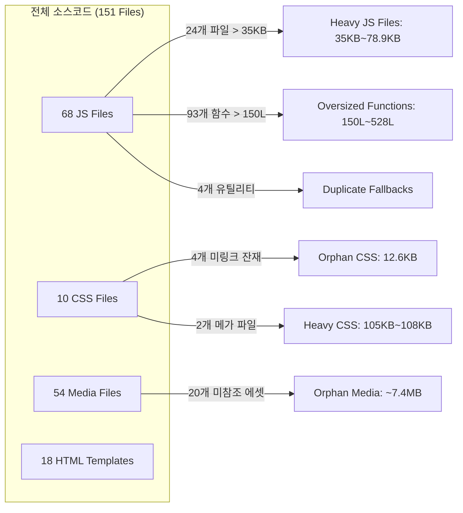

# 🛡️ 시스템 무결성 보장 전방위 리팩토링 종합 마스터 계획서 (Phase 6 Master Plan)

> **문서 버전**: 1.0.0  
> **작성 일자**: 2026-10-06  
> **기반 진단**: [시스템 전체 정밀 진단 종합 보고서 (2026-10-06)](file:///C:/Users/sisun/.gemini/antigravity-ide/brain/b97acafa-fc63-4d53-a393-a01dfff78374/system_wide_deep_diagnosis_report.md)  
> **적용 지침**: [AGENTS.md 7대 필수 게이트웨이 SSOT](file:///c:/Users/sisun/ai_work/AGENTS.md), [.agents/skills/workspace-editor-safety-process/SKILL.md](file:///c:/Users/sisun/ai_work/.agents/skills/workspace-editor-safety-process/SKILL.md), [.agents/skills/workspace-editor-system-diagnosis/SKILL.md](file:///c:/Users/sisun/ai_work/.agents/skills/workspace-editor-system-diagnosis/SKILL.md), [.agents/skills/workspace-editor-engine/SKILL.md](file:///c:/Users/sisun/ai_work/.agents/skills/workspace-editor-engine/SKILL.md)  
> **진단 대상**: 151개 전체 에셋(JS 68개, CSS 10개, HTML 18개, 미디어 54개, JSON 24개) 전수 조사(Full-File Census) 완료본

---

## 1. 📌 개요 및 추진 배경 (Overview & Objectives)

시스템 전체 151개 에셋에 대한 정밀 전수 조사 결과, 구문 문법(V8 VM 컴파일), Edge 브라우저 렌더 엔진 검증, 인코딩, 오프라인 템플릿 빌드 무결성은 **100% 정상(0 Errors)**임이 확인되었습니다.  
그러나 시스템의 장기적 안정성과 유지보수성, 런타임 성능을 극대화하기 위해 다음과 같은 **4대 핵심 부채**가 식별되었습니다:

1. **대형 모듈 비대화**: 35KB 이상 또는 750줄을 초과하는 대형 파일 24개 존재 (최대 `vctrl_ui_atoms.js` 78.9KB / 1,277줄, `vctrl_inspector.js` 74.0KB / 1,575줄, `vctrl_iframe_script.js` 71.5KB / 1,432줄).
2. **미사용 고아 에셋 잔재**: 뷰어/인덱스 어디에도 링크되지 않은 미참조 CSS 4종(12.6KB) 및 SVG 대체 완료로 불필요해진 레거시 PNG 커서 2종, 중복 `.jpg` 일러스트 8종, 레거시 일러스트 10종 등 **약 7.5 MB의 고아 에셋 잔재**.
3. **유틸리티 중복 구현**: `showToast`, `rgbToHex`, `isResponsiveDocument` 등 공통 유틸리티의 fallback 복사본 산재.
4. **거대 함수(Oversized Functions)**: 단일 함수가 150줄 이상인 함수 93개 검출 (최대 `vctrl_core_router.js`의 `init()` 528줄, `vctrl_format_painter.js`의 `pasteCopiedObjectStyle()` 491줄, `vctrl_iframe_grid.js`의 `renderGrid()` 455줄).

본 계획서는 **운영 중인 실제 시스템에 단 1건의 사이드이펙트나 회귀(Regression) 오류도 발생하지 않도록**, 철저한 4단계 위험도 계층화(Phase 6-A ~ 6-D)와 단계별 정적/VM 검증 게이트웨이를 적용하여 안전하게 시스템을 고도화하는 완벽한 실행 가이드를 제공합니다.

---

## 2. 🚨 7대 무결성 절대 원칙 (Absolute Safety Protocols)

모든 리팩토링 작업은 `AGENTS.md`의 [7대 필수 게이트웨이]를 100% 엄격하게 준수합니다:

1. **[운영 시스템 무결성 보장] (Strict Production Integrity)**:
   - 본 시스템은 실제 서비스 중인 실무 운영 시스템이다. 땜질식 임시 가짜 데이터(Mock/Dummy Fallback)나 임의의 하드코딩 객체 주입을 전면 금지하며, 원본 데이터(`metadata.json`, 스크린 HTML 등)를 100% 보존한다.
2. **[사전 정밀 분석 & 사전 계획 수립] (Deep Analysis & Plan First)**:
   - 코드 한 줄이라도 수정하기 전에 관련 소스코드와 연관 스킬(`SKILL.md`)을 전수 분석하고 본 마스터 플랜에 입각하여 안전하게 착수한다.
3. **[사이드이펙트 원천 차단] (Zero Side-Effects)**:
   - 전역 이벤트 리스너(`mouseup`, `keydown` 등), 공통 통신 버스, 타 컴포넌트 렌더링에 간섭이 없도록 모듈 격리와 스코프 가드를 철저히 적용한다.
4. **[스크립트/런타임 에러 0건] (Zero Script/Runtime Errors)**:
   - 변수/함수 미정의(`ReferenceError`), `null`/`undefined` 속성 접근(`TypeError`) 브라우저 콘솔 에러를 100% 방지한다. 안전한 옵셔널 체이닝(`?.`)과 유효성 검증 가드를 필수로 둔다.
5. **[백틱 충돌 에러 0건] (Zero Backtick Syntax Collisions)**:
   - iframe 주입 파일(`vctrl_iframe_*.js`, `vctrl_ui_atoms.js`, `vctrl_common.js` 등) 내부에서는 중첩 백틱(`` ` ``) 및 변수 보간(`${...}`) 사용을 전면 금지하고, 반드시 표준 따옴표와 문자열 결합(`+`)만을 사용한다.
6. **[구문/브래킷 에러 0건 및 자동 정적 검증 강제] (Zero Syntax Errors & Mandatory Verification)**:
   - 각 작업 완료 즉시 `powershell -ExecutionPolicy Bypass -File scripts/check_syntax.ps1` 및 `scripts/verify_all.ps1`을 자체 구동하여 68개 전 파일 브래킷/구문 무결성 통과(0 Errors)를 확인한다.
7. **[CORS 에러 0건 및 통신 프로토콜 준수] (Zero CORS Errors)**:
   - 부모 창과 Iframe 간에 `contentDocument` 직접 접근을 금지하며, 반드시 표준 인터페이스인 `MessageHub` 및 `window.EditorBus`(`sendToIframe` / `sendToParent`)만을 사용한다.

---

## 3. 📊 리팩토링 대상 상세 분석 매트릭스 (Refactoring Target Matrix)



### [분석 테이블 1] 도메인별 최우선 리팩토링 대상 목록

| 카테고리 | 대상 파일 / 식별 위치 | 현재 상태 및 부채 내용 | 조치 방안 및 목표 규격 | 위험도 |
|:---|:---|:---|:---|:---:|
| **고아 에셋** | `assets/css/*.css` (4종)<br>`assets/cursor_*_trimmed.png` (2종)<br>`assets/illustrations/` (18종) | 뷰어 및 스크린 어디서도 참조되지 않는 미링크 잔재 및 구형 중복본 (~7.5MB) | 디스크 및 소스 트리에서 안전 삭제하여 불필요 빌드 부하 차단 | 🟢 매우 낮음 |
| **공통화** | [assets/vctrl_core.js](file:///c:/Users/sisun/ai_work/assets/vctrl_core.js)<br>(L776-L812) | `vctrl_common.js`에 정규 SSOT가 존재함에도 36줄의 fallback 토스트 코드가 중복 작성됨 | `vctrl_core.js` 내 중복 fallback 삭제 및 `vctrl_common.js` `window.showToast` 호출 단일화 | 🟢 낮음 |
| **공통화** | [assets/vctrl_canvas_background.js](file:///c:/Users/sisun/ai_work/assets/vctrl_canvas_background.js)<br>(L32-L39) | `rgbToHex` 로컬 래퍼 함수가 독자 작성됨 | `vctrl_common.js`의 `window.rgbToHex` 직접 참조로 통일 | 🟢 낮음 |
| **공통화** | 16개 JS 모듈 내 반응형 판별식 | `classList.contains('responsive-mode')` 인라인 판별식 산재 | `window.isResponsiveDocument(doc)` 단일 SSOT 호출로 일원화 | 🟢 낮음 |
| **함수 파편화** | [assets/vctrl_core_router.js](file:///c:/Users/sisun/ai_work/assets/vctrl_core_router.js)<br>`init()` (528줄) | 23개 중앙 메시지 수신 분기가 하나의 거대 switch-case에 누적 | `window.v4ParentCoreHandlers` 맵 객체 도입 및 30줄 디스패처로 파편화 | 🟡 중간 |
| **함수 파편화** | [assets/vctrl_format_painter.js](file:///c:/Users/sisun/ai_work/assets/vctrl_format_painter.js)<br>`pasteCopiedObjectStyle()` (491줄) | 도형, 텍스트, 아톰, 테이블 스타일 주입 로직이 한 함수에 결합 | 컴포넌트 타입별 전용 주입기 전략 패턴(`StyleApplicators`)으로 파편화 | 🟡 중간 |
| **함수 파편화** | [assets/vctrl_parent_shortcuts.js](file:///c:/Users/sisun/ai_work/assets/vctrl_parent_shortcuts.js)<br>`initParentShortcuts()` (255줄) | 모든 전역 단축키 키보드 이벤트 분기가 단일 리스너에 결합 | `ParentShortcutMap` 핸들러 맵 객체로 분리 | 🟡 중간 |
| **함수 파편화** | [assets/vctrl_iframe_grid.js](file:///c:/Users/sisun/ai_work/assets/vctrl_iframe_grid.js)<br>`renderGrid()` (455줄) | 헤더, 바디, 컬럼 너비/하이라이트 스타일 계산 결합 | 서브 모듈 함수(`_buildGridHeader`, `_buildGridRows` 등)로 파편화 | 🟡 중간 |
| **모듈 분리** | [assets/vctrl_component_inserter.js](file:///c:/Users/sisun/ai_work/assets/vctrl_component_inserter.js)<br>(64.8KB, 406줄) | 대용량 인라인 SVG 스트링 및 템플릿이 삽입 로직에 직접 임베딩됨 | 템플릿 마크업을 `vctrl_component_data.js`로 SSOT 일원화, 파일 18KB로 경량화 | 🟠 중간~높음 |
| **모듈 분리** | [assets/vctrl_ui_atoms.js](file:///c:/Users/sisun/ai_work/assets/vctrl_ui_atoms.js)<br>(78.9KB, 1,277줄) | 20여 종의 아톰 템플릿과 렌더러가 단일 파일에 모놀리식 집중 | 입력 컨트롤 계열(`vctrl_ui_atoms_inputs.js`)과 디스플레이 계열로 2단계 분리 | 🔴 높음 |

---

## 4. 🗺️ 4단계 점진적 리팩토링 로드맵 (Phased Execution Roadmap)

```mermaid
graph TD
    BKP[0단계: 사전 무결성 백업 snapshot 생성] --> P6A
    
    subgraph "Phase 6-A: 고아 에셋 정리 및 디스크 경량화 (위험도: 매우 낮음)"
        P6A[A-1: assets/css/ 미링크 4종 정리] --> P6A2[A-2: 레거시 PNG 커서 2종 삭제]
        P6A2 --> P6A3[A-3: 미참조 .jpg 중복본 8종 및 레거시 일러스트 10종 정리]
        P6A3 --> V1[검증 A: check_syntax + verify_all 0 Errors]
    end
    
    V1 --> P6B
    subgraph "Phase 6-B: 중복 로직 SSOT 공통화 및 단일화 (위험도: 낮음)"
        P6B[B-1: vctrl_core.js showToast 중복 fallback 제거] --> P6B2[B-2: vctrl_canvas_background.js rgbToHex 통일]
        P6B2 --> P6B3[B-3: isResponsiveDocument 전역 SSOT 일원화]
        P6B3 --> P6B4[B-4: showLoading/hideLoading 진입점 정규화]
        P6B4 --> V2[검증 B: check_syntax + verify_all 0 Errors]
    end
    
    V2 --> P6C
    subgraph "Phase 6-C: 고복잡도 거대 함수 파편화 (위험도: 중간)"
        P6C[C-1: vctrl_core_router init() 핸들러 맵 분리] --> P6C2[C-2: vctrl_parent_shortcuts 단축키 맵 분리]
        P6C2 --> P6C3[C-3: vctrl_format_painter 스타일 주입 전략 패턴 적용]
        P6C3 --> P6C4[C-4: vctrl_iframe_grid 렌더링 서브 함수 분리]
        P6C4 --> V3[검증 C: check_syntax + verify_all 0 Errors]
    end
    
    V3 --> P6D
    subgraph "Phase 6-D: 최상위 대형 모듈 분리 및 관심사 격리 (위험도: 중간~높음)"
        P6D[D-1: vctrl_component_inserter SVG 데이터 외주화] --> P6D2[D-2: vctrl_ui_atoms 입력/표시 계열 2단계 분리]
        P6D2 --> P6D3[D-3: ENGINE_SCRIPT_REGISTRY 및 viewer.html 로더 동기화]
        P6D3 --> V4[검증 D: diagnose_system 6대 기준 전수 재검증 100% 통과]
    end
    
    V4 --> FIN[최종 완료 보고서 작성 및 사용자 승인 대기]
```

---

### 🟢 Phase 6-A: 고아 에셋 정리 및 디스크 경량화 (위험도: 매우 낮음)
> **목적**: 불필요한 미참조 파일 24건을 안전하게 제거하여 저장소 용량 약 7.5 MB를 절감하고 소스 트리를 청정 상태로 복원합니다.

#### [Task A-1] `assets/css/` 미링크 고아 파일 4종 정리
- **대상**:
  - `assets/css/canvas.css` (3.0 KB)
  - `assets/css/inspector.css` (3.5 KB)
  - `assets/css/modals.css` (2.4 KB)
  - `assets/css/toolbar.css` (3.7 KB)
- **근거**: `viewer.html` 및 `index.html` 어디서도 로드되지 않으며, 모든 해당 스타일은 이미 `viewer.css` 및 `style.css`에 통합되어 동작 중임.
- **조치**: 4개 파일 안전 삭제 후 `assets/css/` 빈 디렉터리 정리.

#### [Task A-2] 레거시 PNG 커서 2종 정리
- **대상**:
  - `assets/cursor_ibeam_trimmed.png` (2.0 KB)
  - `assets/cursor_pointer_trimmed.png` (7.3 KB)
- **근거**: `vctrl_component_data.js` 및 `vctrl_ui_atoms_cursor.js`에서 순수 인라인 SVG(`<svg viewBox="0 0 24 24" class="lf-icon v4-cursor-svg">`)로 완벽 대체 완료되어 어떤 코드에서도 호출되지 않음.
- **조치**: 2개 PNG 파일 안전 삭제.

#### [Task A-3] 미사용 중복 `.jpg` 일러스트 및 레거시 일러스트 18종 정리
- **대상**:
  1. 중복 `.jpg` 고객 여정 일러스트 (8건, 2.2 MB): `step1_enter_ecommerce.jpg` ~ `step8_return_clothing.jpg` (화면 HTML 및 카탈로그는 투명 배경이 지원되는 `.png`만을 배타적으로 사용).
  2. 신규 3D Admin 및 2D 일러스트 도입으로 교체된 미참조 레거시 파일 (10건, 5.2 MB):
     - `admin_ill_cms.jpg`, `admin_ill_cms.png`
     - `admin_ill_logistics.jpg`, `admin_ill_logistics.png`
     - `admin_ill_pim.jpg`, `admin_ill_pim.png`
     - `admin_cms_builder.jpg`, `admin_pim_fastpass.jpg`
     - `atomic_system_diagram.jpg`, `storybook_guide_workspace.jpg`
- **조치**: 18개 미참조 미디어 파일 안전 삭제 (~7.4 MB 디스크 확보).

---

### 🟢 Phase 6-B: 중복 로직 SSOT 공통화 및 단일화 (위험도: 낮음)
> **목적**: 복사-붙여넣기된 유틸리티 함수들을 단일 진실 공급원(SSOT) 모듈로 일원화하고 중복 코드를 제거합니다.

#### [Task B-1] `vctrl_core.js` 내 중복 `showToast` fallback 제거
- **현황**: [assets/vctrl_common.js](file:///c:/Users/sisun/ai_work/assets/vctrl_common.js) (L317-L349)에 정규 SSOT `window.showToast`가 구현되어 있음에도 불구하고, [assets/vctrl_core.js](file:///c:/Users/sisun/ai_work/assets/vctrl_core.js) (L776-L812)에 동일한 fallback 코드가 36줄에 걸쳐 중복 선언되어 있음.
- **조치**: `vctrl_core.js`의 중복 코드 블록을 제거하고, 부모 창 최상단 로딩 시 `vctrl_common.js`가 보장하는 `window.showToast`를 단일 SSOT로 일원화.

#### [Task B-2] `vctrl_canvas_background.js` `rgbToHex` 로컬 래퍼 단일화
- **현황**: [assets/vctrl_canvas_background.js](file:///c:/Users/sisun/ai_work/assets/vctrl_canvas_background.js) (L32-L39)에 작성된 로컬 `function rgbToHex(rgb)`는 `window.rgbToHex`를 단순히 호출하는 중복 래퍼임.
- **조치**: 로컬 래퍼를 제거하고 공통 `window.rgbToHex`를 직접 호출하도록 통일.

#### [Task B-3] `isResponsiveDocument` 전역 판별식 SSOT 통일
- **현황**: 16개 JS 모듈에서 `doc.body.classList.contains('responsive-mode')`를 개별적으로 인라인 작성하여 사용 중.
- **조치**: [assets/vctrl_common.js](file:///c:/Users/sisun/ai_work/assets/vctrl_common.js)의 `window.isResponsiveDocument(doc)`를 단일 SSOT로 지정하고, 각 파일에서 이 함수만을 호출하도록 정규화.

#### [Task B-4] 전역 로딩 오버레이 제어 진입점 정규화
- **현황**: `vctrl_revision_history.js`, `vctrl_screen_manager.js` 등 일부 파일에서 `#loading-overlay` DOM에 직접 접근하여 클래스를 토글함.
- **조치**: [assets/vctrl_system_modals.js](file:///c:/Users/sisun/ai_work/assets/vctrl_system_modals.js)의 `window.showLoading(msg)` / `window.hideLoading()` 단일 인터페이스로 통일.

---

### 🟡 Phase 6-C: 고복잡도 거대 함수 파편화 (위험도: 중간)
> **목적**: 150줄 이상 거대 함수의 단일 책임 원칙(SRP)을 회복하고, 핸들러 테이블 맵과 전략 패턴을 도입하여 가독성과 테스트 가능성을 극대화합니다.

#### [Task C-1] `vctrl_core_router.js` `init()` 23개 분기문 핸들러 맵 분리
- **현황**: 단일 함수가 **528줄**(L27-L554)에 달하며, 23개 중앙 메시지 수신 분기가 하나의 거대한 switch-case에 누적되어 있음.
- **조치**:
  1. `vctrl_iframe_script.js`의 `v4IframeCoreHandlers`와 동일한 패턴으로, 부모 창용 핸들러 맵 객체인 `const v4ParentCoreHandlers = { ... }`를 선언.
  2. `LF_DIRTY`, `LF_SCREEN_LOADED`, `LF_SAVE_STYLE_CLIPBOARD`, `LF_REQUEST_STYLE_CLIPBOARD`, `LF_TEXTBOX_CLICK`, `LF_REORDER_PINS` 등의 각 case 본문을 순수 핸들러 함수로 분리 추출.
  3. `init()`의 `message` 이벤트 리스너를 **20줄 이내의 초경량 디스패처**로 전환:
     ```javascript
     window.addEventListener('message', function(e) {
         if (!e.data || !e.data.type) return;
         const handler = v4ParentCoreHandlers[e.data.type];
         if (typeof handler === 'function') {
             handler(e.data, e);
         }
     });
     ```
- **안전 방어책**: 핸들러 추출 시 `state`, `DOM`, `e.source` 스코프 참조 무결성 100% 보존.

#### [Task C-2] `vctrl_parent_shortcuts.js` `initParentShortcuts()` 단축키 맵 분리
- **현황**: 부모 창의 모든 키보드 이벤트 분기가 하나의 거대 함수(**255줄**, L14-L268)에 집중됨.
- **조치**:
  1. 단축키 핸들러 맵 `ParentKeyHandlers`를 구성:
     - `Ctrl+S`: `window.StorageEngine.handleGlobalSave()`
     - `F2`: 선택/편집 모드 토글
     - `Shift+G`: 반응형 그리드 토글
     - `Escape`: 활성 모달 닫기
     - `Arrow/Delete/Space/Ctrl+C/V/X/G`: 활성 iframe 프록시 토스
  2. 메인 `keydown` 리스너를 경량 디스패처(30줄)로 축소.

#### [Task C-3] `vctrl_format_painter.js` `pasteCopiedObjectStyle()` 전략 패턴 적용
- **현황**: **491줄**(L268-L758)에 걸쳐 도형, 텍스트, 아톰, 테이블, 그리드의 스타일 주입 분기가 결합되어 있음.
- **조치**:
  1. 전략 객체 `StyleApplicators`를 선언하여 컴포넌트 도메인별 순수 함수로 분리:
     - `applyShapeStyle(comp, styleData)`
     - `applyTextStyle(comp, styleData)`
     - `applyAtomStyle(comp, styleData)`
     - `applyTableStyle(comp, styleData)`
  2. 메인 함수는 다중 선택 루프 및 Undo 스냅샷 저장, 타겟 디스패치만 담당하도록 경량화 (491줄 ➔ 80줄).

#### [Task C-4] `vctrl_iframe_grid.js` `renderGrid()` 서브 모듈 분리
- **현황**: **455줄**(L320-L774) 단일 루프에서 헤더 생성, 바디 생성, 컬럼 너비/하이라이트 스타일링이 뒤섞여 있음.
- **조치**:
  1. `_buildGridHeader(gridData)` (헤더 행/컬럼 생성)
  2. `_buildGridBody(gridData)` (데이터 셀 및 포맷터 렌더링)
  3. `_applyColumnHighlighting(gridEl, gridData)` (컬럼별 하이라이트/보더 적용)
  3개 서브 함수로 관심사를 완전 격리.

---

### 🟠 Phase 6-D: 최상위 대형 모듈 분리 및 관심사 격리 (위험도: 중간~높음)
> **목적**: 60KB 이상의 최상위 비대 모듈에서 정적 데이터와 렌더링 엔진을 분리하여 모듈 단위 로딩 속도와 단일 책임 원칙을 완성합니다.

#### [Task D-1] `vctrl_component_inserter.js` (64.8KB) 데이터 딕셔너리 외주화
- **현황**: 라인 수는 406줄이나 대용량 SVG 벡터 마크업이 파일 내부에 직접 하드코딩되어 64.8KB에 달함.
- **조치**:
  1. 인라인 SVG 마크업 및 기본 컴포넌트 템플릿 정의를 단일 진실 공급원인 [assets/vctrl_component_data.js](file:///c:/Users/sisun/ai_work/assets/vctrl_component_data.js)로 100% 이관.
  2. `vctrl_component_inserter.js`는 `V4_COMPONENT_LIBRARY` 카탈로그 데이터를 조회하여 캔버스 좌표에 마운트하는 순수 삽입 엔진(약 18KB)으로 대폭 경량화.
- **안전 방어책**: `viewer.html`의 스크립트 로딩 순서(`vctrl_component_data.js` ➔ `vctrl_component_inserter.js`)를 확인하여 참조 에러 0건 보장.

#### [Task D-2] `vctrl_ui_atoms.js` (78.9KB, 1,277줄) 2단계 도메인 분리
- **현황**: 버튼, 뱃지, 체크박스, 라디오, 토글, 셀렉트박스, 데이트피커, 파일업로드, 태그, 알림 등 수십 종 아톰의 마크업 생성과 DOM 렌더링이 결합되어 시스템에서 가장 무거운 단일 JS 모듈임.
- **조치**:
  1. **입력 제어 아톰 분리**: `assets/vctrl_ui_atoms_inputs.js` (신규 모듈 생성)
     - 체크박스, 라디오, 토글 스위치, 셀렉트 드롭다운, 인풋/텍스트에어리어 등 입력 폼 계열 전담.
  2. **디스플레이 아톰 보존**: `assets/vctrl_ui_atoms.js`
     - 버튼, 뱃지, 태그, 알림, 아바타 등 시각 표시 계열 전담.
  3. `ENGINE_SCRIPT_REGISTRY` 및 `check_syntax.ps1`, `verify_all.ps1`에 신규 모듈 등록.
- **백틱 충돌 방지**: iframe 주입 스크립트이므로 템플릿 리터럴 내부 중첩 백틱 0건 규칙 철저 준수.

---

## 5. 🔍 검증 게이트웨이 및 비상 롤백 전략 (Verification & Rollback)

### [검증 파이프라인 (Verification Pipeline)]
각 단계(Phase)의 모든 변경 작업 완료 즉시 아래 3대 검증 도구를 순차 실행하며, **단 1건의 경고나 에러도 없이 100% 통과(Exit Code 0)**해야 다음 단계로 진입할 수 있습니다:

```bash
# 1. JSON 무결성, 깨진 문자열, 6대 기준 정밀 재검사
powershell -ExecutionPolicy Bypass -File scripts/diagnose_system.ps1

# 2. 68개 전 파일 브래킷 밸런스 및 27개 인라인 스크립트 결합 번들 VM 컴파일 검증
powershell -ExecutionPolicy Bypass -File scripts/check_syntax.ps1

# 3. Chromium/Edge Headless 브라우저 렌더 엔진 실시간 런타임 구문 파싱 검증
powershell -ExecutionPolicy Bypass -File scripts/verify_all.ps1
```

### [비상 롤백 전략 (Rapid Rollback Strategy)]
작업 중 예기치 못한 사이드이펙트나 회귀 버그 발생 시, 즉각 복구가 가능하도록 이중 안전망을 가동합니다:
1. **착수 전 즉시 자동 백업 구동**:
   - `powershell -ExecutionPolicy Bypass -File scripts/daily_auto_backup.ps1`
   - 스냅샷 저장 위치: `C:\ai_work_backups\daily\data_daily_YYYYMMDD_HHMMSS.zip`
2. **Git 로컬 격리 롤백**:
   - 원격 저장소(`main`)로의 자동 푸시를 금지하고 로컬 커밋 단위로 작업하여, 문제 발생 시 즉각 `git checkout .` 또는 `git reset --hard HEAD`로 1초 내 완전 롤백 지원.

---

## 6. 🎯 완료 기준 및 정량적 성공 지표 (Definition of Done)

| 성공 지표 | 현재 상태 (As-Is) | 목표 상태 (To-Be) | 측정 및 검증 방식 |
|:---|:---:|:---:|:---|
| **미참조 고아 에셋** | 24건 (~7.5 MB) | **0건 (0 MB)** | `diagnose_deep_inspection.js` Section 3 전수 스캔 |
| **500줄 이상 거대 함수** | 1건 (`init()` 528줄) | **0건 (최대 150줄 이하)** | `diagnose_deep_inspection.js` Section 5 스캔 |
| **중복 `showToast` 코드** | 36줄 중복 작성 | **0줄 (SSOT 일원화)** | `analyze_duplicates.js` 검증 |
| **`vctrl_component_inserter` 크기** | 64.8 KB | **25 KB 이하** | 파일 크기 측정 |
| **V8 구문 / 브래킷 에러** | 0건 (PASS) | **0건 (PASS 유지)** | `scripts/check_syntax.ps1` 실행 |
| **Edge Headless 렌더 오류** | 0건 (PASS) | **0건 (PASS 유지)** | `scripts/verify_all.ps1` 실행 |
| **오프라인 템플릿 번들** | 최신 (PASS) | **최신 (PASS 유지)** | `scripts/diagnose_system.ps1` Section 7 |
| **룰 & 스킬 동기화** | 100% 동기화 | **100% 동기화 유지** | `AGENTS.md` 및 `SKILL.md` 문서 일치율 |

---

## 7. 🚀 실행 승인 요청

본 계획서는 시스템의 7대 필수 게이트웨이와 6대 진단 기준을 전수 분석하여 수립되었습니다.  
사용자 승인 시 즉시 **Phase 6-A (고아 에셋 정리 및 디스크 경량화)**부터 안전하게 착수하겠습니다.
