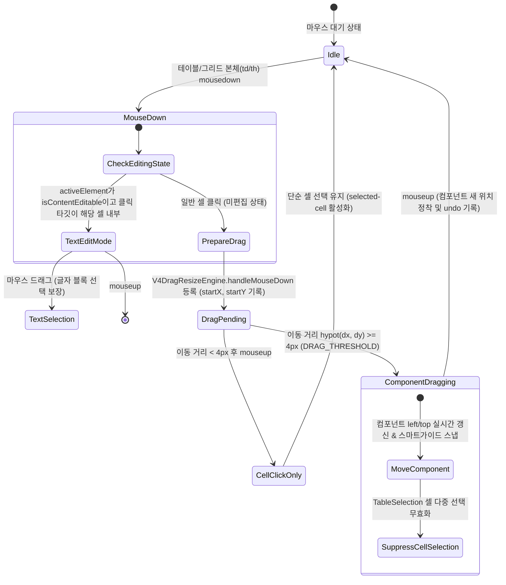

# Table SHAPE 및 Grid UI 몸체 마우스 드래그 이동 구현 계획서 (방안 B: 4px 드래그 임계값 기반)

## 1. 개요 및 목적 (Overview & Goals)

본 계획서는 Workspace Editor 라이브러리의 2대 테이블 기반 객체인 **Table SHAPE (`v4-data-table`)** 및 **Grid UI (`v4-atom-grid`)**가 스크린 생성 후 마우스 드래그로 위치를 이동하기 매우 어려운 문제를 해결하기 위해, **별도의 버튼이나 핸들을 추가 조준할 필요 없이 파워포인트(PPT)나 키노트처럼 표 몸체 아무 곳이나 마우스로 누르고 4px 이상 끌면 컴포넌트가 즉시 이동**하도록 만드는 **[방안 B: 4px 드래그 임계값 기반 컴포넌트 이동 엔진]**의 정밀 구현 명세입니다.

### 핵심 목표
1. **자유로운 테이블 본체 드래그 이동 (PPT-Style Physical Interaction)**:
   - 테이블 내부(`<td>`, `<th>`, 셀 여백 등) 어디든 마우스로 누른 후 4px 이상 이동하면, 셀 선택이나 텍스트 블록 지정 대신 **테이블 컴포넌트 전체가 마우스 커서를 따라 부드럽게 캔버스 상에서 이동**합니다.
2. **단순 클릭 vs 드래그 이동의 완벽한 분리 (4px Drag Threshold)**:
   - 마우스 이동량이 4px 미만인 단순 클릭: 기존과 동일하게 셀 선택, 셀 포커스, 또는 그리드 행 선택이 정상 작동합니다.
3. **더블클릭 인라인 텍스트 편집 모드의 100% 안전한 보호**:
   - 셀 내부 텍스트를 더블클릭(`dblclick`)하여 커서가 깜빡이며 타이핑 중인 상태(`document.activeElement.isContentEditable`)에서는 글자 블록 드래그를 보호하고 컴포넌트 드래그가 간섭하지 않습니다.
4. **Grid UI 체크박스/정렬/페이징 인터랙션 무결성 유지**:
   - 그리드의 체크박스 클릭, 컬럼 정렬 헤더 클릭, 하단 페이징 바 클릭 등의 기존 기능이 전혀 왜곡되지 않습니다.
5. **무결성 및 사이드이펙트 0건**:
   - `assets/vctrl_iframe_script.js`, `assets/vctrl_iframe_drag.js`, `assets/vctrl_table.js` 파일 내의 백틱 충돌 0건, 괄호 매칭 100%, 런타임 에러 0건을 준수합니다.

---

## 2. 근본 원인 분석 (Root Cause Analysis)

### 2.1. 코드 레벨의 원천 차단 (`assets/vctrl_iframe_script.js` L427)
```javascript
// assets/vctrl_iframe_script.js (Line 427)
if (c && !e.target.closest('td, th')) { 
    if (window.V4DragResizeEngine) {
        window.V4DragResizeEngine.handleMouseDown(e, null, null, d, c);
    }
}
```
* 일반 컴포넌트(사각형, 원, 버튼, 카드 등)는 내부가 `div`, `svg`, `p` 등이어서 어디를 눌러도 `!e.target.closest('td, th')` 조건을 통과하여 드래그 엔진이 정상 동작합니다.
* 하지만 **Table SHAPE**과 **Grid UI**는 면적의 **95%~100%가 `<td>`와 `<th>`**로 채워져 있습니다.
* 따라서 사용자가 표나 그리드 내부를 마우스로 잡고 끄는 순간, **이 가드 조건문에 걸려 컴포넌트 드래그 엔진(`handleMouseDown`) 호출 자체가 완전히 차단**되어 있었습니다.

### 2.2. 테이블 내부 이벤트(`TableSelection`)의 즉시 플래그 점유
* `assets/vctrl_table.js`의 `TableSelection` 리스너는 `mousedown` 시점에 즉시 `this.isDragging = true`를 세팅하고 `e.preventDefault()`를 호출하여, 마우스 이동 시 셀 다중 선택(`selected-cell` 확장)을 수행하려고 시도합니다.
* 이로 인해 상위 컴포넌트 이동 드래그와 셀 범위 선택 간의 경합(Race Condition)이 발생할 수 있습니다.

---

## 3. 핵심 기술 설계 명세 (Detailed Technical Design)

### 3.1. 마우스 인터랙션 상태 전이 모델 (State Transition Model)



### 3.2. 인터랙션 시나리오별 우선순위 매트릭스

| 사용자 시나리오 | 동작 조건 | 시스템 반응 | 비고 |
| :--- | :--- | :--- | :--- |
| **① 표 본체 드래그 이동 (주 동작)** | 테이블 미편집 상태에서 `td/th`를 누르고 4px 이상 이동 | **컴포넌트 위치 이동 (`isDragging = true`)**<br>셀 다중 선택 및 텍스트 선택 차단 | 사용자가 체감하는 PPT 스타일의 직관적 이동 |
| **② 단순 셀 클릭** | `td/th`를 클릭하고 4px 미만에서 마우스 뗌 | **단순 셀 선택 / 활성화**<br>`selected-cell` 클래스 부여, 인스펙터 연동 | 기존 단일 셀 속성 확인 및 수정 기능 완벽 보존 |
| **③ 더블클릭 텍스트 편집** | 셀 내부 더블클릭(`dblclick`) | **텍스트 커서 활성화 (`focus()`)** | 기존 PPT-style 더블클릭 룰 100% 유지 |
| **④ 텍스트 편집 중 글자 블록 드래그** | 셀 편집 모드 진입 후 마우스 드래그 | **글자 블록 텍스트 선택 (컴포넌트 이동 차단)** | 타이핑 중 글자 블록 지정 정상 동작 |
| **⑤ 체크박스 / 액션 버튼 클릭** | Grid UI의 `input[type="checkbox"]` 등 | **기본 폼 이벤트 즉시 실행** | 체크 토글 및 상세 버튼 정상 작동 |
| **⑥ 테이블 리사이저 조작** | 우측 하단 `.lf-resizer` 드래그 | **테이블 크기 조절 (`isResizing = true`)** | 기존 리사이즈 엔진 유지 |

---

## 4. 파일별 상세 구현 명세 (File-by-File Changes)

### 4.1. `assets/vctrl_iframe_script.js`
- **수정 위치**: `document.addEventListener('mousedown')` 내부 (약 Line 427 전후)
- **변경 내용**:
  - `if (c && !e.target.closest('td, th'))` 가드 조건을 개선하여, `td, th` 클릭 시에도 컴포넌트 드래그 엔진(`handleMouseDown`)을 호출하도록 허용.
  - **단, 예외 가드(Guard)**:
    1. 활성 포커스된 셀 내부에서 텍스트를 편집 중인 경우:
       `const isCurrentlyEditingCell = document.activeElement && (document.activeElement.isContentEditable || document.activeElement.classList?.contains('v4-editable-cell')) && document.activeElement.contains(e.target);`
       → 이 경우에는 컴포넌트 드래그를 시작하지 않고 브라우저 네이티브 텍스트 블록 선택을 보장.
    2. 체크박스(`input[type="checkbox"]`) 클릭 시: 컴포넌트 드래그보다 체크 토글을 우선 처리.
  - 개선된 코드 구조:
    ```javascript
    const isCurrentlyEditingCell = document.activeElement && 
        (document.activeElement.isContentEditable || document.activeElement.classList?.contains('v4-editable-cell')) && 
        document.activeElement.contains(e.target);
    const isFormInput = e.target.tagName === 'INPUT' || e.target.tagName === 'BUTTON';

    if (c && !isCurrentlyEditingCell && !isFormInput) { 
        if (window.V4DragResizeEngine) {
            window.V4DragResizeEngine.handleMouseDown(e, null, null, d, c);
        }
    }
    ```

### 4.2. `assets/vctrl_iframe_drag.js`
- **수정 위치**: `handleMouseDown` 및 `handleMouseMove` (Line 25 ~ 70)
- **변경 내용**:
  1. `handleMouseDown`:
     - `e.target.closest('td, th')` 클릭 시 마우스가 아직 움직이지 않은 상태(`isPendingDrag = true`)에서는 섣불리 `e.preventDefault()`를 호출하지 않거나, 더블클릭 및 셀 선택이 유지될 수 있도록 최소화.
  2. `handleMouseMove`:
     - 마우스 이동 거리가 4px 이상(`dist >= DRAG_THRESHOLD`)이 되어 `isDragging = true`로 전환되는 순간:
       - `window.TableSelection && (window.TableSelection.isDragging = false);` 동기화 코드를 삽입하여, 셀 다중 선택이 확장되는 것을 차단하고 컴포넌트 이동 전용으로 전환!
       - 캔버스 텍스트 선택 잔상이 남지 않도록 `window.getSelection()?.removeAllRanges();` 호출.

### 4.3. `assets/vctrl_table.js`
- **수정 위치**: `TableSelection.bindEvents` 내부 (Line 101 ~ 175)
- **변경 내용**:
  - `table.addEventListener('mousedown')`에서 마우스다운 즉시 `this.isDragging = true`로 설정하던 것을 보완:
    - 컴포넌트 드래그 엔진이 활성화 중(`window.V4DragResizeEngine?.isDragging`)일 때는 셀 범위 선택(`mouseenter` 확장)을 즉시 취소(`this.isDragging = false`)하도록 가드 추가.
    - 단순 클릭인 경우에만 단일 셀 선택(`cell.classList.add('selected-cell')`)을 유지.

---

## 5. 엣지 케이스 및 사이드이펙트 방어 설계 (Zero Side-Effects)

1. **템플릿 리터럴 백틱(`) 충돌 원천 차단 (게이트웨이 5)**:
   - `assets/vctrl_iframe_script.js`, `assets/vctrl_iframe_drag.js`, `assets/vctrl_table.js`는 모두 파일 전체가 백틱(`` ` ``)으로 감싸진 dynamic eval 모듈입니다.
   - 코드 수정 시 파일 내부에서 중첩 백틱(`` ` ``) 및 `${...}` 보간을 절대 사용하지 않으며, 따옴표(`'` 또는 `"`)와 `+` 결합만을 사용합니다.
2. **PC / 모바일 반응형 프레임 간 드래그 드롭 무결성 유지**:
   - `vctrl_iframe_drag.js`의 PC ↔ Mobile 교차 드롭(Reparenting) 및 No-Measure 좌표 클램핑 로직은 `window.activeEl`을 기준으로 완벽히 동작하므로, 테이블 객체 이동 시에도 반응형 좌표가 100% 정상 보존됩니다.
3. **스마트 가이드 및 스냅(Snap) 정상 연동**:
   - 테이블이 드래그될 때 `LF_SNAP_REQUEST`와 `ResponsiveSmartGuide`가 정상 호출되어, 다른 도형이나 캔버스 중심선과의 자석 스냅선이 미려하게 표시됩니다.
4. **Undo / Redo 무결성**:
   - 드래그 임계값 4px를 넘는 순간 `window.V4UndoManager.saveState()`가 1회만 정확히 호출되므로, 드래그 후 `Ctrl+Z`를 누르면 원래 위치로 완벽히 복원됩니다.

---

## 6. 단계별 검증 및 테스트 계획 (Verification Plan)

### Step 1: 정적 구문 및 브래킷 검증
- PowerShell 스크립트를 통한 0 Errors 검증 강제:
  ```powershell
  powershell -ExecutionPolicy Bypass -File scripts/check_syntax.ps1
  ```
- 백틱 중첩, 닫는 괄호, ReferenceError 가능성 전수 검사.

### Step 2: 실 브라우저 동작 검증 시나리오
1. **Table SHAPE 테스트**:
   - 라이브러리에서 Table SHAPE 추가.
   - 테이블 내부 임의의 셀(`td`)을 클릭한 채 마우스를 휙 드래그 → 테이블이 캔버스 상에서 부드럽게 이동하는지 확인.
   - 드래그 후 `Ctrl+Z` (Undo) 실행 → 원래 위치로 되돌아가는지 확인.
   - 테이블 셀을 1회 가볍게 클릭(이동 없음) → 해당 셀이 정상 선택되고 인스펙터에 셀 속성이 뜨는지 확인.
   - 테이블 셀을 더블클릭 → 텍스트 편집 모드로 진입하여 글자 타이핑 및 글자 블록 드래그가 정상 작동하는지 확인.
2. **Grid UI 테스트**:
   - 라이브러리에서 Grid UI 추가.
   - 그리드 데이터 행(`td`) 아무 곳이나 잡고 드래그 → 그리드 전체가 부드럽게 이동하는지 확인.
   - 체크박스 열 클릭 → 체크박스가 정상 토글되는지 확인.
   - 컬럼 헤더 클릭 → 정렬 속성이 정상 동작하는지 확인.
3. **일반 도형 및 다른 아톰 회귀(Regression) 테스트**:
   - 사각형, 버튼, 배지, 텍스트박스 등이 기존처럼 정상적으로 드래그 이동되는지 확인.
