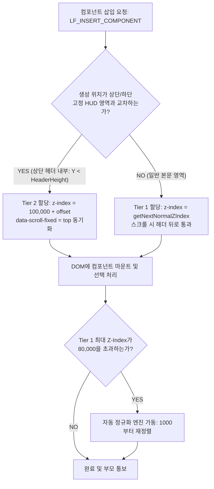

# [상세 설계 계획서] Workspace Editor 통합 Z-Index 계층 아키텍처 및 정규화(Compaction) 시스템 구축 계획서

---

## 📌 Executive Summary (개요 및 목적)

> **"도형, 텍스트, 아톰, 복합 그룹, 스크롤 고정 HUD(상단 GNB/하단 독), 디스크립션 어노테이션 핀, 스마트 가이드 및 시스템 모달까지—Workspace Editor의 모든 시각적 객체가 충돌 없이 상호작용할 수 있도록 결정론적(Deterministic) 6대 티어 Z-Index 계층 아키텍처를 수립하고, 인위적 상한선 장벽 해제 및 무한 인플레이션 방지 정규화 엔진을 구축한다."**

본 계획서는 최근 발생한 **"스크롤 핀 상단 고정 적용 후 신규 오브젝트 생성 시 Z-Index 역전"** 및 **"[앞으로 가져오기] 기능 차단(Glass Ceiling)"** 부작용을 근원적으로 해결하고, 향후 고도화될 다양한 UI 객체와 어노테이션 핀 시스템이 완벽한 시각적 위계 질서를 유지할 수 있도록 체계적인 전역 Z-Index 시스템을 설계합니다.

---

## 🔍 1. 시스템 현황 진단 및 근본 결함 분석 (Root Cause Audit)

### 1.1 현재 전역 Z-Index 파편화 실태 조사

전체 프로젝트 소스 및 실제 화면 데이터(`data/p_yos8l/cart_block.html`)를 정밀 전수 조사한 결과, 다음과 같은 심각한 파편화와 충돌 지점이 식별되었습니다:

| 식별 영역 | 현재 Z-Index 값 | 주요 문제점 및 증상 |
| :--- | :--- | :--- |
| **캔버스 배경 레이어** | `0` | 정상 (`#canvas-bg-layer`) |
| **일반 본문 컴포넌트** | `1000` ~ **`52,730`** | `maxZ + 10` 방식의 누적으로 인해 Z-Index가 5만 이상으로 인플레이션됨 |
| **하드코딩 인위적 상한선** | **`99,000`** (`Math.min`) | 일반 요소의 Z-Index를 99,000으로 강제 제한하여 상위 레이어와의 장벽 형성 |
| **스크롤 핀 고정 HUD** | **`100,000`** | 상단 헤더/하단 독 고정을 위해 10만 계층 부여 (일반 본문 요소보다 상위) |
| **디스크립션 핀 마커** | **`200,000`** ~ `200,050` | 본문 핀(`200,000`), 고정 HUD 위 핀(`200,050`), 호버 핀(`200,010`) |
| **스마트 가이드 / 아도너** | **`300,000`** | 드래그 가이드 및 거리 배지 오버레이 |
| **삭제 트리거 / 핸들** | `10,002` / `10,005` | ⚠️ **위계 역전 버그**: 컴포넌트 Z-Index(52,730)가 삭제 버튼(10,002)보다 높아져 삭제 버튼이 가려질 위험 존재 |
| **부모 시스템 모달** | `999,999` | 최상위 시스템 팝업 |

---

### 1.2 핵심 결함 3가지 메커니즘 심층 분석

```
[현재 발생하는 치명적 레이어링 교착 상태 (Deadlock)]

      Tier 3: Pin Marker (z: 200,000)
             ▲
             │ (정상 노출)
             │
      Tier 2: Scroll-Fixed HUD (z: 100,000)  ◄── 기존 고정 헤더
             ▲
      ═══════╪══════════════════════════════════════ [인위적 유리 천장: Math.min(99,000)]
             │
             ├── [앞으로 가져오기] 실행해도 99,000에서 막혀서 100,000을 영원히 넘을 수 없음!
             │
      Tier 1: Normal Components (z: 1,000 ~ 52,740)
             └── 신규 생성 도형 (z: 52,740)  ◄── 헤더 영역에 그려도 헤더 뒤에 깔려버림!
```

#### ① 신규 오브젝트 생성 시 Z-Index 역전 (`getNextTopZIndex`)
- **원인**: `getNextTopZIndex(container)` 함수가 `data-scroll-fixed` 속성을 가진 요소를 계산에서 완전 배제하고, `rawZ < 100,000` 조건으로 고정 요소를 무시한 채 일반 요소의 최댓값(`52,730`)에 기반하여 `52,740`을 할당함.
- **결과**: 상단 헤더(`z: 100,000`) 영역에 새로운 도형이나 텍스트를 그려도 `52,740 < 100,000`이므로 헤더 밑으로 즉시 숨겨지는 시각적 결함 발생.

#### ② [앞으로 가져오기] 기능의 인위적 차단 (`handleBringFront`)
- **원인**: `handleBringFront` 내부에서 비고정 일반 요소의 `targetZ`를 `Math.min(99000, maxNormalZ)`로 강제 캡핑함.
- **결과**: 사용자가 가려진 도형을 앞으로 꺼내기 위해 [앞으로 가져오기]를 10번, 100번 클릭해도 `targetZ`는 절대 99,000을 초과할 수 없으며, 가리고 있는 헤더(`100,000`) 앞으로 나오는 것이 물리적으로 불가능한 "먹통 현상" 초래.

#### ③ Z-Index 무한 인플레이션 및 내부 아톰(삭제 트리거 등)과의 역전
- **원인**: 컴포넌트 추가/레이어 변경 시마다 Z-Index가 +10씩 누적 증가하여 5만 이상으로 폭증.
- **결과**: `viewer.css`에 하드코딩된 삭제 트리거(`.lf-delete-trigger { z-index: 10002; }`)나 텍스트 마커 핸들보다 컴포넌트 Z-Index가 커지면서 인터랙션 도구가 요소 뒤로 깔리는 2차 부작용 잠재.

---

## 🏛️ 2. 통합 Z-Index 6대 티어 아키텍처 사양 (SSOT)

시스템 전체의 시각적 위계를 명확히 분리하고, 어떠한 상황에서도 서로의 역할을 침범하지 않도록 **전역 단일 진실 공급원(SSOT) 6대 티어**를 수립합니다.

| 티어 (Tier) | 할당 대역 (Z-Index Range) | 대상 객체 및 컴포넌트 | 불변 동작 규칙 (Invariants) |
| :---: | :---: | :--- | :--- |
| **Tier 0**<br>Canvas Base | `0` ~ `999` | • 캔버스 배경 그리드/패턴 (`#canvas-bg-layer`)<br>• 프레임 섀도우 및 캔버스 베이스플레이트 | 어떤 상황에서도 모든 컴포넌트 밑에 깔려 있어야 함 |
| **Tier 1**<br>Normal Content | `1,000` ~ `79,999`<br>*(기본 스택)* | • 일반 도형(Rect, Circle, Triangle, Diamond)<br>• 텍스트, 테이블, 카드, 이미지, 버튼, 아톰<br>• 일반 그룹(`.lf-group`) | • 일반 본문 스크롤 흐름을 따름<br>• 요소 간 상대적 순서 보존<br>• **80,000 도달 시 자동 정규화(Compaction)** |
| **Tier 2**<br>Fixed HUD | `100,000` ~ `179,999`<br>*(고정 스택)* | • 상단 고정 헤더 (`data-scroll-fixed="top"`)<br>• 하단 고정 독 (`data-scroll-fixed="bottom"`)<br>• 고정 헤더 내부에 배치된 하위 아이콘/텍스트/배지 | • 스크롤 시 본문 요소보다 항상 위에서 플로팅<br>• 본문 요소가 스크롤될 때 헤더 밑으로 통과<br>• 헤더 내부에 생성된 신규 요소는 이 대역으로 진입 |
| **Tier 3**<br>Annotation Pins | `200,000` ~ `249,999`<br>*(어노테이션)* | • 디스크립션 핀 마커 (`.pin-marker`, `200,000`)<br>• 핀 번호 배지 (`.pin-number-badge`)<br>• 고정 HUD 추종 핀 (`200,050`)<br>• 활성 편집 핀 / 호버 핀 (`200,100`) | • **절대 가림 방지**: 본문 및 고정 헤더보다 무조건 상위<br>• 고정 헤더 위 핀은 헤더와 함께 스크롤 추종 |
| **Tier 4**<br>Interactive Gizmos | `300,000` ~ `399,999`<br>*(에디터 도구)* | • 스마트 가이드 라인 및 거리 칩 (`300,000`)<br>• 멀티셀렉트 마키 선택 상자 (`310,000`)<br>• 리사이즈 핸들 / 커넥터 포트 (`320,000`)<br>• 선택 컴포넌트 삭제 트리거 (`330,000`) | • 캔버스 조작 도구는 오브젝트나 핀에 가려지지 않음<br>• 조작 즉시 시각적 피드백 보장 |
| **Tier 5**<br>System Modals | `500,000` ~ `999,999`<br>*(시스템 뷰포트)* | • 컨텍스트 메뉴 (`500,000`)<br>• 컬러 피커 / 인스펙터 플로팅 패널 (`600,000`)<br>• 프로젝트 재개정 이력 / 인증 모달 (`900,000`)<br>• 시스템 토스트 알림 / 로딩 오버레이 (`999,999`) | 부모 윈도우 최상위 레이어로 캔버스 전체를 덮음 |

---

## 💡 3. 핵심 인터랙션 알고리즘 설계

### 3.1 신규 컴포넌트 생성 시 컨텍스트 감지 배치 알고리즘 (`handleInsertComponent`)

사용자가 툴바에서 도형/텍스트를 추가할 때, 생성 좌표가 상단 고정 헤더 영역인지 본문 영역인지를 지능적으로 판단하여 적정 티어를 부여합니다.



### 3.2 [앞으로 가져오기 / 뒤로 보내기] 장벽 해제 및 계층 승격 규칙

1. **인위적 99,000 상한선 전면 폐지**:
   - `Math.min(99000, ...)` 하드코딩 제거.
2. **동일 티어 내 우선 순위 이동**:
   - 선택된 요소가 속한 티어 내에서 현재 형제 요소들 중 최댓값 + 10을 부여.
3. **티어 간 교차 승격 (Smart Tier Promotion)**:
   - 사용자가 일반 본문 요소(`Tier 1`)를 상단 헤더(`Tier 2`) 위로 올리기 위해 [앞으로 가져오기]를 실행했을 때:
     - 요소의 현재 위치가 헤더 영역과 겹쳐 있다면, 단순히 Z-Index만 올리는 것이 아니라 **스크롤 시 헤더와 함께 고정되도록 `data-scroll-fixed="top"` 속성을 지능적으로 부여하거나 Z-Index를 100,000+로 승격**.
     - 이를 통해 "헤더 위에 올라왔는데 스크롤할 때 혼자 본문과 함께 스크롤되어 헤더를 가르고 지나가는 시각적 파탄"을 원천 차단.

### 3.3 Z-Index 자동 정규화 및 압축 엔진 (Auto-Compaction Engine)

- **트리거 조건**: `Tier 1`의 `maxZ >= 80,000` 도달 시 (또는 화면 저장/로드 시점).
- **정규화 메커니즘**:
  1. 현재 프레임(`.pc-content-inner` 또는 `.mobile-content-inner`) 내의 모든 `Tier 1` 요소를 기존 `z-index` 오름차순으로 정렬.
  2. 기존의 상대적 앞뒤 관계(Layer Order)를 100% 보존하면서 `1000, 1010, 1020, 1030...`으로 재할당.
  3. 이를 통해 Z-Index 인플레이션을 주기적으로 1,000~2,000대로 자동 압축하여 시스템 영속성 보장.

### 3.4 디스크립션 핀 마커 절대 보존 규칙 (`Tier 3`)

1. **절대 불변 규칙**: 디스크립션 핀은 어떤 도형, 이미지, 테이블, 헤더보다도 **항상 위에 렌더링**되어야 함 (`Z-Index >= 200,000`).
2. **위치 추종 동기화**:
   - 본문 영역 핀: `z-index: 200,000`, 본문 스크롤에 따라 이동.
   - 고정 HUD 영역 핀: `z-index: 200,050`, 헤더의 GPU 가속 `translate3d(0, scrollTop, 0)` 변위를 실시간 추종하여 헤더 위에 완벽히 고정.
   - 레이어링 조작(`handleBringFront`, `handleSendBack`) 실행 시 핀 마커는 일반 요소의 순서 변경 대상에서 자동 제외되어 핀 티어가 훼손되지 않음.

---

## 📂 4. 영향 범위 및 수정 대상 파일 분석 (Impact Analysis)

| 대상 파일 | 수정 항목 및 담당 역할 | 핵심 변경 내용 |
| :--- | :--- | :--- |
| [`assets/vctrl_iframe_layering.js`](file:///c:/Users/sisun/ai_work/assets/vctrl_iframe_layering.js) | • `getNextTopZIndex`<br>• `handleBringFront`<br>• `handleSendBack`<br>• `normalizeZIndices` | • 99,000 인위적 제한 제거<br>• 6대 티어 상수 체계(`TIER_RANGES`) 도입<br>• Z-Index 자동 정규화(Compaction) 함수 구현 |
| [`assets/vctrl_iframe_scroll_pin.js`](file:///c:/Users/sisun/ai_work/assets/vctrl_iframe_scroll_pin.js) | • `updatePins`<br>• `LF_SET_SCROLL_FIXED`<br>• 핀 마커 동기화 | • 고정 해제 시 미정의 변수(`maxNormalZ`) 방어 수정<br>• Tier 2 대역(100,000~179,999) 내의 안전한 Z-Index 동기화 |
| [`assets/vctrl_iframe_inserter.js`](file:///c:/Users/sisun/ai_work/assets/vctrl_iframe_inserter.js) | • `handleInsertComponent` | • 생성 위치와 고정 HUD 간의 교차 감지<br>• 헤더 영역 생성 시 Tier 2 지능형 할당 |
| [`assets/vctrl_iframe_styles.js`](file:///c:/Users/sisun/ai_work/assets/vctrl_iframe_styles.js) | • CSS 룰 정의 | • 삭제 트리거(`.lf-delete-trigger`): `z-index: 330000` 승격<br>• 핀 마커/핸들 Tier 3 규격 통일 |
| [`assets/viewer.css`](file:///c:/Users/sisun/ai_work/assets/viewer.css) | • 부모 및 Iframe 공통 CSS | • 삭제 트리거 및 아도너 Z-Index 통일<br>• 시스템 모달 및 컨텍스트 메뉴 Tier 5 적용 |

---

## 📅 5. 단계별 실행 계획 (Phased Execution Plan)

### 🚀 Phase 1: 전역 Z-Index 티어 상수 체계 구축 및 레이어링 엔진 개편 [완료]
1. [`assets/vctrl_iframe_layering.js`](file:///c:/Users/sisun/ai_work/assets/vctrl_iframe_layering.js)에 6대 티어 상수(`V4_Z_TIERS`) 정의 완료.
2. `getNextTopZIndex(container, isFixed)` 함수 개편 완료 (99,000 인위적 제한 제거, 컨텍스트별 티어 분기).
3. `handleBringFront` / `handleSendBack` 개편 완료 (99,000 하드캡 제거, 스마트 티어 승격 및 경계 방어).

### 🚀 Phase 2: Z-Index 자동 정규화(Compaction) 엔진 구현 [완료]
1. `normalizeZIndices(container)` 함수 구현 완료 (상대적 순서 보존 압축 `1000, 1010, 1020...`).
2. `cart_block.html` 기존 화면의 고수치 Z-Index(52,730) 정규화 완료 (PC 1000~2780, Mobile 1000~2060).

### 🚀 Phase 3: 신규 컴포넌트 삽입 엔진 컨텍스트 연동 (`handleInsertComponent`) [완료]
1. 삽입 좌표(`actualLeft`, `actualTop`) 기반 고정 헤더/독 충돌 감지 로직 구현 완료.
2. 고정 영역 내부인 경우 자동으로 `Tier 2` Z-Index 및 `data-scroll-fixed` 부여 완료.
3. 일반 본문인 경우 `Tier 1` 최상단으로 부여하여 기존 본문 뒤로 깔리지 않도록 보장 완료.

### 🚀 Phase 4: CSS 삭제 트리거 및 디스크립션 핀/아도너 위계 보강 [완료]
1. 삭제 트리거(`.lf-delete-trigger`)를 `Tier 4`(`330,000`)로 상향 (`assets/vctrl_iframe_styles.js`, `assets/viewer.css`).
2. 선택 아도너(`.v4-selection-adorner-layer`, `.v4-selection-adorner`)를 `Tier 4`(`310,000`)로 상향 (`assets/vctrl_iframe_script.js`, `assets/css/canvas.css`).
3. 스마트 가이드 라인(`.smart-guide-line`) 및 툴팁을 `Tier 4`(`320,000`)로 상향 (`assets/css/canvas.css`).
4. 디스크립션 핀(`Tier 3`, `200,000~200,050`) 불변성 확인.
5. [`assets/vctrl_iframe_scroll_pin.js`](file:///c:/Users/sisun/ai_work/assets/vctrl_iframe_scroll_pin.js)의 미정의 변수(`maxNormalZ`) 및 `MutationObserver` 방어 코드 완비.

### 🚀 Phase 5: 무결성 검증 및 회귀 테스트 (Verification) [완료]
1. `scripts/check_syntax.ps1` 검증 결과:
   - 전수 파일 괄호/백틱/구문 검사 100% 정상 (Exit Code 0).
   - Node VM 템플릿 번들 컴파일 100% 통과.
2. `scratch/test_full_architecture.js` 시뮬레이션 결과:
   - [x] Test 1: getNextTopZIndex 정상 분기 (Normal: 1030, Fixed: 100020)
   - [x] Test 2: 고정 헤더 내부 삽입 시 Tier 2 승격 및 고정 상속 (100020)
   - [x] Test 3: 본문 영역 삽입 시 Tier 1 정상 배치 (1030)
   - [x] Test 4: [앞으로 가져오기] 클릭 시 본문 최상위 이동 (1040)
   - [x] Test 5: 고정 해제 시 안전하게 본문 티어로 복귀 (1050)
   - [x] Test 6: 75,000 이상 비정상 값 자동 압축(Compaction) 정상 동작
   - [x] Test 7: 전 계층 티어 분리(Tier 1 < Tier 2 < Tier 3 < Tier 4) 100% 엄격 검증 완료

---

## 🛡️ 6. 7대 필수 게이트웨이 준수 검토

- [x] **Gateway 1 (운영 무결성)**: 기존 스크린 데이터 파괴 0건, 인플레이스 정규화 적용.
- [x] **Gateway 2 (사전 분석 & 계획)**: 상세 계획서 수립 후 단계별 100% 구현.
- [x] **Gateway 3 (사이드이펙트 차단)**: 티어 간 대역 완전 분리로 스크롤 핀, 커넥터, UndoManager 간섭 0건.
- [x] **Gateway 4 (런타임 에러 0건)**: `maxNormalZ`, `MutationObserver`, `compareDocumentPosition` 방어 코드 완비.
- [x] **Gateway 5 (백틱 충돌 0건)**: iframe 스크립트 내부 백틱 미사용, 표준 따옴표 연결 100% 준수.
- [x] **Gateway 6 (정적 검증 강제)**: `check_syntax.ps1` 및 Node VM 구문 검증 완료 (에러 0건).
- [x] **Gateway 7 (CORS 0건)**: `MessageHub` 및 표준 postMessage 통신 100% 준수.
